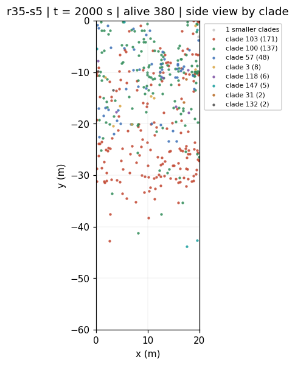
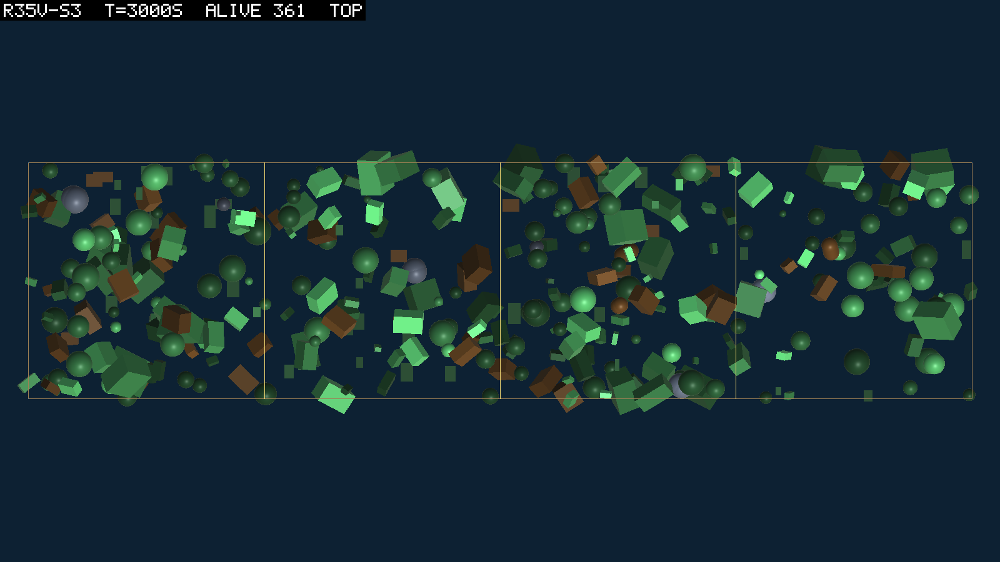
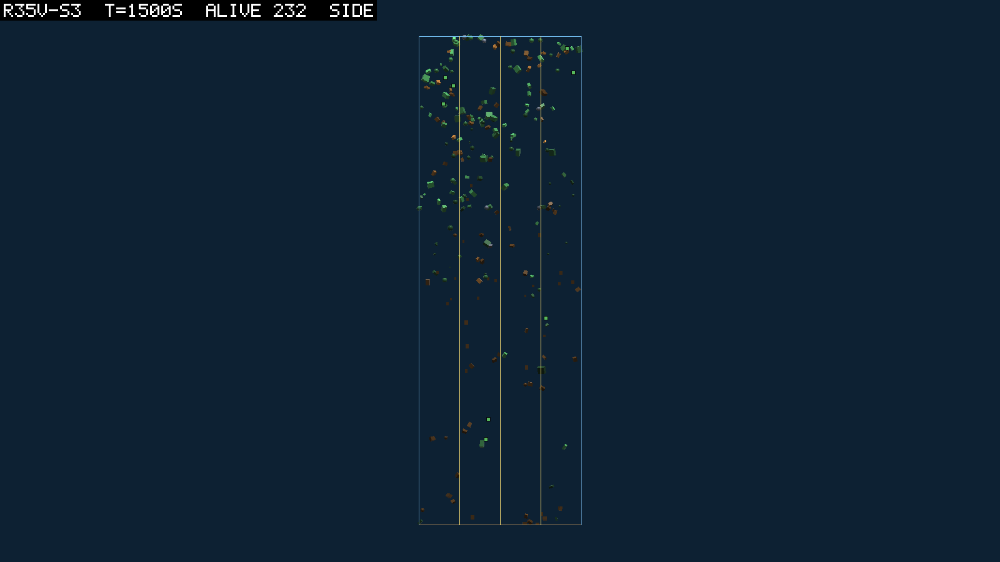
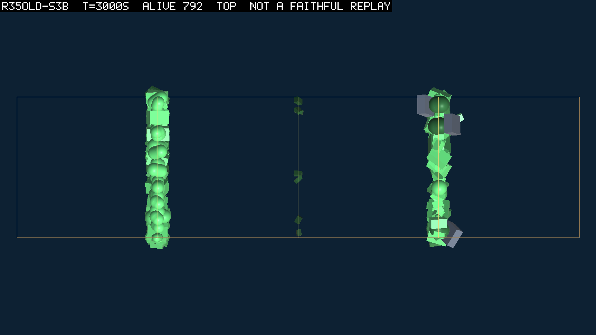

# 0086 — Seen from above

**2026-09-10**  ·  the first pictures of the three-dimensional world, taken by the agent; two tools that look into a run; a divergence that killed a process instead of a body

The owner had no time for the theatre and said so: "you will need to continue by yourself
here. use the literal tool to take screenshots (or manufacture them in headless)." So the
first look at D088's world is mine, through two tools built for the purpose the same
afternoon, and this entry says what I saw. The numbers are from one seed of a run still
going and from a six-hundred-second smoke; nothing here is a result about a world that has
run its course.

## The tools

**Pictures.** `TheatreSnapshot.Run` enters Play mode headless, replays a run under the
identity check to each requested second, and renders four fixed views to PNG: from above,
from the side along the length, from the end along the width, and a three-quarter view.
The box, its patch seams and a label are composited into the pixels so a picture carries
its own provenance, and the label says `NOT A FAITHFUL REPLAY` whenever the build does not
match the recording, whatever the identity check then reports. `scripts/theatre-snap.ps1`
launches it against a free worker. The first pictures found two faults in the renderer
itself, a second box drawn in perspective inside the orthographic one and the label
covering the surface line, both fixed before any picture was read.

**Positions.** From this build a shared-space run writes `positions.jsonl`: one row per
sample with every body's id, x, y, z to the centimetre and its expressed guild, about 13 MB
over a full run. `scripts/positions-read.py` streams it and prints, per sample, the occupied
columns, the circular spread, the median nearest-neighbour distance in the plane and in
three dimensions, depth by guild, and how many bodies stand within a metre of their own
clade. On the smoke its `cols` and `x sd` reproduce the table's to the rounding. Depth by
guild, which CLAUDE.md has called unmeasurable for a week, is measurable from here.

*What the positions reader draws: `r35-s5` at 2,000 s from above, one colour per clade, the
largest eight named and the rest grey.*

## What the pictures show

`r35v-s3`, seed 3 at dt 0.01 on the launcher's defaults (dispersal 5 m, transport at
0.3 m/s), photographed at 500, 1,500 and 3,000 s while it ran; every replayed sample matched
the recording, so these are the run and not a cousin.

From above at 3,000 s: 361 bodies over all four patches, green producers and brown stomachs
mixed through one another, no patch empty and no patch crowded, the four seams crossed
without a change of density. From the side at 1,500 s: bodies from the surface to the bed,
thicker in the top twenty metres and present all the way down, a scatter rather than a
layer. The table says the same: 94 to 99 of 100 columns occupied from 2,400 s and all
100 from 7,000 s, the inherited stomach line of 50 to 90 spread over 40 to 53 columns,
`x sd` between 6.4 and 8.9 m, 1,404 alive at 11,100 s with nothing diverged.

*From above at 3,000 s: 361 bodies over all four patches, the seams crossed without a change
of density.*

*From the side at 1,500 s: surface to bed, thicker in the top twenty metres, a scatter and
not a layer.*

The before picture is a recreation, because round 33's own recording predates two of
D088's tunables and the loader refuses it rather than defaulting them. `r35old-s3b` is the
same launcher with dispersal 0 and the rolls, seed 3 at dt 0.02 for 3,000 s: D077's placer
and D037's current under the new build, the old rules and not the old run. Its table at
3,000 s reads 792 bodies in 23 of 100 columns, `x sd` 4.5, mean depth 6 m, both books
closed. From above at 3,000 s it is 0083's picture exactly: two ribbons the width of the
box, one in the first patch and one in the fourth, a metre thick, with seven bodies loose
between them and the second and third patches empty; the replay matched the recording on
all thirty samples. Six hundred seconds in, the new world had already put 119 bodies in
71 columns. The difference is
not the population, which the fast step and the surface film confound (0056), and not the
depth; it is the twenty columns against a hundred.

*The old rules under the new build: two ribbons a metre thick in the first and fourth
patches, the middle two empty. 0083's picture again.*

The one number to carry that no picture shows: `mean m/s` reads 0.22 to 0.24 in the
transport world and 0.03 to 0.06 in the rolls world. That is the water. A sitter rides it,
and the column that was the locomotion readout for thirty-three rounds is not one now.

## A divergence that killed the process

The first recreation, `r35old-s3`, died at 618 s with the whole process and a manifest
reading `error`, from an exception in the chemical sense: a part's transform had gone
non-finite and the grid refused the point with a message blaming a constructor nobody had
called. The harness's finiteness check read the root alone, at the metabolic cadence; the
sense read every part on every physics step; so a link that diverged between two checks
reached the field before the check reached it. Round 33's three divergences were one-part
bodies, and a one-part body's root is the whole of it. The root check caught them by luck.

From this build the check reads every link and runs again before the sensors on any step
where a birth or a resize moved a body outside the solver; the sense skips a non-finite
part as a second line; the grid's refusal says a non-finite position when it means one. The
rerun diverged the same body at the same step, a two-joint founder 380 s old just under the
surface, dumped it, counted it, and went on to its budget.

## What the owner is asked

Five questions, put in plain terms in conversation: how far a newborn may land from its
parent (5 m spans the width; my recommendation is to keep it for the base round), whether
the box's bookshelf shape should change (not yet), how fast the water should move (0.1 m/s,
so that a swimmer can beat it), whether founders reserve their adult size as children now
do (yes), and whether a plotting library may be installed for the positions reader. The
base round in three dimensions waits on the answers.

## Sources

`scratch/snaps/r35v-s3/`, `scratch/snaps/r35old-s3b/`; `runs/r35v-s3`, `r35old-s3`,
`r35old-s3b`, `r35psmoke`; `scripts/theatre-snap.ps1`, `scripts/positions-read.py`;
`runs/r35old-s3b/<run>/diverged/234.json`; D088; logbook/0083, 0084, 0085.
