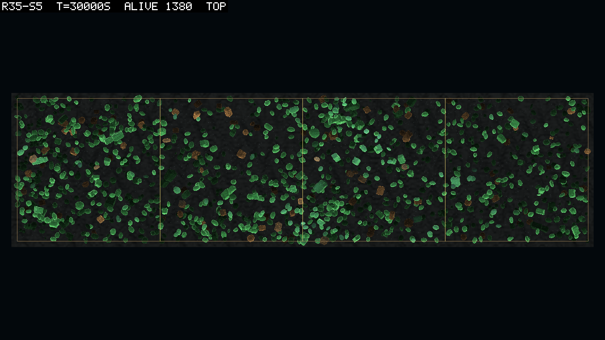
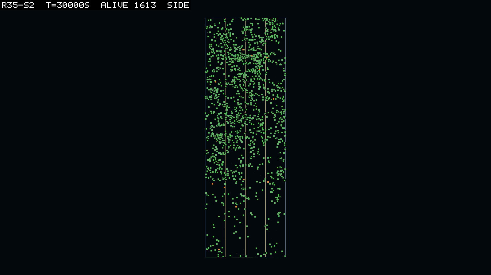
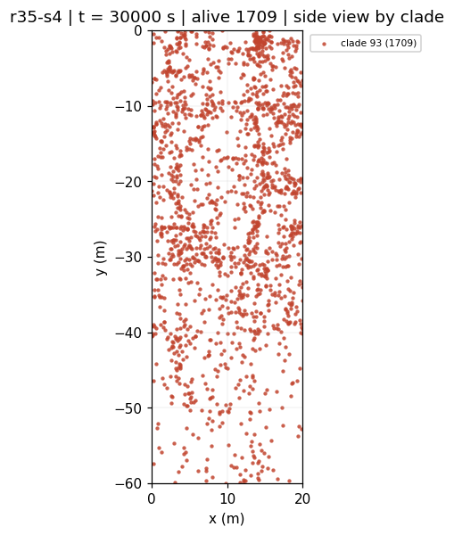

# 0087 — The base round in three dimensions

**2026-09-10**  ·  round 35 pre-registered: round 33's world with D088's dispersal and current, five seeds at 0.01; the rules written before the first arm has a row

The owner's ruling on the five questions of 0086 was "proceed with your recommendations":
dispersal stays at 5 m, the box keeps its shape, the water slows to 0.1 m/s, founders
reserve the adult as children do, and the plotting library may be installed. Round 35 is
the first round in the three-dimensional world and becomes the base for everything after
it, the free joint (round 34, logbook/0080) first.

## The world

Round 33's launcher (growth, the grid, corpses at 0.005/s, mixing 0.02, the D082 prices,
the 30,000 J ceiling) with D088 on it: a newborn set down over a 5 m disc about its parent,
`CurrentMode Transport` at an RMS of 0.1 m/s over 6,000 s, every destroy immediate, the
placer reserving the adult's radius for births and founders alike. Five seeds, dt 0.01,
30,000 s, workers 2 to 6, `rounds/launch-r35.ps1` defaults. The header must read
`dispersal=5 m` and `current 0.1 m/s transport`, and every arm's manifest must carry one
build and `physicsJobWorkers 0`.

Two things changed since the viewing arm of 0086: the speed (0.3 there) and the founders'
reservation. Both are per-step changes, so no arm of this round replays that one.

## Rules, before scoring

**Verification.** V1: every header carries the two tokens above and the `cols`, `cols abs`,
`x sd` columns; every manifest one `simHash` and one `coreHash`. V2: `audit` 0.0000% and
`mat resid` 0 on every row. V3: `diverged` read on every arm; a run with any is read with
that caveat and a run whose manifest reads `error` is censored.

**The world stands and stays spread.** S1: `cols` at or above 90 of 100 on every sample
after 3,000 s, in every seed. A seed that falls under it is read for why before anything
else in it is read. S2: `positions.jsonl` is read with `scripts/positions-read.py` at 5,000,
15,000 and 30,000 s, and the entry reports the median nearest-neighbour distance and the
kin-within-a-metre count; the pictures at the same three times are taken with
`scripts/theatre-snap.ps1` and the entry says what they show, per the theatre rule.

**The goal rule.** G0: D063 as amended, by connected clade, per seed. The bar is round 33's
five of five; the reading is against it and against round 32's two of five. The question
0079 left open, why the eaters' lines stop recruiting on the grid, is re-asked here: G1, the
inherited stomach births in the last window, per seed, against round 33's 51 to 187.

**The dials.** G2: adult scale, investment and litter at the end, per seed, against round
33's 0.39 to 0.60, 0.20 to 0.49 and 1.9 to 5.1. The 0082 rule stands: three dials pushed
the same way in five seeds of five is the world pushing them.

**Movement.** G3: `mean m/s` is the water and is not read as locomotion. A jointed line's
survival is read on `jnt inh` and `food jnt` against `food rig`, as in 0082's G4. Nothing
about swimming is claimed from this round; that is round 34's.

**What this round cannot answer.** Whether the difference from round 33 is the dispersal,
the current or the founders' reservation: all three moved at once, by the owner's ruling
that the fixed world comes first. The one-at-a-time separations are 0084's bin 3 and come
after the base is read.

## Launch

2026-09-10, 11:28 to 11:29 UTC: `r35-s1` to `r35-s5` on workers 2 to 6, commit `8e1ebaf`,
`simHash b5d31a48…`, `coreHash cafcb692…`, `configHash 2129e5bf…` on all five,
`physicsJobWorkers 0`. Every header reads `current 0.1 m/s transport over 6000 s`,
`dispersal=5 m`, `dt=0.01`; V1's tokens verified from the reports before this line was
written. One monitor watches the five for their end, an error signature and a stalled
report.

## Results

Written 2026-09-11 in the small hours, the five arms landed between 17:30 and 19:00 UTC the
evening before, the pictures taken overnight by replaying each run in the theatre. Seed 4
took 451 minutes at 1.1 times real time beside four others.

**Verification.** V1 holds: every header carries the tokens and the three columns, every
manifest the one build and `physicsJobWorkers 0`, and the five config hashes are one hash.
V2 holds on every one of the 1,500 rows: `audit` 0.0000% and `mat resid` 0. V3: every arm
ended on its budget, none is censored, and `diverged` reads 0, 0, 3, 0, 1 for seeds 1 to 5
(round 33 read one, in seed 2). The four bodies are read with that caveat and nothing more;
the placer reserves the adult now, so the round 33 suspect is not this round's.

**The world stands and stays spread.** S1 holds in every seed. The footprint reached 90
columns of 100 between 500 and 1,100 s and never fell under 96 after 3,000 s (the minima
are 97, 98, 96, 100, 99). Round 33 stood on about 17 columns for a thousand bodies. The
eaters' footprint is smaller and moves with their numbers: 34 to 75 columns at the end.

| seed | alive at end | `cols` min after 3,000 s | `cols abs` at end | `x sd` at end | nn 3D (m) | kin within 1 m | leaf depth (m) | stomach depth (m) |
|---|---|---|---|---|---|---|---|---|
| 1 | 1,270 | 97 | 75 | 8.4 | 0.70 | 890 | −18.5 | −22.3 |
| 2 | 1,613 | 98 | 37 | 7.1 | 0.64 | 1,332 | −21.0 | −24.0 |
| 3 | 1,671 | 96 | 34 | 9.2 | 0.62 | 1,171 | −21.5 | −29.1 |
| 4 | 1,709 | 100 | 46 | 7.1 | 0.63 | 1,403 | −22.7 | −27.3 |
| 5 | 1,380 | 99 | 66 | 8.4 | 0.65 | 1,015 | −19.2 | −22.9 |

The last four columns are the positions file at 30,000 s: the median distance to the nearest
body in three dimensions, the count of bodies with a clade-mate within a metre, and the mean
depth by guild. A spread of 7 to 9 m in x is a scatter over the whole 20 m of the box. The nearest neighbour is two thirds of a metre at every seed and every time, the spacing
of a uniform scatter at these numbers. The horizontal reading is 0.11 to 0.13 m, so a body's
nearest neighbour is almost always above or below it rather than beside it. Kin within a
metre runs at seven to eight bodies in ten. That is not the ribbon; it is what a 5 m disc
leaves after thirty thousand seconds when nothing swims. The leaves sit 18 to 23 m down and
the stomachs 4 to 8 m under them, where round 33 had put both in a column. At 5,000 s the
gap was wider, 8 to 20 m, and it closed as the stomach lines thinned.

**The goal rule.** G0 holds in five seeds of five, as in round 33. The passing clades are
smaller: 130, 20, 31, 54 and 77 alive at the end against round 33's 102, 74, 120, 82 and 79,
with the last-two-lifetimes minima at 95, 16, 19, 39 and 74. Seeds 2 and 3 pass by six and
nine bodies over the bar. Seeds 1 and 2 pass on a founder's line; seeds 3, 4 and 5 on a
child's, born at 1,991, 4,178 and 1,653 s. G1: the inherited stomach births in the last
window, per passing clade, are 116, 13, 24, 42 and 66, against round 33's 51 to 187; three
seeds are under round 33's floor. Every seed but the first shows the shape round 32 had on
the grid (0079): the stomach line peaks early and thins. Seed 4 held 364 inherited eaters at
5,000 s across 97 columns and 45 at 15,000; seed 5 held 337 and 109 at the end. The
question 0079 left open is open here too, in a world where the eaters were not stacked on
one cell.

| seed | passing clade | founded | min last 6,000 s | inherited births, last window | living clades | `inherit` at end |
|---|---|---|---|---|---|---|
| 1 | 130 | founder, 16.5 s | 95 | 116 | 3 | 134 |
| 2 | 20 | founder, 1.5 s | 16 | 13 | 6 | 48 |
| 3 | 31 | child, 1,991 s | 19 | 24 | 6 | 35 |
| 4 | 54 | child, 4,178 s | 39 | 42 | 4 | 67 |
| 5 | 77 | child, 1,653 s | 74 | 66 | 3 | 110 |

**The dials.** G2 does not replicate. Round 33 walked all three dials the same way in five
seeds of five, which 0082 read as the world pushing them and 0084 read as what a packed
clade with no dispersal selects for. Here they split two ways. Seeds 1 and 5 kept round
33's shape: adults at 0.65 and 0.52 of the founder scale, investment 0.37 and 0.33, litters
of 3.6 and 2.6. Seeds 2, 3 and 4 went the other way: adults at 0.29 to 0.34, investment 0.66
to 0.84, litters of 1.5 to 1.7, a child born nearly whole and one or two at a time. By
0082's own rule that is a trade-off with more than one answer, not a push, and the
"world pushing the dials" reading of round 33 does not survive dispersal. It was the
column.

| seed | adult scale | investment | litter |
|---|---|---|---|
| 1 | 0.65 | 0.37 | 3.6 |
| 2 | 0.29 | 0.66 | 1.5 |
| 3 | 0.32 | 0.78 | 1.5 |
| 4 | 0.34 | 0.84 | 1.7 |
| 5 | 0.52 | 0.33 | 2.6 |
| round 33 | 0.39 to 0.60 | 0.20 to 0.49 | 1.9 to 5.1 |

**Movement.** G3: `mean m/s` reads 0.082 to 0.091 in every seed at the end, the water at a
0.1 m/s RMS, and is not read. No jointed body was alive at 30,000 s in any seed and none
was inherited; the joint's columns print a dash. Nothing about swimming is claimed.

## What the pictures show

The theatre replayed every seed faithfully at 5,000, 15,000 and 30,000 s, four views of the
box and one close, and the positions reader drew the same three times. From above, every
seed fills the footprint from the first pictures on: bodies across all four patches and the
whole width, no ribbon and no column, and the eaters scattered among the leaves rather than
gathered under them. From the side, bodies from the surface to the bed, the green thickest in
the top thirty metres and thinning below forty. The stomachs are no layer beneath the
leaves; they are a sparser scatter through the same water, a few metres lower on average. Seed 2
at 30,000 s shows a denser shelf of leaves eight to ten metres down, the one horizontal
structure seen in fifteen pictures. Seed 5's bodies are mostly spheres by the end where
seed 3's are small boxes, so a picture can now tell one seed's morphology from another's
at a glance. Seed 4 is one founder's lineage in the whole box, every one of its 1,709 bodies
descending from the creature born at 27.5 s, the stomach line among them a mutant of 4,178
s. Seed 4's pictures, taken last, add one thing: from the side its 1,709 small oblong bodies
are drawn into diagonal filaments a few metres long, the eddies of the transport field seen
in what they carry, and the only picture of the fifteen in which the water itself shows.
Whether anything holds against the current or rides it cannot be read from a still.

*Seed 5 from above at 30,000 s: 1,380 bodies across the whole footprint, mostly spheres by
now, the eaters brown among the green.*

*Seed 2 from the side: bodies from the surface to the bed, a shelf of leaves eight to ten
metres down, and 49 stomachs somewhere among them.*

*Seed 4's recorded positions at 30,000 s, coloured by founder: one lineage, the whole box.*

## Verdict

The three-dimensional world stands, spread, in five seeds of five, and the goal rule holds
in it as it held in the column. That is the base secured. Two of round 33's readings do not
carry over. The dials no longer walk one way, so D087's "the world pushes the dials" is
downgraded to a trade-off with two answers, and the mass floor as the sieve that shapes the
litter (0082) is now one of two sieves. The stomach lines are thinner in three seeds and
thin from an early peak in four, which is round 32's shape on the grid, so 0079's open
question stands in the fixed world and cannot be blamed on the column. Two of 0084's bin 2
items move to bin 1 on this evidence. The goal-rule pass is now shown in a world that fills
the box. And the population at the end, 1,270 to 1,709 against round 33's 1,321 to 1,762,
says the ribbon's shading bargain was worth nothing to the count.

What the round cannot say, as pre-registered: which of dispersal, the current and the
founders' reservation did what. That is 0084's bin 3, and the first of those retries is the
free joint, round 34, launched on this base the same night.

## Sources

Logbook/0079, 0082, 0083, 0084, 0085, 0086, 0088; D063, D086, D087, D088;
`rounds/launch-r35.ps1`; `runs/r35-s1` to `r35-s5` (manifests, reports, `positions.jsonl`);
`scripts/clade-score.ps1`, `scripts/positions-read.py`, `scripts/theatre-snap.ps1`;
`scratch/snaps/r35-s*/`, `scratch/positions/r35-s*/`, `scratch/r35-read/summary.md`.
