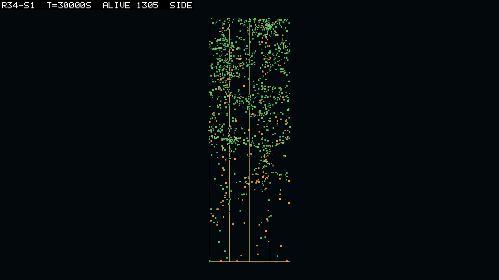
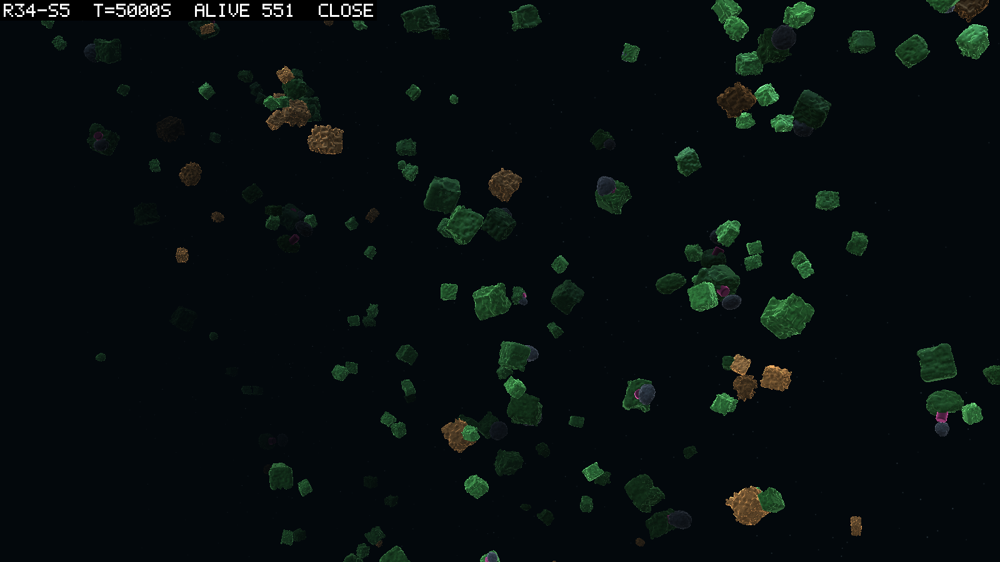

# 0090: The stroke that nothing charged

**Date:** 2026-09-11
**Round:** 34, the free joint, on round 35's world (logbook/0080 as amended twice)
**Verdict:** five seeds of five pass the goal rule; the joint founds in every seed and is gone from every seed by 23,100 s; the price was the founding barrier and not the whole story

## The question, once more

Round 34 asked whether a joint that costs nothing to own survives founding. Every priced
world had lost its last joint by about 5,000 s, and the campaign's explanation was the price:
idle torque, a neuron, a connection, a stroke, each charged against a body that had not yet
found a use for movement. So this world set every one of those prices to zero, or as near
to zero as the harness allows (the idle price at 0.0001 because `LinkCell` refuses a price
of nothing), and left the joint free to be a trait like any other. logbook/0080 has the
predictions; the amendments moved the round onto round 35's world and read M4 against the
water rather than against drift, since in the transport current both speeds are the water's.

## Launch

Five seeds on `rounds/launch-r34.ps1` (commit `43218fd`), `configHash 96b76bdc`, build
`simHash b5d31a48`, `coreHash cafcb692`, dt 0.01, physics on one thread. Every header was read
for `idle 0.0001 W/N·m`, the four prices at zero, `current 0.1 m/s transport` and
`space shared 4x5x5 m` before the arm was counted. The first launch of seed 1 died at
construction on the `LinkCell` guard, which is where the 0.0001 came from; the round is the
relaunch. All five ended at budget, 30,000 s, between 2026-09-11 morning and midday.

## Results

Every seed passes D063 as amended, on a rigid clade in every case.

| seed | verdict | passing clade | alive at end | round 35's same seed |
|---|---|---|---|---|
| 1 | PASS | 206 alive | 1,305 | 1,270 |
| 2 | PASS | 139 alive | 1,593 | 1,613 |
| 3 | PASS | 69 alive | 1,557 | 1,671 |
| 4 | PASS | 47 alive | 1,766 | 1,709 |
| 5 | PASS | 115 alive | 1,281 | 1,380 |

The joint's story is the same in every seed, and it is a story in three parts. It founds:
at 1,000 s there are 46 to 140 bodies whose parent carried a joint, where every priced world
had a handful. It thins: by 5,000 s the count has held or halved in four seeds and fallen to a
fifth in one. And it ends: the last body with a jointed parent is seen between 8,200 and
23,100 s. After that the joint is re-invented by mutation every few hundred seconds to the
end of the run, one body at a time, and never breeds a jointed child.

| seed | `jnt inh` at 1,000 s | at 5,000 s | last inherited jointed body | re-inventions after it | `diverged` |
|---|---|---|---|---|---|
| 1 | 72 | 73 | 23,100 s | 68 samples, last at 28,900 s | 3 |
| 2 | 58 | 57 | 17,000 s | 18, last at 26,700 s | 27 |
| 3 | 84 | 17 | 8,200 s | 26, last at 29,100 s | 0 |
| 4 | 46 | 34 | 10,800 s | none | 2 |
| 5 | 140 | 49 | 14,900 s | 19, last at 28,400 s | 17 |

Against the predictions:

| | prediction | reading |
|---|---|---|
| M0 | the world stands, `alive` within 0.5 to 1.5 of the same seed's base | holds, 5 of 5: 0.93 to 1.03 |
| M1 | the price was the reason: a jointed tenth of the world at the end in 3 of 5 | fails, 5 of 5: no inherited joint at the end in any seed |
| M2 | the founding scramble is survived: the 5,000 s count at least a quarter of the 1,000 s count in 3 of 5 | holds, 4 of 5 (seed 3 reads 0.20) |
| M3 | a free joint does not diverge more: at most 2 per arm | fails, 3 of 5: 3, 27 and 17 |
| M4 | movement, if any, is drift | moot as written, since M1 fails; read anyway below |

The two-sided reading that fires is the third one in 0080: free joints survive founding and
are then lost slowly. That reading named drift or a slow disadvantage in the body itself,
and asked for the decay to be read against a neutral-drift expectation. It was, and the
answer is not drift; and M3's failure adds the solver to the account. The three reads are
below.

### R1: the ledger says a free joint costs nothing

Two jointed genomes alive in seed 1 at 5,000 s were run through the ledger against the same
genome with its joint fixed and its power zero (`logbook/specs/r34-read/summary.md` has the files
and the commands). The gap between jointed and rigid is the idle price times the power times
the degrees of freedom, 0.0011 to 0.0015 W, a fraction of a percent of income at any depth
or density. Net watts, lifetime and R0 agree to the second figure. So as the ledger counts
it, the world charges a free joint nothing, as the round set out to arrange.

### R2: jointed bodies die young, whoever their parents were

`scripts/reads/parent-births.py` reads the lineage for children per parent and lifetime by
the parent's own joint flag, right-censored at the run's end. In seed 1 over the whole run a
jointed body left 0.94 children and lived 542 s on average; a rigid one left 1.00 and lived
1,373 s. Over the first 5,000 s the two groups bred alike, 1.50 against 1.49, and the jointed
lived half as long. The difference is at the start of life: 41 percent of jointed newborns
were dead within 50 s against 23 percent of rigid ones, and over the run a third of all
jointed bodies died in their first 50 s. Not one of seed 1's 1,404 bodies born with an
expressed joint was alive at the end.

Birth size is part of it and not the whole. Jointed newborns were born small: a body fraction
of 0.074 at the median against 0.347 for rigid ones in the first 5,000 s. Since 87 to 97
percent of them had a jointed parent, the small litter is inherited along with the joint.
But a rigid child of a jointed parent is born at the same 0.080 and dies in its first minute
21 percent of the time, the rigid rate. A jointed child of a rigid parent, born at the rigid
size, dies in its first minute 54 percent of the time. The joint kills, whichever
lineage it arrives in and whatever the size it arrives at.

### R3: it is the stroke, and it is driven flat out

Nothing here pays for a stroke, so the brain has no reason not to drive it. The table's
`work J/s` column is the joint work the world does per second, and dividing it by the
jointed count gives a body's stroke. At 1,000 s that is 5 W per jointed body in seed 1, 13
in seed 2, 14 in seed 3, 43 in seed 4 and 23 in seed 5, and 77 W in seed 4 at 3,000 s. A leaf's income
at the surface is about 4 W. In a priced world that work would have bankrupted its owner in
minutes; here it costs nothing and moves the body. M4 read as the amendment says: while
jointed bodies exist, they move at 1.06 to 1.55 times the rigid ones, and the rigid ones
move at the water's speed to the third figure. So the free stroke is used, and the joint
carries the body faster than the current in every seed.

That is the reading, and what it means is the entry's title. A joint on a small newborn,
driven at tens of watts by a brain that was never selected to drive it well, throws the
body about. The divergence dumps say so directly. Every diverged body in seeds 1, 2 and 4
carries an active joint in its genome, and 16 of seed 5's 17 do; 25 of seed 2's 27 expressed
it. Their median age at divergence is about 1,200 s, so these are jointed adults thrown out
of the world by the solver, at about two percent of jointed births. The first-minute deaths
are the same thing below the solver's threshold, read as inference. A newborn at a fifteenth
of its adult size, stroked flat out, spends its reserve or is carried away from what it
could eat before it has eaten anything. The rigid child of the same parent, born at the same size,
lives.

Drift was ruled out by arithmetic. A neutral trait carried by a tenth of a population of a
thousand takes of the order of the population size in generations to be lost. The joint was
lost in about ten generations in every seed, at rates that agree across five independent
realisations, so something removes it.

## What the pictures show

The five seeds were photographed with `scripts/theatre-snap.ps1` at 5,000, 15,000 and
30,000 s in the five views. At 30,000 s every seed is round 35's world again: a green haze
through the whole box with the eaters in orange scattered through it, filling every column,
and nothing in the picture that says a joint was ever here.

At 5,000 s in seed 5, the seed that founded the most jointed bodies, the close view shows
what the table cannot. Among the green boxes and balls hang the jointed ones: a dark ball on
a magenta neck, the link, attached to a green producer that carries it. They are the only
two-coloured bodies in the picture, and most of them are small.

The close view backs off to frame the largest body, so in seed 3 at the same second, where
the largest body is a long chain, the picture is a field of specks. A view that frames the
body with the most parts is queued with the skin's third day (HANDOFF's ideas of 2026-09-11).

## Verdict

The round's hypothesis, that the price was the reason the joint never survived founding,
is half right. The price was the founding barrier: with it removed, the joint founds in
every seed, at a hundred bodies where the priced worlds had none, and M2 holds. But the
price was not what removed the joint afterwards. What removes it is the stroke itself,
driven without limit by a brain that has never been selected to use it, on a body born at a
fifteenth of its adult size. A free joint is not a neutral trait in this world. It is a
motor with no throttle, and the world selects against owning one.

Read against the campaign: movement has never paid its cost because nothing has yet been
selected to move well, and a free stroke shows the other side of that. The joint can be
carried; it cannot yet be used. Two things follow for the sequence, and both are recorded in
HANDOFF's path. Round 36, already running, gives the link an income of its own and asks
whether an earning hinge is kept. Its first seed ended with a jointed line alive at 30,000 s,
which no seed here managed, and the set will say whether that holds. Round 39 prices the
stroke alone with everything else free, and this result moves it forward from its place in
the ten. The stroke is the term that matters, and a stroke that costs something is a stroke
a brain has a reason to modulate. And a drive impulse limiter at every step, not only above
dt 0.01, goes to the owner as a proposal before any cheap-stroke round. The solver's share
of the losses is real, with M3 failing in three seeds, and it is the harness's to remove
rather than the world's to select against.

I add a personal note. I expected this round to settle the price question one way or the other, and
it did something better: it separated two barriers that every earlier round had read as
one. The joint was never cheap enough to found; that is now fixed. What remains is that a
stroke is only useful to a body that can steer with it, and nothing in this world yet gives
it a reason to.

## Sources

- logbook/0080, the pre-registration and its two amendments; logbook/0087, the world it runs on.
- `logbook/specs/r34-read/summary.md`: the per-seed reads, the ledger files and commands, the
  parent-births outputs, the divergence table.
- `scripts/reads/parent-births.py`, `scripts/reads/diverged-read.py`, `scripts/clade-score.ps1`,
  `scripts/analyse-arm.ps1` for the columns read here.
- Run directories: `runs/r34-s1` to `runs/r34-s5`, each with `run.json` carrying the hashes.
