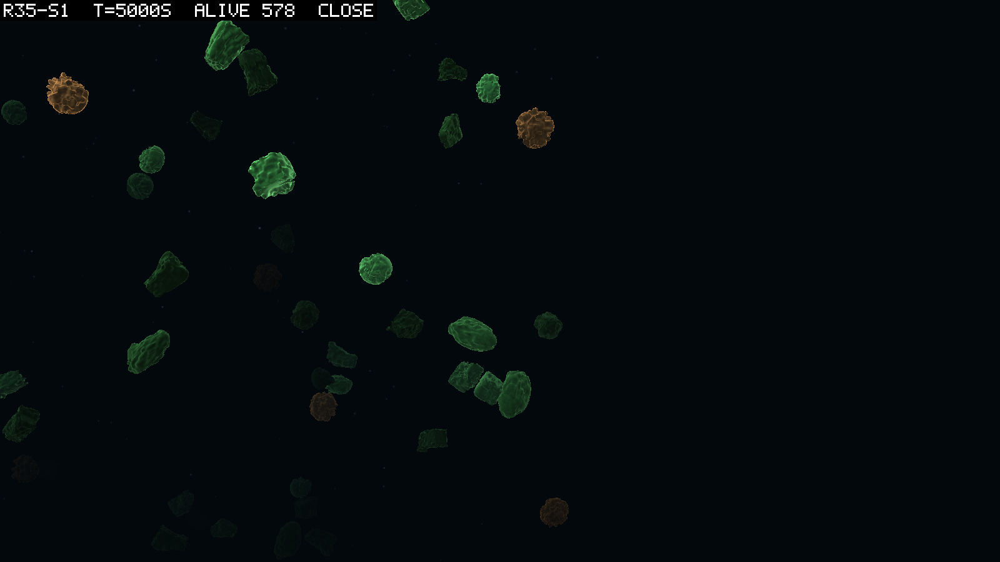
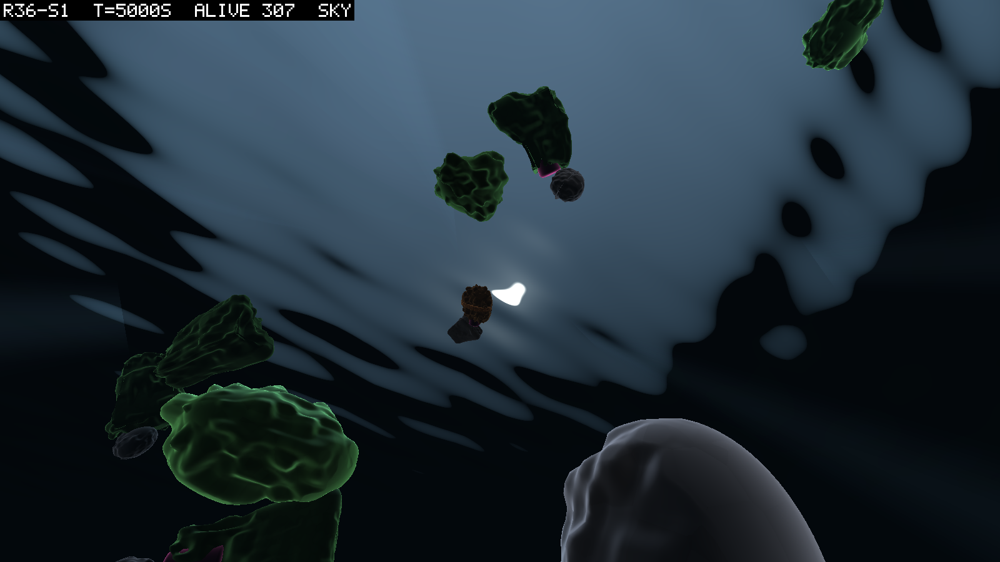
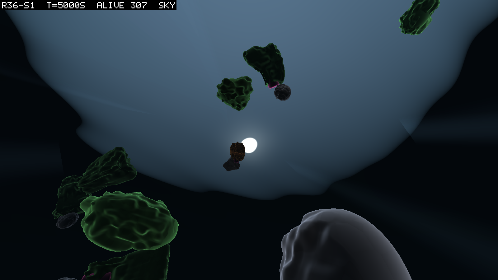

# 0091: The box that stopped looking made, and the sun

**2026-09-11**  ·  the theatre's third and fourth days of skin: a box that tapers and bends inside its collider, and a surface with a sun in it; what the owner saw in the theatre that the pictures had not shown

## The two complaints

The second day's carve (logbook/0088) had made the spheres look alive and left the boxes
looking manufactured. The owner said so from the close views of round 35 seed 1 at 5,000 s:
"the spheres look amazing, and the rectangles have improved, but they still look somewhat
non-biological." The same second at a deeper carve, 0.35 against 0.2, already looked better
to them. So the third day was the box's, and its spec is `logbook/specs/skin-spec-3.md`.

Then the owner ran the theatre on round 36 seed 1, the first world in which a hinge has
been kept for five lifetimes. They said: "I couldn't see the sun, or the water shimmer, the
underwater ripple effect, or many of the things we discussed." They were not there. Three
days of skin had been about bodies; the water had a colour, a fog, snow and a caustic term
painted on bodies from nowhere in particular. The fourth day was the water's, and its spec
is `logbook/specs/skin-spec-4.md`.

## What was built

**The box.** A box part now narrows toward one end along its longest axis, eased so that it
reads as a seed rather than a wedge. It bends once across itself, in a direction and toward
an end drawn from the creature's own seed, so that no two are congruent and nothing
flickers. The corner rounding, a constant since the second day, became a dial. All of it is
inward. The cross-section is multiplied by a number never above one, and the bend is paid
for out of the cross-section before it is spent. The vertex is clamped into the mesh's own
box afterwards, so a dial past its range cannot put a visual outside a collider. Spheres
and capsules were left alone, because their colliders are the ball and the tube and the box
clamp would hold them inside nothing the physics has. The carve default moved to 0.35, and
the rim softened.

**The sun.** A plane at the waterline, seen from below only, is rippled by three trains of
waves whose normal is built per pixel. Snell's window shows through it: the sky refracted
into a cone of about 97 degrees, a sun disc where the refracted ray meets the scene's own
key light, and the dark water mirrored outside the cone. A handful of additive shafts lie
along the sun's refracted ray, brightened by the same ripple sampled at their top. The
caustics on bodies and on the bed are that ripple focused, one function in one include,
fading with depth on one curve. A `sky` view for the snapshot camera looks up from three
metres down. From above and from outside the box nothing changed, which the side
view confirms.

Everything is under `Assets/Theatre`, moves no hash, and compiled on its first Unity launch
in both days, which was the render itself.

## What the pictures show

The same crowd as the second day's comparison, round 35 seed 1 at 5,000 s, under the third
day's defaults:

The boxes narrow and lean, the joined pair at the lower right reads as two grains meeting,
and no two are alike. What still says "box" is the straight long edge on the largest
bodies. Two more frames were taken for the owner's ruling. Carve 0.5 turned the spheres into
burrs and the boxes ragged, and the agent's reading was to refuse it. Pillow 0.5 turned every
box into a bean, pleasant and uniform, and the ruling on it is the owner's.

*Ruled 2026-09-12 night, by the agent at the owner's word ("you can do those things for
me"): the pillow stays at 0.34.* Side by side, the two frames of round 35 seed 1 differ by
a softer edge and nothing a viewer would name. At 0.5 every silhouette is the same bean,
and the straight long edge the default keeps is the genome's, a flat plate drawn as a flat
plate. Round 37's close frames (0094) are slabs with mouths, and that reading depends on
the edge. The dial stays for anyone who wants the beans.

The fourth day's first frame, round 36 seed 1 at 5,000 s looking up:

The window, the sun, bodies silhouetted against the light, a jointed one with its magenta
neck near the centre. And the surface reads as bands of black and white rather than as
water: the waves were too steep for their length. The same frame at half the height over
twice the length:

That is the default now, and the dials remain for the owner to move by picture.

## What the theatre showed that the pictures had not

The owner watched the replay in motion and saw two things no still had shown. Bodies were
displaced, a jump rather than a death and a birth, and bodies appeared and vanished. The
second is births and deaths, one of each every two seconds in that seed, drawn today as a
body at full size on its first frame and gone on its last. The first is the wrap. The box
is periodic, and since D088's current carries bodies every one of them crosses a seam about
once every hundred seconds. The report had been counting that in its `wraps` column for two
rounds without anyone reading it as a problem. The rule had been chosen for being cheap
when nothing crossed a seam. That reading, and the crowd the owner saw beside it, a body
every metre, became `fable-propose-aquarium.md` and a change to the sequence the same
evening; HANDOFF's path and CLAUDE.md's gotcha carry it. What it means for this entry is a
rule. A still is a census of shape and place, and only motion is a census of motion, so a
round is watched as well as photographed before it is written up.

## What it cannot show yet

A newborn does not grow in and a dead body does not fade. The surface is a picture and moves
no body. The sun does not set, though the world's day does. The shafts are geometry rather
than scattering. The close view still frames the largest body, so a long chain backs the camera
off until everything is a speck, and a view that frames the body with the most parts is
queued. None of it moves a hash.

## Sources

- `logbook/specs/skin-spec-3.md`, `logbook/specs/skin-spec-4.md`: the specs, with the
  invariant and each item's argument for staying inside the collider.
- `unity/Assets/Theatre/`: `TheatreMeshes.cs`, `TheatreBody.shader`, `TheatreSkin.cs`,
  `TheatreWater.hlsl`, `TheatreSurface.shader`, `TheatreShafts.shader`,
  `SnapshotCamera.cs`; commits `e4d6540` (day 3) and `da92f97` (day 4, merged as `7f0a3ce`).
- Pictures: `scratch/snaps/skin3-*/`, `scratch/snaps/skin4/`, `scratch/snaps/skin4-calm/`;
  the three beside this entry.
- logbook/0088 for the first two days; `research/theatre-look/README.md` for the reading
  the look rests on.
