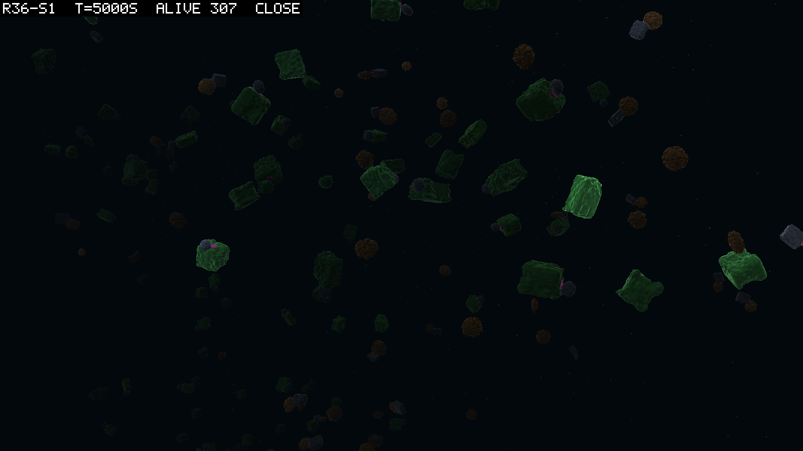

# 0092 — The hinge that stood was on an eater

**2026-09-12**  ·  round 36 read: five seeds of five pass; the link that earns kept a jointed line to the last row in two seeds, and the one standing jointed population so far is a clade of jointed eaters, not the jointed producer the round reached for

Round 36 paid the link part half a leaf's light (logbook/0089), on the reading that round 34's
joint was lost after founding because the part that carried it earned nothing. The goal rule
holds in all five seeds, as it did in round 34. The pre-registered bar for a standing jointed
line fails in all five. And under that bar something moved. Every seed carries its inherited
jointed line further than its round 34 twin, and two carry it to the last birth of the run.
Seed 1 ends with 75 jointed bodies, all absorptive and all descended from one jointed
absorptive founder. The jointed leaves, which were most of the jointed bodies at
5,000 s in every seed, are gone from all five by the end.

## Verification

V1 holds. Every header carries round 34's tokens and `linkPhoto 0.5`, and a token-by-token
diff of a round 34 header against a round 36 header differs in that token and the config
hash only. All five manifests: `status ended`, `reason budget`, `simHash b5d31a48…`,
`coreHash cafcb692…`, `physicsJobWorkers 0`. V2 holds: `audit` 0.0000% and `mat resid` 0 on
all 1,500 rows. V3 is M3 below.

## Results

| seed | run | worker | alive at 30,000 s | D063 as amended | passing clade (kind, born) | alive in it | min over last 6,000 s |
|---|---|---|---|---|---|---|---|
| 1 | `2026-09-11-071830-55a61291` | 2 | 1,154 | PASS | founder 3 (f, 1 s) | 124 | 108 |
| 2 | `2026-09-11-072004-55a61291` | 3 | 1,624 | PASS | 2783 (r, 4,927 s) | 46 | 42 |
| 3 | `2026-09-11-112526-55a61291` | 4 | 1,342 | PASS | 79 (f, 44.5 s) | 106 | 85 |
| 4 | `2026-09-11-170833-55a61291` | 6 | 1,329 | PASS | 816 (r, 1,896 s) | 171 | 171 |
| 5 | `2026-09-11-182321-55a61291` | 5 | 1,650 | PASS | 3932 (r, 9,138 s) | 74 | 69 |

The producer clause held on all three readings in every seed. The jointed line, read as
`jnt inh` (bodies alive whose parent had a joint) over `alive`:

| seed | 1,000 s | 5,000 s | 10,000 s | 15,000 s | 20,000 s | 30,000 s | last inherited jointed birth | round 34's |
|---|---|---|---|---|---|---|---|---|
| 1 | 99 / 155 | 166 / 307 | 139 / 387 | 140 / 576 | 128 / 757 | 73 / 1,154 | 29,965 s | 23,100 s |
| 2 | 113 / 237 | 92 / 1,100 | 38 / 1,457 | 8 / 1,535 | 4 / 1,609 | 4 / 1,624 | 29,660 s | 17,000 s |
| 3 | 133 / 193 | 113 / 787 | 24 / 1,082 | 10 / 1,209 | 2 / 1,284 | 0 / 1,342 | 24,520 s | 8,200 s |
| 4 | 97 / 364 | 47 / 1,352 | 5 / 1,305 | 0 / 1,389 | 0 / 1,358 | 0 / 1,329 | 9,926 s | 10,800 s |
| 5 | 118 / 181 | 78 / 577 | 11 / 1,056 | 11 / 1,388 | 4 / 1,607 | 0 / 1,650 | 17,990 s | 14,900 s |

**Who the jointed bodies were.** Every active joint node in every snapshot of every seed sits
on a link cell, 5,626 of 5,626, so the jointed part is always the part that now earns. Joining
snapshot ids to the birth rows' guild flags:

| seed | at 5,000 s: jointed, of which photosynthetic / absorptive | at 30,000 s |
|---|---|---|
| 1 | 169: 103 / 66 | 75: 0 / 75, all descended from founder 3 |
| 2 | 101: 98 / 3 | 5: 3 / 2 |
| 3 | 130: 109 / 21 | 2: 2 / 0 |
| 4 | 51: 49 / 2 | 0 |
| 5 | 79: 79 / 0 | 0 |

The genome pool has not lost the joint where the phenotype has. At 30,000 s 95% of seed 2's
genomes and 99% of seed 3's carry an active joint node, 716 and 987 of them reachable from
the root, and 5 and 2 express it. The joint is being selected out of the body rather than out
of the pool. Which of development's prunings does the selecting is not readable from a graph
walk; the reader's limits are in `logbook/specs/r36-read/`.

**Divergence.** `diverged` at 30,000 s: 33, 55, 20, 6, 17 against round 34's 3, 27, 0, 2, 17.
Of 126 dumps 120 carry an active joint, almost all die with the root's height non-finite,
and the median age at divergence is 183 to 4,328 s by seed: jointed adults. Seed 2 hit the
harness's cap of 50 dumps, so its last five divergences have no post-mortem; the cap was not
recorded anywhere and is now (CLAUDE.md).

**Depth.** The report's `dep jnt` and the positions file agree to centimetres. At 5,000 s the
jointed bodies sit shallower than the rigid in four seeds of five, by 0.4 to 7.1 m; at 30,000 s
in seed 1, the one seed with jointed bodies in numbers, they sit 4.3 m deeper. Seed 1's
jointed bodies at 30,000 s sit at −21.3 m and its eaters at −21.8 m, its leaves at −15.9 m.

**The footprint.** 98 to 100 of 100 columns from 5,000 s in every seed, `x sd` 6.1 to 10.2 m,
median nearest neighbour in three dimensions 0.57 to 1.14 m: D088's world, and the crowd the
owner saw. `wraps` per window 1,143 to 2,058 at the end, the count that became D089.

## The predictions

| # | verdict | numbers |
|---|---|---|
| M0 the world stands | holds 5 of 5 | alive over round 34's same seed 0.88, 1.02, 0.86, 0.75, 1.29; D063 5 of 5 |
| M1 the part was the reason | fails 5 of 5 | `jnt inh` over `alive` at 30,000 s 0.063, 0.003, 0, 0, 0 against a bar of 0.1 in 3 of 5; the 10-at-every-sample clause holds in seed 1 alone (minimum 62) |
| M2 founding is survived | holds 5 of 5 | `jnt inh` at 5,000 over 1,000 s: 1.68, 0.81, 0.85, 0.48, 0.66 (round 34: 1.00, 0.98, 0.20, 0.74, 0.35) |
| M3 no more divergence | fails 4 of 5 | 33 vs 3, 55 vs 27, 20 vs 0, 6 vs 2, 17 vs 17, against a bar of the same seed plus 2 |
| M4 depth is not bought | fails 5 of 5, and dissolves | no seed within 3 m at all three times; shallower at 5,000 s in 4 of 5, deeper at 30,000 s in the one seed that can be read |

## What the numbers mean

**M0.** Nothing about the world moved. Five populations inside a quarter of round 34's, five
passes, the audit and the matter identity clean on every row. The link's earning is small
beside the world's income, so this is the experiment being clean rather than the earning being
nothing to the body that carries it.

**M1 and M2, together.** The fork 0089 named is the one that fires, round 34's shape again:
founding is survived and the line thins. But it thins less, and in one seed it does not thin.
Seed 1's inherited jointed line grows through founding (1.68 where round 34's best was 1.00),
holds 64 or more jointed bodies through the last 6,000 s, and runs to the last birth of the
run. It is the first standing jointed population in this record, and it is not what the round
was reaching for. At 5,000 s the jointed bodies are mostly leaves in every seed, and those are
the ones that vanish. What stands is a clade of jointed eaters, all 75 absorptive, all from
founder 3, a jointed absorptive founder born at 1 s, and that clade is the one the scorer
passes on. Read as inference: the link's light did not save the jointed leaf, and what stood
is a body whose moving part also earns, the arrangement the link cell's Core comment
(`StandardCellTypes.cs`, its `PhotosyntheticEfficiency`) warned would blur the trade-off
from the other side. Per-parent births in seed 1 agree: a jointed parent leaves 1.09
children against a rigid parent's 0.97 over the run, where round 34 seed 1 read 0.94
against 1.00. Seed 4, which lost
its joints by 11,600 s, read the opposite through founding (1.30 against 3.09). One seed found
a body plan in which the hinge pays and four did not. That is a founder-draw-sized result in a
five-seed round, and I do not read it as five seeds' worth of mechanism.

**R1, the ledger.** Three jointed genomes against their rigid copies under round 36's own
config: seed 1's jointed eater alive at 30,000 s (id 12772, founder 3's clade), a jointed
leaf alive at 5,000 s (id 168), and round 34's own R1 genome (id 150, which still loads). In
every pair and at every depth the rigid copy reads a hair ahead: net watts lower by about
0.001 W with the joint, lifetime shorter by tens of seconds, R0 identical in every cell. The
link's earning is in the ledger (the stored config carries the link cell at 0.025, half a
leaf's efficiency) and it raises both copies equally: genome 150 reads 0.33 W more than it
did under round 34's config, jointed and rigid alike. So the ledger says two things. The
hinge is neutral to a tenth of a percent on the books, as it was in round 34. And what the
round changed is not the hinge's price but the income of any body that carries a link,
which is why every seed carries its jointed line further. The books do not say why seed 1's
jointed eaters bred better than their rigid neighbours; the ledger carries no movement and no
field depletion, and those are where the difference has to be, if it is not the draw.

**M3.** More divergence, and I read it as the same fault at a larger exposure rather than a new
one. Round 36 has many more jointed adults alive for much longer (4,186 jointed births in
seed 1 against round 34's 1,404), the solver throws jointed adults at a roughly fixed rate,
and seed 5, whose jointed count is nearest round 34's, is the one seed where M3 holds. The
leak is about 0.8% of jointed births in seed 1, too small to be the thinning's cause where
the line dies. The limiter proposed after round 34 was built and checked this morning, and
did not remove these throws (D089's check 4); what throws a jointed adult is open.

**M4.** The prediction fails in both directions at different times, which says it was the
wrong question. Depth follows the guild. At 5,000 s the jointed are mostly leaves, and leaves
live in the light; at 30,000 s seed 1's jointed are all eaters and sit half a metre from the
eaters, five metres below the leaves. Nothing in this round separates what a joint buys in
depth from what a stomach does, and the readings at 15,000 s in seeds 2, 3 and 5 rest on 9,
13 and 12 bodies. A depth-by-guild-and-joint reading needs a body count the jointed line has
not yet given.

## What the pictures show

The owner watched seed 1 in the theatre on the evening of the 11th, and what they saw became
D089 (logbook/0091). The agent's frames from the same seed:

At 5,000 s: the green leaf boxes, several with a dark link on a magenta neck, the jointed
leaves that will be gone by the end; the brown balls are eaters. At 30,000 s the same view is
a leaf world, the eaters few and the jointed eaters below the frame's crowd.

## Verdict

Five of five on the goal rule. On the round's own question, the part was part of the reason:
paying the link relieves founding in three seeds of five and carries the line further in all
five, and it produced the record's first standing jointed population, in one seed, on a body
plan the round did not predict. The jointed producer still does not stand. The sequence is
unchanged by this: round 37 is the tank on this world (logbook/0093), and the light sense and
the priced stroke come after the world is dilute, when a hinge on an eater has something to
chase.

## Sources

- The read: `logbook/specs/r36-read/` (the timelines, the lineage split, the diverged and
  positions reads, the snapshot joint and guild tables, the per-parent births).
- `runs/r36-s1.md` to `r36-s5.md` and their manifests; logbook/0089 for the predictions,
  0090 for round 34's read, 0091 for what the theatre showed.
- Pictures: `scratch/snaps/r36-s1/` to `r36-s5/`; the one beside this entry.
