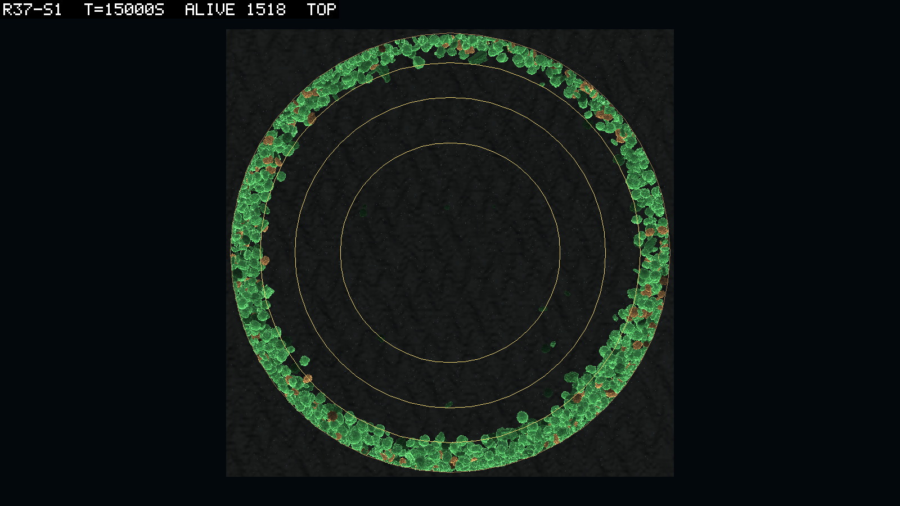
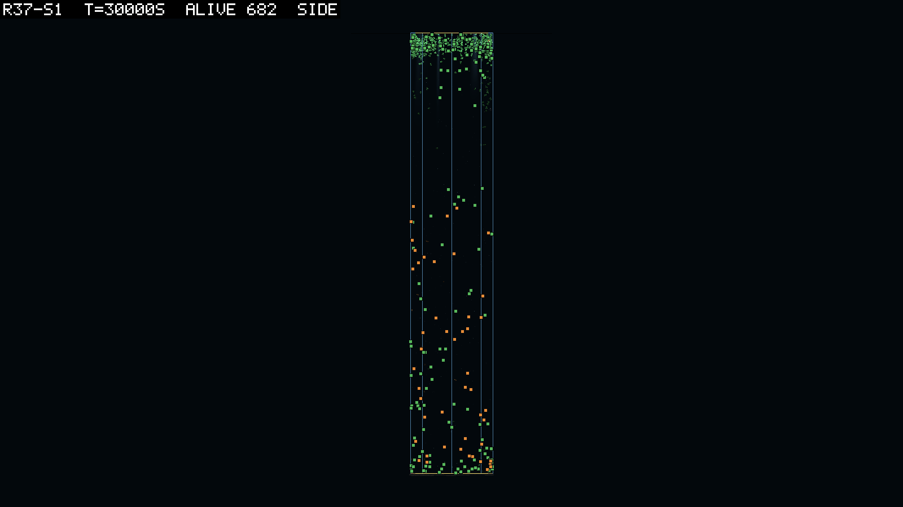

# 0094 — The glass, the centrifuge, and the throws that stopped

**2026-09-12, night**  ·  round 37 read against its pre-registration (logbook/0093): five seeds of the tank, on round 36's world

## In one paragraph

The world stood in the tank, five seeds of five on the population and four of five on the
goal rule, and it stood as a ring. The rim quarter held 45 to 98% of the bodies at every
named time in every seed. The drift was outward at every radius in every seed, and births
landed inward of their parents, so the crust is not the placer's and not the field's. It is a
drag-only body failing to turn with the water, which the owner named before the data did
(D090). The crowd was two to three times tighter than round 36's at the same abundance, and
the joint fared as it did in the box. The tank threw no body at all across a third more
jointed body-seconds than the box that threw 131. The last of those is the finding I
did not expect, and I read it, as inference, as the wrap's confession.

## Verification

Every header carries `space tank r=5.64 m (100 m2), depth 60, wall, bed`, `current 0.1 m/s
transport`, `dispersal=5 m`, `driveLimit >0.01`, `matterBudget 0`, `linkPhoto 0.5`, `dt=0.01`
and no `fluidAccel` token, which is the drag-only world 0093 registered; one build,
`simHash c50c465b…`, `coreHash e6797e6e…`, `configHash 96d4bce6`, `physicsJobWorkers 0`.
Every manifest reads `ended`, `budget`, at 30,000 s. `audit` 0.0000% and `mat resid` 0 on
all 300 rows of all five; `wraps` 0 on every row; no arm censored. The predictions were
committed three minutes after the first manifest was written and the launcher now refuses
that (0093's note).

## Results

| # | prediction | result |
|---|---|---|
| M0 | the world stands: `alive` at 30,000 s within 0.5 to 1.5 of round 36's | **holds, 5 of 5** (0.59, 0.96, 0.69, 1.25, 1.11); the goal rule, read not required, 4 of 5 against round 36's 5 |
| M1 | the glass does not gather: rim ring 15 to 40% at 5,000, 15,000 and 30,000 s in 3 of 5 | **fails, 0 of 5**: not one of fifteen readings in the band; the lowest 45%, the highest 98% |
| M2 | the middle is not empty: `cols` at least 60 from 5,000 s in 3 of 5; `x sd` 2.0 to 3.4 m | **holds on `cols` by the corrected count, 3 of 5**; fails on `x sd` (7 of 15 readings in the band; means 3.27 to 3.39 m, the ring's value is 3.99) |
| M3 | the crowd is round 36's: nearest neighbour within 0.8 to 1.25 of round 36's at 5,000 and 30,000 s in 3 of 5 | **fails, 0 of 5**: 0.29 to 0.83 raw; at matched abundance every one of ten anchors reads 0.33 to 0.67 |
| M4 | the joint's fate is the world's: seeds with at least 10 inherited jointed bodies at the end within one of round 36's one | **holds**: one seed (seed 3, 148, all inherited, above 100 for the last 10,000 s) |
| M5 | the water carries as the box's did: `mean m/s` within 0.7 to 1.3 of round 36's | **fails**: 2 of 5 at each time, 1 of 5 at both; the run means 0.68 to 0.71 of round 36's in every seed |
| M6 | no more divergence than the box: `diverged` at most twice round 36's plus 2 | **holds**: 0, 0, 0, 0, 0 against bounds of 68, 112, 42, 14, 36 |

**The ring, in the positions file.** Eight shells of equal area, so a spread disc reads
0.125 in each; the outermost shell held 0.28 to 0.81 of the bodies at the named times, and
the share within a metre of the glass, 0.32 for a spread disc, never fell below 0.21 over
thirty readings and sat at 0.70 to 0.79 by seed. The report's `cols` printed above 100 on
34 to 83 samples per arm, because its numerator counted any column a body stood in and its
denominator only the columns whose centres are inside the circle. The branch fixed the
report on the morning of the launch, and the read found its reader still counting the old
way. The corrected numbers in the table are from the reader as fixed tonight;
`logbook/specs/r37-read/cols-check.tsv` has both counts.

**Where the bodies went, and where the births went.** The change in a body's distance from
the axis over 100 s, by starting radius, whole runs, five seeds:

| starting radius | mean drift, m per 100 s | share moving outward |
|---|---|---|
| 0 to 1 m | +2.4 to +3.5 | 0.89 to 0.99 |
| 1 to 2 m | +2.3 to +2.8 | 0.89 to 0.95 |
| 2 to 3 m | +1.8 to +2.2 | 0.85 to 0.92 |
| 3 to 4 m | +1.1 to +1.3 | 0.83 to 0.90 |
| 4 to 5 m | +0.10 to +0.18 | 0.64 to 0.67 |
| 5 m to the glass | −0.30 to −0.34 | 0.33 to 0.35 |

Nine bodies in ten that start inside 3 m are further out a hundred seconds later. Births
went the other way: children's birth rings (`pt` on lineage rows, 17,000 to 21,000 births
per arm) put 12 to 16% in the rim quarter while the crowd that bore them sat 66 to 72%
there, so the dispersal disc, clipped at the wall, is a steady inward flux.

**The crowd.** The horizontal nearest-neighbour median was 0.04 to 0.12 m against round
36's 0.11 to 0.27 m, the three-dimensional one 0.18 to 0.84 m against 0.57 to 1.14 m.
Matched on abundance (the round 36 sample of the same seed nearest in time within 10% in
`alive`), every one of the ten anchors that found a match read 0.33 to 0.67 of round 36's;
seed 4 found none, its tank never holding a population round 36's box held. Depth is not
matched: the tank's mean depth swung from −1.4 to −56 m across the cycle where round 36's
sat at −17 to −22 m, so the two readings, a rim arc and a depth extreme, move together.

**The joint.** Seed 3 ended with 148 inherited jointed bodies, the largest end-of-run
jointed cohort of any round, above 100 for the last 10,000 s; seeds 2 and 4 carried 295 and
202 at their peaks and lost them by 27,300 and 25,600 s; seeds 1 and 5 lost theirs by 8,400
and 14,100 s. One seed of five at the end, as in round 36.

**The throws.** No arm wrote a `diverged/` directory. Jointed body-seconds, from `jnt inh`
summed over samples at the 100 s interval: 9.17 million across the tank's five seeds
against 6.91 million across the box's, where the box threw 131 bodies (19 per million). Zero
in 9.17 million bounds the tank at 0.33 per million, a floor of about fifty-eight times
fewer.

**The cycle.** Peaks 8,200 to 10,300 s apart in seeds 1, 2 and 4, ragged in 3 and 5;
`alive` between 286 and 1,894 over t ≥ 5,000 s, a peak-to-trough ratio of 1.9 to 5.4
against the box's 1.1 to 4.0. The rim share at a trough is not systematically above the
share at a peak (0.81 against 0.64 in seed 1, 0.64 against 0.92 in seed 5), so the crust is
not the cycle. Stillbirths (2, 14, 5, 183, 56) and crowded conceptions are in the box's
range despite the crowding at the glass.

## What the numbers mean

**M1 and M3, together.** The tank gathered, and the data say how. Not the placer: births
land inward. Not the field: the gyre's radial flow at the glass is below 1e-6 by
construction (`GyreTests`), and the streams' tracer check (D090) showed a perfect parcel of
water keeps its spread in the gyre as in any divergence-free field. What is left is the
body: a lagging body on a curved streamline fails to turn as sharply as the water and drifts
outward by about `τ·u_θ²/r` a second, which is a centrifuge, and this read is the
centrifuge measured in the world's own positions, outward at every radius in every seed
with the drift falling to zero only at the glass because there is nowhere further to go.
The owner named it before the read did, and D090's fluid acceleration force is the term
that removes it; the crowd of M3 is the same fact seen from inside the ring. Under 0093's
two-sided reading M3's failure sends round 38 to read against round 37 rather than 36, and
D091 sends it further, to 37b, the first tank without the centrifuge.

**M2.** The middle was not empty, only thin: 45 to 90 of the 100 live columns held a body
at the named times, and a ring one or two bodies deep against the glass still reaches most
columns of a 5.6 m tank. `x sd` read the ring, 3.3 to 3.4 m against 2.8 for a spread disc
and 4.0 for a line at the glass, with maxima above 4.0 at the peaks, which says the crust was
a clumped arc and not an even ring. The picture agrees.

**M4 and M5.** The joint did in the tank what it did in the box, one standing seed of five,
and seed 3's 148 is the record's largest; the container changed nothing about its fate,
which is what M4 asked. `mean m/s` read 0.68 to 0.71 of the box's in every seed with the
named-time readings scattered either side of 0.7, and I read that as the crust reading its
own water: the gyre's swirl and its radial flow are both zero at the glass by construction,
so a crowd pressed to the glass sits in the slowest water in the tank whatever the field's
RMS. It is an inference from the field's form, not a measurement of the field, which no run
file records.

**M6.** This is the result of the round. The tank carried a third more jointed body-seconds
than the box and threw none, where the box threw one jointed adult per fifty thousand
jointed body-seconds. The box's throws began with D088, the round the current first carried
every body across a seam about once per hundred seconds (rounds 34 to 36 wrapped in every
window; round 33, before it, diverged three one-part bodies by contact and no jointed
adult), and the tank has no seam. I read the wrap as the throw's mechanism: a multi-link
body carried across the seam is moved by a teleport of its transform, and an articulation
teleported with its velocities kept, or with one link's contact still on the far side, is
the kind of state the solver leaves at 10³¹ metres. That is an inference from a between-
rounds comparison with many differences in it (the gyre for the transport field, a masked
grid, ring patches, a crowd at glass), and the record's caution about diagnosis by
coincidence applies. But it explains why the limiter's check found the same throws with the
drive bound (D089's check 4), why the mass-ratio search found ratios that do not move under
growth, and why the trace built for round 37b will have nothing to trace if the tank is the
base. So the trace stays as an instrument, the mass-ratio cap is not proposed, and 37b's
`diverged` column is the confirmation: zero again in a tank with the same joints is the
wrap's confession signed; a throw in 37b reopens the question with the trace in hand.

**The cycle.** A 10,000 s swing of a factor of three, wider than the box's, not driven by
the rim share, and I do not have its mechanism. The candidates are the ones a ring world
offers, a producer crust that shades itself and starves the eaters beneath it until it
thins, and a depth oscillation the side view shows (the whole population at −1.4 m at one
peak and −56 m at another). 37b reads the cycle's amplitude as a bar (0095): if the crust is
its cause, the even world damps it.

## What the pictures show

Seed 1 from the top at 5,000 s: a lopsided ring, an arc packed on one side, the centre ring
empty, the swirl legible in the arrangement, 752 bodies. At 15,000 s the same seed is a
ring one or two bodies deep at the glass and nothing inside it, and from the side the
whole population of 1,518 sits in the top three metres of a sixty-metre tank; the close view
is a flat green wall with orange eaters embedded, pressed to the glass. At 30,000 s the ring
is still there, all producers, the centre empty, but the side view shows a second, sparse
community through the whole depth and on the bed, eaters among them: the crust did not take
the whole world with it. Seed 3 at 5,000 s is sparser, mostly rim, small eaters scattered
inward. The tank world of round 37 was two-dimensional twice over, a ring and a film, which
is what D090's streams keep both the radial and the vertical flow off the wall to undo.

## Verdict

The container held (M0, M4, M6) and gathered (M1, M2's spread, M3, M5), and the gathering is
the drag-only body's and not the glass's. Round 37 stands as measured under its build and is
not the tank's base; round 37b, the same world on the streams with the fluid acceleration
force, the throw trace, the conservative transporter and the wall clearance (D090 as
amended, the Astra review's F1 and F2), is, and reads M1 to M3 as a fresh baseline with the
cycle's amplitude and the throws' absence beside them. The wrap as the throw's mechanism is
the round's unlooked-for finding and 37b's `diverged` is its test.

## Sources

`logbook/specs/r37-read/` (the read's tables and scripts: `timeline-every1000.txt`,
`verdicts.txt`, `radial-hist.tsv`, `dispersal.tsv`, `nn-matched.tsv`, `cols-check.tsv`,
`exposure.tsv`, `cycle.tsv`, `diverged-anatomy.tsv`), `logbook/specs/r37-read/brief.md`,
`runs/r37-s1` to `r37-s5` (manifests and hashes above), `scratch/snaps/r37-s1/` and the two
frames beside this entry, `logbook/0093`, D089, D090, D091,
`gpt-astra-2026-09-12-1308-review-response.md`.
