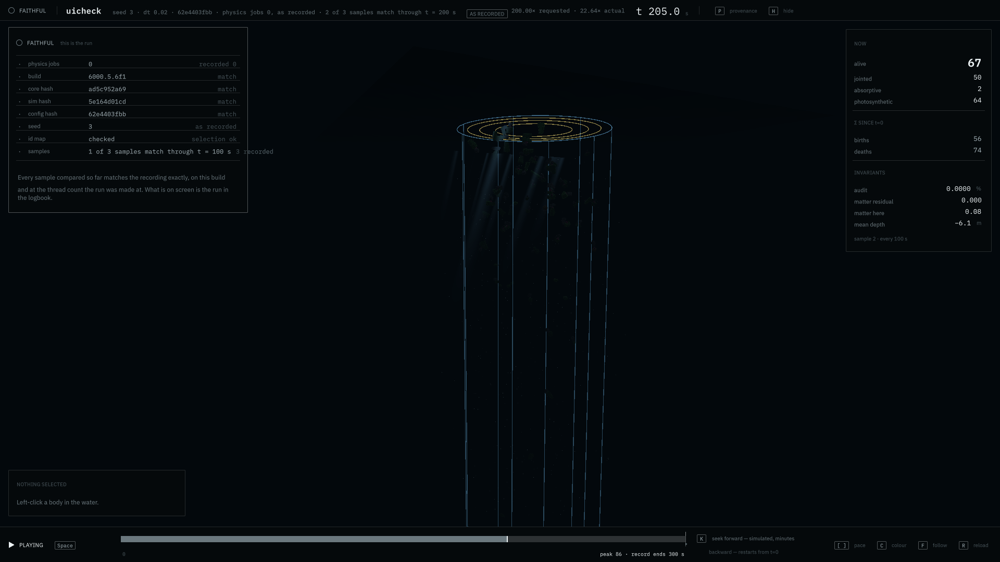
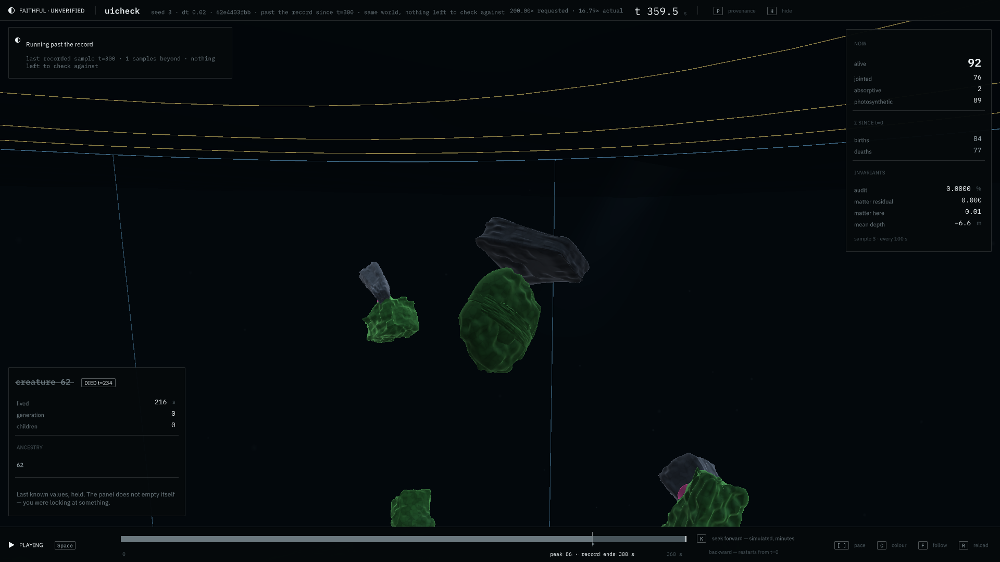
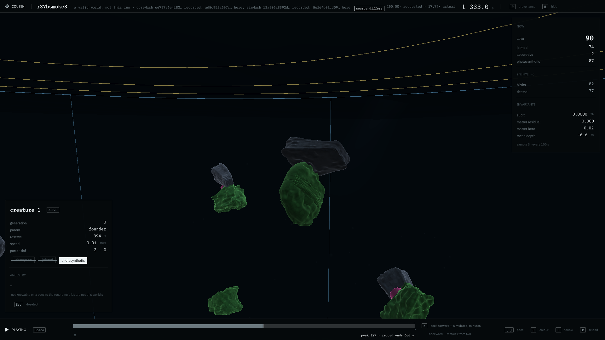
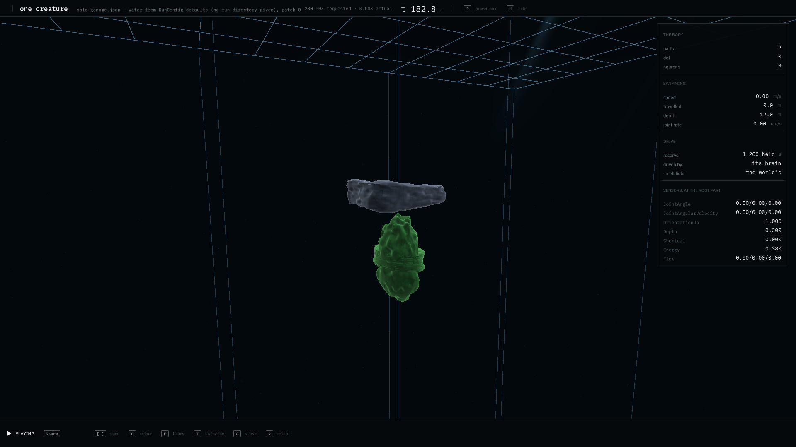
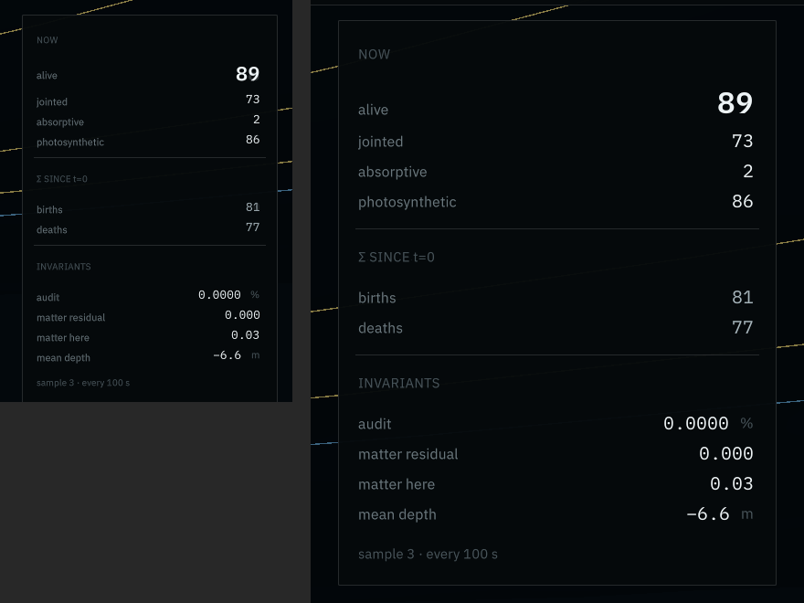

# 0096 — The theatre gets a face that checks itself

**2026-09-13, night**  ·  the theatre's interface built from the owner's design (`design/SPEC.md`) by a subagent from two specs, run seven times in the Editor on worker 6, read from its own pictures; branch `theatre-ui` merged into main

## What was asked

The owner designed the theatre's interface on 2026-09-12 (`design/SPEC.md`, the canvas
mockup and its stylesheet, three reference frames the chrome has to stay legible over)
and left the open points to the agent. The decisions are in
`logbook/specs/theatre-ui-spec.md`: the vermilion plate fires on the two identities (the
energy audit and the matter residual) and on no reading a healthy world moves; "faithful"
always carries its coverage and the thread caveat is its own state; `H` hides every panel
and the record's snapshots stay chromeless; IBM Plex is committed with its licence; the
owner's monitor is 3840 wide, so a second density step at 3400 exists beside the design's
2240. The test plan is `theatre-ui-test-spec.md`: an end-to-end entry in Play mode in the
project's own style, pictures the agent reads, and `simHash` unchanged.

## What was built

UI Toolkit under `unity/Assets/Theatre/UI/`: the document (399 lines, 106 named elements),
the stylesheet ported from the design's (`theatre.uss` stays the authority for every visual
value), the three Plex faces with `OFL.txt` beside them and four font assets that rasterise
from them at runtime, `TheatreUi` (the strip, the transport bar and timeline, the census,
the provenance popover, the inspector in its states, the solo census), `LineageIndex`
(streams `lineage.jsonl` on the first selection), `TheatreUiCapture` (the world camera and
the panel into one texture, read back), and under `Editor/` the font build and
`TheatreUiCheck`, the end-to-end. The IMGUI overlay is gone from `TheatreRunner`; the
matter residual joins the census from the same four terms the report's `mat resid` uses;
`theatre-snap.ps1 -Chrome` photographs the interface over a frame. Nothing under
`Assets/Evosim` moved: the fixture recorded on the merged tree carries `simHash 5e164d01`,
the same as round 37b's arms.

Seven questions the design left to the Editor were answered from the shipped assemblies
and the font binaries before building on them: no `text-decoration` (the struck reading is
a drawn rule), no `line-height` (a fourth font asset carries the prose leading), `rotate`
exists, fonts named directly rather than through a variable, no C# route to a custom
property (the density step is two classes on the root), no play glyph in any face (drawn
with `Painter2D`), Σ in Sans only.

## How it was tested, and what each run found

`TheatreUiCheck.Run` enters Play mode on a worker with no person at the Editor, drives the
runner through its states one phase per tick, and asserts every field against the values
the replay holds, with an independent count from `lineage.jsonl` for a dead creature's
panel. It writes the interface at 1920 by 1080 and at 3840 by 2160 for every state, and
exits 0 or 1. Three arms: the fixture (`uicheck`, a 300 s smoke of round 37b's world at
dt 0.02), a cousin (`r37bsmoke3` under `EVOSIM_THEATRE_OVERRIDE=1`, recorded on the same
tunables under a different `simHash`), and a solo genome from the fixture's snapshot.

| run | world | cousin | solo | what it found |
|---|---|---|---|---|
| 1 | 60 / 0 / 2 | ran as solo | 6 / 0 | `ScreenCapture` writes nothing under `-batchmode`, so no picture existed; the cousin named in the test spec (`r37-s1`) cannot be opened by this build at all (its config predates two tunables), and a run that did not open was read as solo mode |
| 2 | 60 / 0 / 2 | 55 / 6 / 2 | 6 / 0 | pictures land through the texture route; the cousin showed the recording's lineage as this body's (creature 149's ancestry from another world's file); the timeline's three end labels drawn on one spot; the font atlases never persisted (dynamic by accident) |
| 3 | 69 / 3 / 2 | 67 / 3 / 2 | 14 / 0 | the cousin's ids read unverifiable, ancestry and the dead panel withheld, live readings kept; the labels apart; the density step measured in the picture (strip 66 px, padding 30 px) and the type still 13 px; the new overlap assertion read a 640-wide Game View whose axis has no length |
| 4 | 77 / 0 / 3 | 75 / 0 / 3 | 20 / 0 | the type takes the step (20 px measured) after the custom-property route reached nothing and 28 literal mirrors carried it; the rows did not, so 20 px type sat in 22 px rows |
| 5 | 81 / 0 / 3 | 79 / 0 / 3 | 20 / 2 / 2 | the rhythm (70 rules: spacing tokens, row heights, paddings, panel widths) takes the step, and the 3840 panel is the 1920 one at 1.5; the row-height assertion read a row the solo census lacks; the axis's end label spilled past the axis into the seek note |
| 6 | 79 / 0 / 5 | 77 / 0 / 5 | 24 / 0 / 2 | the end label clamped inside the axis, clear of the note; the widened overlap assertion found no labels and skipped, because a UQuery from an element includes the element itself, so every label read as a parent |
| 7 | 81 / 0 / 3 | 79 / 0 / 3 | 26 / 0 / 0 | the leaf test fixed; every assertion that can run on these three arms runs and passes |

The counts are passed / failed / skipped. The three skips that remain are honest ones: a
run with no warning cannot show the warning text, a faithful run cannot produce the
unavailable state (the cousin run does), and the bar's labels are read under the captures
rather than in the 640-wide Game View, whose axis has no length.

## Two rulings the runs forced

**The type scales at 3400.** The design rules out uniform panel scaling ("the water gains
the area, not the chrome") and its stylesheet says the type scale never changes. On a
3840-wide monitor that leaves 13 px type, which the agent could not read in the picture,
and the furniture alone at 1.5 times made the panels look emptier rather than larger. The
ruling (the owner delegated these on 2026-09-12): a second density step is the design's own
mechanism, not the scaling it forbids, so the type and the rhythm take the same 1.5 at
`.is-wider`. It is recorded in the build spec's item 5 and can be reversed in one block.

**A cousin's ids are unverifiable.** The runner's id map is sound on a cousin (a click
names the body on screen), but the recording's `lineage.jsonl` belongs to another
realisation, and the first cousin picture showed creature 149's ancestry read out of a
file about a different creature 149. So in the cousin state the provenance row says
unverifiable, the ancestry block says why, a dead id shows the unavailable state, and only
what the live body carries (generation, parent, reserve, speed, parts, guild) is shown.

## What the pictures say

The popover names the build, both hashes, the config hash, the seed, the thread count and
the id map, each with its verdict word at the right, and says in prose what "faithful"
means; the census at the right carries the two identities at 0. Spec §9's items read from
the frames: the states are distinguishable in greyscale (a filled circle, a half circle, a
diamond and the word beside each); a digit changing does not reflow (the numerics sit in a
fixed-width column); a warning arriving does not reflow (the plate has its own slot under
the strip); and the centre of the frame is clear in every state. Item 7, legibility over
the bright surface frame, is not read: the chrome capture takes the fly camera's view, and
the sky view is the snapshot camera's, so no chrome frame over the bright surface exists
yet. It is on the unverified list below.

The dead panel: the name struck through, the death time on the badge, lived, generation
and children from the lineage file, and a line saying the panel holds its last values
rather than emptying itself.

The cousin: the diamond, "a valid world, not this run", both hashes as recorded and as
here, "source differs" on the badge; the inspector shows the live body's readings and, for
ancestry, a dash and the reason.

Solo mode: the same strip, a census of the body (parts, dof, neurons), its swimming, its
drive, and its sensors at the root part; no global-brain readout anywhere.

The census panel at 1920 (left) and at 3840 (right), at one pixel each, after the fifth
pass: the type, the rows and the paddings all at 1.5, so the wide panel is the narrow one
at a larger size rather than an emptier one. The whole 3840 frame is beside the entry
(`images/theatre-ui-selected-3840.png`): the world keeps the area, the chrome keeps its
proportions.

## What is not verified

The interface has not been used by a person: every state was reached by the check's
calls, not by a click or a key, and the fly camera's chrome-over-world composition has
been seen only in the capture. The chrome has not been seen over the bright surface frame
(spec §9 item 7), which needs the chrome capture to take a snapshot view rather than the
fly camera's. A player build has never been made; the font assets need
their TTFs at runtime and the theatre has only ever run in the Editor. The prose leading is
baked into one font asset at the base step, so prose reads relatively tighter at 3840. Why
a custom property declared under `.is-wider` reaches nothing is unsettled; the stylesheet
carries the same six numbers twice, with a comment saying to move both.

## Where things are

- Specs: `logbook/specs/theatre-ui-spec.md`, `theatre-ui-test-spec.md`; the design in
  `design/`.
- The build: branch `theatre-ui`, eleven commits (`69e2d35` to `39f3aad`), merged into main.
- The check's logs: `scratch/logs/theatre-ui-check7-*.log`; the pictures of every state:
  `scratch/snaps/ui/`; the ones this entry cites, beside it in `logbook/images/`.
- Run the check: `TheatreUiCheck.Run` with `EVOSIM_THEATRE_RUN` (a world),
  `EVOSIM_THEATRE_GENOME` (solo) or `EVOSIM_THEATRE_OVERRIDE=1` (a cousin), `-batchmode`
  without `-quit` and without `-nographics`, on a worker; `scratch/theatre-ui/w6-ui-chain7.ps1`
  is the chain that ran it.
