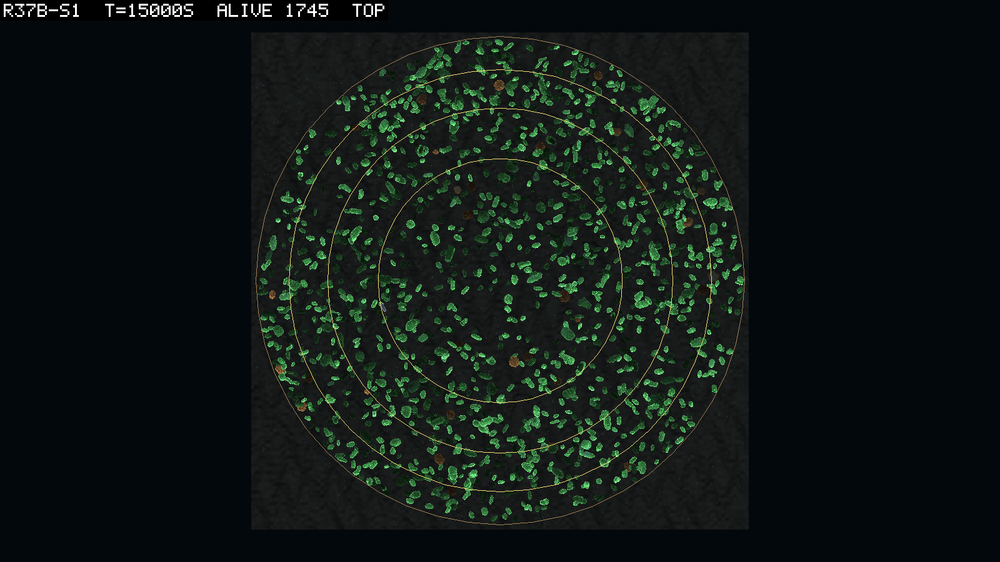
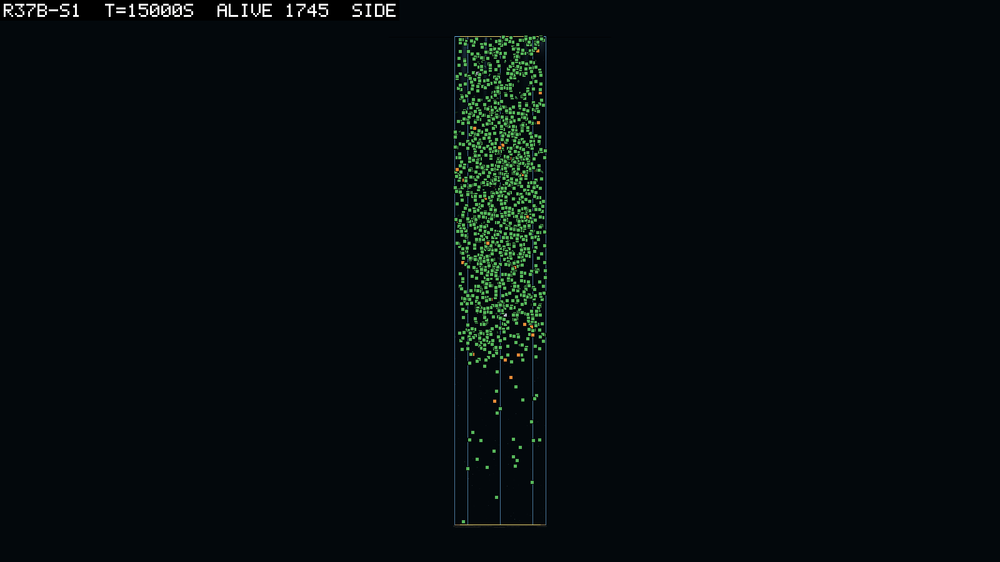
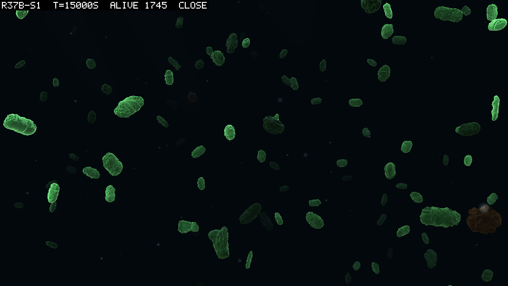

# 0097 — The water carried, and the tank threw

**2026-09-13, afternoon**  ·  round 37b read against logbook/0095's nine predictions; five seeds on one build, four to their budget and one censored at 29,200 s; the read's files in `logbook/specs/r37b-read/`

## What the round asked

Round 37b is a replacement (D091). It is round 37's tank with the water carrying bodies as
water does: D090's streams and the acceleration force at 1. Beside them are the conservative
transporter, the whole-body wall clearance and the corrected `cols`. On the
owner's ruling it replaces round 37 as the tank's base.

0095 pre-registered nine predictions of what the carried water would do. It asked for no
gathering at the glass (M1), a filled middle (M2), the box's crowd (M3), the box's water
speed (M5) and a damped cycle (M7). It asked that the joint's fate be unchanged (M4) and that the population land within half
to one and a half of round 37's (M0). It asked for no throws (M6) and a pace held (M8).

The rules V1 to V4 hold on every row. The headers and hashes are as recorded. The audit
reads 0.0000% and the matter residual 0 on all 1,492 rows, `wraps` reads 0, and a trace
file sits beside all 43 dumps.

Seed 5 is censored. It wedged at 29,200 s. Every file of the run stopped at 14:29 while the
process burned a full core for 36 minutes, the signature of the campaign's first hang
(logbook/0043). The discriminator confirmed it twice and the arm was stopped as
`manual-stall` (0095's launch section). Its numbers below are read at its last sample and
marked. The cause is as unknown as the first's. The seed that wedged is also the seed that
threw 37 of the round's 43 bodies, which is one case and no more.

## What it looked like

Seed 1 from above at 15,000 s, 1,745 alive: the disc filled to the glass with no ring and
no crust, the eaters scattered among the leaves. Round 37's same seed at the same time was
a ring at the glass (0094). Seed 2 at 5,000 s shows one denser patch at the rim on one
side. It is a clump rather than a ring, and the angular histogram below says the clumps are
small.

From the side the crowd is a cloud through the top 40 m, with a sharp lower edge and a few
bodies below it. Round 37 kept a three-metre film over a deep scatter.

In the close view the bodies read as rounded lumps. That is the skin's doing rather than
the genome's. The moving links in the jointed seeds are 94% boxes. The skin draws them as
near-cubes, with a corner radius a third of their smallest half-extent and the pillow on
top, so a box reads as a ball. The owner saw it first and asked whether it was intentional.
It is not. It hides the shape that matters most to a paddle, and a theatre fix is queued.

## Results

| # | prediction | result |
|---|---|---|
| M0 | `alive` at 30,000 s within 0.5 to 1.5 of round 37's | **fails on the upside, 3 of 5**: 2.46, 1.11, 1.99, 1.07, 0.96 (1,674 / 1,735 / 1,840 / 1,782 / 1,764 against 682 / 1,557 / 925 / 1,660 / 1,831) |
| M1 | the rim quarter holds 15 to 40% at the three times | **holds, 5 of 5**, all fifteen readings 0.19 to 0.27; no sample of any seed above 0.40 |
| M1 | the mean radial drift within ±0.5 m in every bin inside 4 m | **fails as written, 0 of 5**; the threshold was ill-posed (below) |
| M2 | corrected `cols` at least 60 from 5,000 s; `x sd` 2.0 to 3.4 m | **holds, 5 of 5**: the minimum 98 of 100 in every seed; `x sd` 2.66 to 2.90 against 2.82 for a spread disc |
| M3 | the nearest neighbour at matched abundance within 0.8 to 1.25 of round 36's | **holds, 6 of the 9 anchors** that matched (0.99 to 1.32); the three misses are all above the band |
| M4 | seeds holding 10 inherited jointed bodies at the end within one of round 37's one | **holds**: 2 (seed 4 with 38, seed 5 with 102 at 29,200 s) against 1 |
| M5 | `mean m/s` within 0.7 to 1.3 of round 36's at 5,000 and 30,000 s | **holds, 5 of 5**, all ten readings 0.81 to 1.24; round 37 read 0.68 to 0.71 |
| M6 | `diverged` 0 in at least 4 of 5, every dump traced | **fails on the count, 2 of 5**: 0, 0, 1, 5, 37; every dump has its trace |
| M7 | the peak-to-trough ratio of `alive` after 5,000 s below 2.5 | **holds, 5 of 5**: 1.79, 1.28, 1.66, 1.85, 2.35 against round 37's 1.9 to 5.4 |
| M8 | wall clock per 1,000 s within 1.5 of round 37's | **4 of 5** as written (1.51, 0.78, 1.46, 0.78, 1.09); per living body 0.72 to 1.04 |

The goal rule, read and not required: five of five, seed 5 censored. The passing clades are
rigid eaters in four seeds, founded at 8,210, 1,498, 4,567 and 5,273 s. They hold 146, 26,
74 and 64 alive at the end. The fifth is seed 1's founder line (root 70, born at 25 s, 51
alive). Seed 3's passes at the floor of the stability clause, 26 through the last two
lifetimes.

## The water was the tear

The centrifuge is gone. Round 37's rim quarter held 45 to 98% of the bodies. This round's
holds 19 to 27% at every named time in every seed, and never passes 40% in any sample. The
radial histogram in eight equal-area shells reads 0.095 to 0.160 against 0.125 for a
uniform disc. Round 37's outermost shell read 0.28 to 0.81. The share within a metre of the
glass is 0.27 to 0.36 against 0.32 for a spread disc (round 37: 0.70 to 0.79). The angular
histogram in twelve sectors has a max-to-min of 1.4 to 2.3 and a resultant length of 0.03
to 0.12. So the clump in seed 2's picture is the eddies' doing, and it is small.

M1's second clause failed for a reason that is the prediction's and not the world's. It
asked the mean change in a body's radius over 100 s to lie within half a metre in every
bin inside 4 m. A body drawn from a uniform disc and put back anywhere in it 100 s later
drifts outward from the centre bins by construction. The mean radius of a disc is two
thirds of its radius. So the fully-mixed bound is +3.0 m from the innermost bin and +2.2 from the next. Water at
0.1 m/s moves a body metres in 100 s. Every bin in every seed sits
at 0.40 to 1.14 of that bound. The pooled net flux over all radii is +0.0025 to
+0.0032 m per 100 s. Round 37's was +0.020 to +0.049, and outward in every bin including
the rim's. Read against the bound rather than against zero, the drift says
"mixed"; the threshold was not a test of a mixed disc. The clause is recorded as failed
and the reading as the one the mechanism needed.

The crowd is the box's again. At matched abundance the nearest neighbour is 0.99 to 1.32
of round 36's, where round 37's was a third to two thirds. The three anchors outside the
band are looser than the box rather than tighter. Six of the fifteen anchors found no match,
because no round 36 box ever held 1,674 to 1,840 bodies. The depths at the matched pairs
are the box's too (mean −12 to −22 m, spread 8 to 13 m), so 0094's depth confound is
closed. The water carries at the box's speed: `mean m/s` 0.81 to 1.24 of round 36's, the
crust's slow water gone with the crust.

The cycle was founding. Every trough in every seed is the 5,000 s sample, and the
ratios are 1.3 to 2.4. The rim share at peak and trough alike is 0.18 to 0.27. So the
population swing of round 37 was the crust's after all, and there is no cycle left to
explain.

M0 failed on the upside. Seeds 1 and 3 hold 2.0 and 2.5 times what round 37's held, because
round 37's crust starved them (682 and 925 at the end). Seeds 2, 4 and 5 are within 11%.
The band was symmetric and should not have been. A world without the crust was always going
to hold more, and the reading is that the crust cost round 37 half its population in two
seeds.

The pace was 1,274 to 1,579 wall seconds per 1,000 simulated, against round 37's 856 to
1,694. The concurrency was similar, four to five arms each, but the crowd was much larger.
Divided by the mean living population the ratios are 0.72 to 1.04, so the force costs
nothing detectable per body. Seed 5's figure carries the wedge's 36 minutes.

## The tank threw

Round 37 threw no body across 9.17 million jointed body-seconds, and 0094 read the wrap as
the throw's mechanism, as inference. This round threw 43 across 11.1 million, 3.9 per
million against round 36's 19.0 and round 37's 0. So the wrap was not the whole mechanism,
and the inference falls.

The traces say one thing about all 43. Every one is a two-part jointed body. In 40 of 43
the body is aged three seconds or less at the dump, median half a second, so they blow up
at or just after birth. The joint mass ratios are 1.00 to 2.37, none near the 10:1 rule the
search named. None is within five steps of a resize. The root's radius at the dump is 0.16
to 5.53 m, and none is outside the glass. That leaves 12 of 43 within a metre of it, which
is a spread disc's share. So the wall, the mass ratio and the resize are all excluded.

The clusters share parents: 18 of 43 come from seven parents, all themselves jointed and
long-lived. One in seed 5 lost all four of its children this way, another five of eight.
That reads as a heritable body plan that cannot survive its first seconds in this water, as
inference from the clustering and not from a measured force.

The instrument missed the onset. The trace keeps a three-frame ring of every link's
position and velocity, and in 42 of 43 dumps all three frames are already non-finite. The
ring is written after the check that fires it, so the last finite step is gone. One dump
caught finite frames, because it died on the height guard rather than on a non-finite
value. That was seed 4's id 702, aged 653 s, thrown to +60.8 m with a finite 5.6 m/s and
80 rad/s. The trace as built cannot say what the first bad force was. That is the fix
queued before anything is proposed: keep the ring of the last finite frames, and capture
the frame before the one that fails.

Why this round throws newborns and round 37 did not is open, and a control is cheap. It is
seed 5, the seed with 37 of the 43, on this build with `fluidAccel 0`, so that the force is
the one thing that differs from the streams alone. It is a replay of a scored condition and
launches beside the fresh seeds. The mass-ratio cap is not proposed: the traces exclude it.

## Two more readings

The fields are as even as the crowd. `patch max share` over four equal-area rings reads
0.26 to 0.46, with means of 0.28 to 0.29 against 0.25 for even. Round 37 read 0.45 to
0.98, and `det patch sd` averages 0.03 to 0.06 against round 37's 0.08 to 1.31.

There are no pockets by ring. That is what the pockets question expected of a well-mixed
tank. It is also why the `field cv` column is built and waiting: a ring statistic cannot
see a pocket smaller than a ring.

Stillbirths rose: 12 / 196 / 449 / 201 / 181 against round 37's 2 / 14 / 5 / 183 / 56,
with `crowded` 0 everywhere. The wall clearance at birth is the obvious suspect and the
larger crowd the other; nothing in the output separates them, so it is recorded and not
read.

## Verdict

Round 37b holds M1 (the rim), M2, M3, M4, M5 and M7. It fails M0 on the upside and M1's
drift clause on a threshold that could not be met by a mixed disc. It fails M6 on 43
throws, and M8 in one seed by a hundredth. The water was the tear. The mechanism
predictions that named the crust all hold, and the tank without a centrifuge is the box's
crowd at the box's speed with a filled middle. Round 37b is the tank's base as ruled
(D091), read as a baseline and not as round 37 repaired. The fresh seeds run on it, round
38 dilutes it and reads against it.

Three things stay open, ahead of the fresh seeds' read. The first is the throws, with the
trace fixed to catch the step before the blow-up and the one-part control at
`fluidAccel 0`. The second is the wedge, one case. The third is the stillbirths.

## The control's launch

*15:39.* `r37bc-s5` launched on worker 6 from `rounds/launch-r37b.ps1 -Seed 5 -FluidAccel 0
-Name r37bc-s5`. Its header was verified
(`space tank r=5.64 m (100 m2), depth 60, wall, bed`, `fluidAccel 0`, `dispersal=5 m`,
`driveLimit >0.01`, `linkPhoto 0.5`, `addedMass 0.5`, `dt=0.01`, seed 5),
with `simHash 5e164d01…` and `coreHash ad5c952a…` as
the round's, `configHash f203818b` (the force is the one changed tunable) and
`physicsJobWorkers 0`. It is a replay of a scored condition and not a round. It is read on
`diverged` and the traces' anatomy against seed 5's 37, and on the rim quarter. Without the
force the streams alone should gather, since D090's tracer check read 0.83 to 0.98 at the
rim for a lagging body.

## Addendum, 2026-09-14 small hours: the control

`r37bc-s5` ended on its budget (30,000 s, 1,422 alive, the goal rule passed by a rigid
eater clade of 111 founded at 3,021 s). Beside seed 5 with the force, the same seed on the
same build without it:

| | with the force (seed 5, to 29,200 s) | without it (`r37bc-s5`) |
|---|---|---|
| `diverged` | 37 | **0** |
| stillbirths | 181 | **0** |
| rim quarter at 5,000 / 15,000 / 30,000 s | 0.27 / 0.22 / 0.23 | **0.46 / 0.42 / 0.51** |
| `mean m/s` | 0.07 to 0.09 | 0.03 to 0.05 |
| inherited jointed at the end | 102 | 2 |
| `alive` at the end | 1,764 | 1,422 |

The comparison has three readings.

The force is causal for the throws, per jointed birth and not only per run. The joint also
thinned without the force, from 152 inherited jointed bodies at 5,000 s to 2 at the end, so
the control had fewer jointed newborns to throw. Counted from the lineage files, seed 5
with the force threw 37 in 2,744 jointed births, 1.35%. The control threw 0 in 1,421, where
that rate predicts 19. Round 37's seed 5 threw 0 in 1,154.

The stillbirths are not the force's. A stillbirth is a genome that developed into no parts
at all (`World.Stillbirths`, a development count), so no fluid term can make one. The force
changed which lineages bred, and the lineages it kept, the jointed ones, are the ones whose
children sometimes develop into nothing. Either way, 0097's suspicion of the wall clearance
is withdrawn.

The force is what the round was for. Without it the streams alone gather 42 to 51% of the bodies in the rim quarter, as D090's
tracer check said a lagging body would. Without it the bodies also move at half the
water's speed. So M1 and M5 are the force's doing. The world needs
the term and the term throws one jointed newborn in a hundred.

The field itself, sampled without a body in it (`scratch/accel-probe/`, the closed form
at 12 million points per seed over 20 instants), says the mechanism is not the force's
size. The largest water acceleration anywhere in the live tank is 0.12 m/s², so a
neutrally buoyant part feels at most 1.9% of its own weight. The difference across a
newborn's 0.02 m is at most 4.5e-3 m/s², and the field moves by 1e-5 m/s² in a physics
step. Neither the axis nor the glass is singular: a smooth bowl, both rims four times the
floor.

The field is roughest at the glass, where the closed form is clamped with a kink in its
derivative. There the nine-sample stencil disagrees with it by up to 55% within 0.02 m of
the wall, because the stencil straddles the kink. The tank does not use the stencil. A
second scan returned no non-finite and no large value anywhere. It made three million calls
per seed at exact boundaries, outside the glass, above the surface, below the bed, at
t = 0 and before it. A NaN in gives a NaN out, and a body already at 10³¹ m gets ordinary
water back, which is downstream of a throw and not a cause.

One number from that scan bears on the anatomy. The water's speed peaks at the axis,
0.94 m/s where the RMS is 0.1, and the thrown newborns' birth rings skewed inward. So
whatever throws a newborn is not a large force. It is something the term's application does
to a body in its first steps in fast water, or a body plan that only the force-carrying
world breeds. The trace's second pass (the last finite frames with the forces in them,
`throw-trace-spec.md`) is the instrument that will say which.

One caution on the control itself. The with-force rate per jointed birth is
lineage-clustered, 0, 0, 0.08%, 0.25% and 1.35% by seed. So one control realisation at 0 in
1,421 is strong beside round 37's 0 in every seed without the force, and it is not proof on
its own.

The genomes say how clustered. All 43 dumps carry their genome (`scratch/throw-parents/`,
against 1,591 jointed adults from the snapshots nearest each dump). Every thrown body's
link is a hinge or a twist-hinge, where 18% of the jointed population carries a multi-axis
joint. The thrown are small adults, adult scale 0.26 to 0.32 for nine in ten against a
population spanning to 1.0. They are born at a large fraction of that size: the 90th
percentile of the birth fraction is 0.89 against 0.68. Their link is a third larger
relative to the root, and their drive power never falls below 12 W where the population
reaches 7 W.

Six of the seven parents that lost two or more children are near-identical genomes in
seed 5. Each is a sphere root and a box link on a hinge at 13.7 to 15.0 W, limits 1.22 to
1.26 rad. That is one lineage rather than seven draws, breeding at 2,300 to 5,900 s of age.
So the throw is a body plan's. It is a small two-part hinge body driven at full power from
its first step, the failure round 34 found in adults (the unthrottled stroke, 0090),
arriving in newborns.

What the force does, as inference, is ecological. It is the world in which that lineage
stands: with the force seed 5 held 100 to 260 jointed bodies, and without it the joint
thinned to 2. So it is the world in which that lineage's children are born to be thrown.
The mitigation is therefore neither the force's nor the mass ratio's. It is the drive's,
which is round 41's question and the owner's. The trace's second pass comes before any
proposal, and says what the joint did on the step before the blow-up.

## Sources

`logbook/specs/r37b-read/` (the brief, `summary.tsv`, `p3-share.tsv`, `drift.tsv`,
`radial-hist.tsv`, `nn-matched.tsv`, `exposure.tsv`, `diverged-anatomy.tsv`,
`diverged-lineage.tsv`, `cycle.tsv`, `pace.tsv`, `eaters.tsv`, `fields.tsv`, `verdicts.txt`,
the scripts); the pictures in `scratch/snaps/r37b-s*/` and `scratch/positions/r37b-s*/`;
the three beside this entry.

A subagent did the read from the brief, and I checked it against the reports' end rows, the
exposure and pace tables and the manifests.

*2026-09-15, 04:00.* Seed 5's frames at 5,000 and 15,000 s exist now
(`scratch/snaps/r37b-s5/`), taken by hand after the render queue passed the stopped run
over. A stopped run writes no Ended footer, and the queue reads the manifest as well since
this morning. At 15,000 s the disc is filled evenly to the glass. Eaters sit in every
ring, with the thin two-part jointed bodies of its standing population among the leaves. It
is the same world the other four seeds showed.
