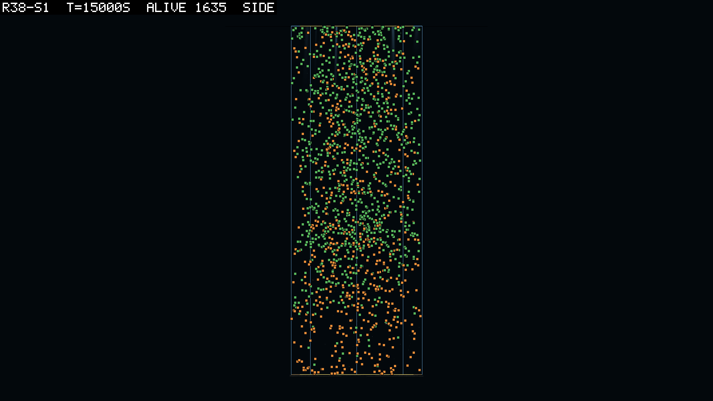
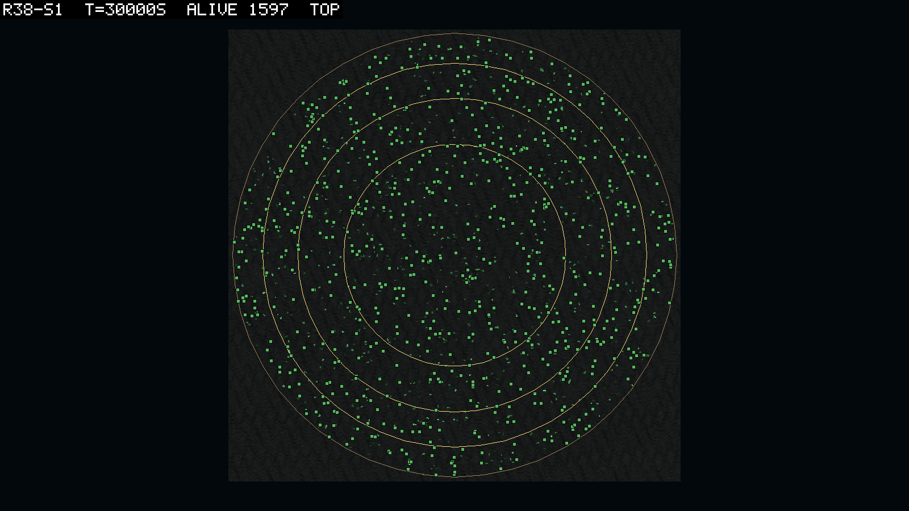
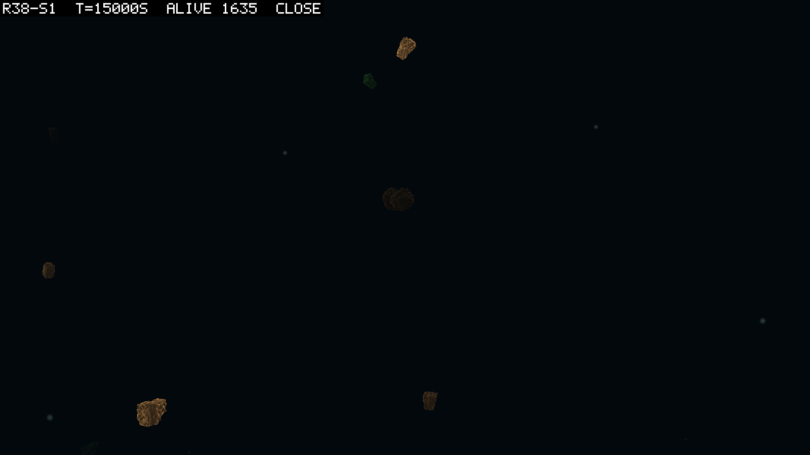

# 0101 — The eaters ate the larder

**2026-09-15, night**  ·  round 38 read against 0100's D1 to D8. Five seeds ran on one build (`simHash ecc41ec5…`, `coreHash 16073c69…`, `configHash 30637fb0`, `physicsJobWorkers 0`, `prereg.json` at `4cab313`), and every one ended at its 30,000 s budget. The tables and the scripts are `logbook/specs/r38-read/`.

## What was asked

The question was whether round 37b's world stands when the tank is four times as wide with
the same 6,000 units of matter and corpses decaying in place. That is D089's dilution, read
for its mechanism (0100). The short answer is that it stands, at 1,600 bodies in every
seed, and that the dilution changed almost nothing 0100 predicted. What it did change was
not in the predictions at all. Every seed's eaters rose to a third or more of the living
and then starved to nothing. And the goal rule, which asks for a clade that holds, failed
five of five on a world that oscillates.

## The rules before scoring

All five of them hold. Every header carries the round's tokens (`space tank r=11.28 m (400 m2),
depth 60, wall, bed`, `area 400 m2`, `matterBudget 6000`, `fluidAccel 1`, `current
0.1 m/s transport`, `dispersal=5 m`, `driveLimit >0.01`, `dt=0.01`, `field grid …
cell=1 mcell=5 corpse=0.005/s`); every manifest the one build and `prereg.json` at 0100's
commit (V1). `audit` 0.0000% and `mat resid` 0 on all 1,500 rows (V2); `wraps` 0 on all
(V3). Every diverged dump of a jointed body carries its trace. And for the first time
every trace holds three finite frames before the first non-finite step (V4; 0097's ring
was all non-finite in 42 of 43). Eight of seed 5's ten dumps have no trace because they
are one-part bodies, for which no ring is allocated. No arm was censored (V5).

## The predictions

| # | prediction | result |
|---|---|---|
| D1 | founding survives the dilution | **holds, 5 of 5**: births by 1,000 s 271 to 589 against a bar of 40; `alive` at 5,000 s 1,339 to 1,610 against 300; `mat short` 0, `floor` 0, 55 to 104 blocked attempts per birth |
| D2 | the world stands | **holds, 5 of 5**: `alive` at 30,000 s 1,597 / 1,602 / 1,641 / 1,642 / 1,633 (37b's ten: 1,585 to 1,840) |
| D3 | the crowd thins as the water does | **holds, 14 of 15 anchors**: the three-dimensional nearest neighbour 1.54 to 1.93 times 37b's at matched abundance (1.11 to 1.41 m against 0.66 to 0.79 m); the one miss reads 1.93 against a bar of 1.9 |
| D4 | the disc stays mixed at the new radius | **holds, 5 of 5**: the rim quarter 0.23 to 0.30 at the three times; `cols` 93 to 96% of the live columns; `x sd` 5.3 to 6.0 m on a disc that reads 5.64 spread |
| D5 | the eaters stand in thin water | **fails, 2 of 5**: inherited eaters at 30,000 s 2 / 300 / 11 / 2 / 4 |
| D6 | the joint's fate does not turn on the dilution | **holds, 1 of 5**: `jnt inh` at the end 0 / 0 / 0 / 1 / 15, the peaks 73 to 226 at 2,100 to 3,200 s |
| D7 | the tank throws only newborns | **the count holds, 5 of 5; the anatomy fails**: 0 / 0 / 0 / 2 / 8 throws, 0 to 5.5 per million jointed body-seconds; seed 4's two are the familiar two-part newborns, seed 5's eight are something else (below) |
| D8 | the pace follows the bodies | **holds, 5 of 5**: 774 to 993 wall seconds per 1,000 simulated seconds per 1,000 bodies, 0.88 to 1.12 of 37b's mean |

D3's two-sided reading is not triggered. The crowd's depth band is wider than 37b's, an
interquartile range of 21 to 32 m against 11 to 24 m. So the thinning is a thinning and
not a crowd packed into the lit band. D5's failure is the round's finding.

## The world, watched

Seed 1 at 15,000 s from the side, at the peak of its boom: green above, red below, and a
gap between them. The eaters' median depth at every seed's peak is 37 to 43 m; the
leaves' is 20 to 23 m. The eaters sat 15 to 20 m under the crowd they lived off, in
water the light does not reach.

Seed 1 from above at 30,000 s: an evenly filled disc, no crust at the glass, and six
eaters in it. The rim quarter reads 0.24. The radial flux is 0.002 to 0.004 m per 100 s,
37b's, against round 37's 0.02 to 0.05 before the acceleration force.

The close view at the same second: the leaves as boxes in a loose crowd, more than a body
length apart, which is D3 seen rather than measured.

## The eaters ate the larder

Every seed boomed and busted. The inherited absorptive count, its peak and its end:

| seed | peak | at | share of the living | trough | at | end | a second boom |
|---|---|---|---|---|---|---|---|
| 1 | 720 | 13,500 | 0.43 | 0 | 23,600 | 2 | no |
| 2 | 596 | 11,800 | 0.37 | 0 | 22,800 | 300 | yes, a fresh line |
| 3 | 288 | 17,200 | 0.20 | 0 | 24,700 | 11 | a late rise |
| 4 | 702 | 16,400 | 0.41 | 2 | 25,400 | 2 | no |
| 5 | 682 | 14,900 | 0.41 | 0 | 22,800 | 4 | no |

Round 37b's ten seeds peaked at 247 to 972 and held 3 to 7% of the living at the end, ten
of ten with ten or more. The peaks here are inside that range. What changed is the share,
a fifth to two fifths of the world, and the collapse.

It is a food crash. No matter was lost: `matterStanding` reads 6,000.0 at every sample of
every seed. And `shade %` falls through every boom (seed 1: 8.2 to 3.2%), so the eaters
shaded nothing.

The detritus they lived on collapsed. The standing stock peaked at 120 to 196 kJ between 6,600
and 10,000 s. It read 24 to 40 kJ at the eaters' peak, and was back to 61 to 91 kJ and rising
at 30,000 s. The column `refuge J` fell from 450 to 1,049 to 83 to 185 over the same interval.
And `det deep` fell from 4.1 to 8.7 to 0.7 to 1.5.

The absorptive log closes it. The density each eater was fed at fell from about 4 J/m³ at the
boom's start to 0.7 to 1.5 at the peak. And `share` read 1.000 in every window, so no eater was
outbid. The mean net watts of the eaters crossed zero within one or two samples of the peak in
every seed. This is a consumer-resource oscillation with a period longer than the run: about
15,000 to 20,000 s from a line's founding to its bust.

Each boom is a fresh line. In four seeds the founder of the last window's eaters is not the
founder of the boom. Seed 2's second boom, 300 at the end, was founded at 26,642 s from a leaf,
and the first boom's line, founded at 4,164 s, is gone. Only seed 4 keeps its line, at two
bodies.

As inference: the absorptive trait is re-invented from the leaf stock each cycle, cheaply,
since the mutation is one node. The goal rule's stability clause then fails on a world that
oscillates rather than on a world without eaters. The scorer's best clades bear it out. Seed
2's has 158 alive with a stability minimum of 0, and seeds 1, 3 and 5's have 2 to 6 alive. Seed
4's 842-member line has 2 alive and no inherited birth in the last 20 samples. Five of five
fail D063 as amended.

## What else the round read

- **The fields are uniform**, the first `field cv` reading on any round. After 5,000 s
  `det cv` reads 0.05 to 0.48 and `mat cv` 0.01 to 0.39, never above 0.5 in any seed. At
  the end `det cv` reads 0.10 to 0.14. Before 5,000 s `det cv` starts at 2.4 to 3.0 and
  falls as the field fills. `patch max share` 0.27 to 0.28 against 0.25 even. This is round
  39's baseline, and the reason a floor with places is the next dial.
- **Stillbirths** 214 to 1,294 per seed (13 to 130 per 1,000 births), two seeds above
  37b's whole range. And `crowded` reads 0 to 3 for the run, so crowding is again excluded.
  The rate per window rides with the standing eater count in four seeds (r 0.21 to 0.58)
  and against the jointed count in four. So 0097's reading that stillbirths ride with the
  jointed lines does not survive. Their cause stays open: a genome that develops into no
  parts is a development fact the run does not record.
- **The joint** founded in every seed (peaks 73 to 226 by 3,200 s) and was gone from
  four by the end; seed 5 held 15. By 0099's count that is three of ten on 37b and one of
  five here.
- **Corpses** 488 to 2,355 standing at any of the three times; `mean m/s` 0.075 to
  0.080, still the water's.
- **The cycle** of the whole population is 1.10 to 1.23 peak to trough after 5,000 s. That
  is the fresh-draw end of 37b's 1.1 to 2.4. The population is flat while the eaters boom
  and bust beneath it, because the leaves are most of it.

## Seed 5's eight are not throws

Seed 4's two dumps are the familiar kind: two-part jointed newborns, mass ratios 1.45,
non-finite within seconds. The trace's oldest finite frame is already at 2e5 to 4e6 rad/s.
The ring keeps finite frames now and still misses the onset.

Seed 5's eight are one-part rigid photosynthetic bodies aged 5,250 to 19,253 s, at the surface,
every number finite. Each was caught by the tank's radius guard at 12.284 to 12.286 m against
the guard's 12.284. These are bodies that leaked through the glass, spinning at 9 to 48 rad/s
where they were caught. The guard's own comment says it should never fire. Round 38's throw
rate without them is 2 over 6.8 million jointed body-seconds, 0.3 per million, against 37b's
2.8.

Why the glass leaks for a spinning body at the surface, and in one seed of five, is not in
the dumps: no contact history, no wall impulse. It goes to the queue as its own item, and
round 39 counts a radius-guard dump apart from a throw.

## Verdict

D1 to D4, D6 and D8 hold; D5 fails; D7's count holds and its anatomy does not. The dilute
tank is round 37b's world at a quarter of the density: mixed, thin, standing at 1,600. It
reads five of five as failing the goal rule, because the eaters' line does not persist. It
eats the standing crop in 15,000 s and starves, and a new line is founded from the leaves
after. That is a finding about the world and not about the dilution. In 37b's ten seeds the
eaters peaked as high and kept 3 to 7%, because the trough had not arrived by 30,000 s at
twice the density. The uniform fields say why no eater found refuge: there was nowhere in
the water that was richer than anywhere else.

Two things follow from it. Round 39's floor with places is the right next dial. Its
pre-registration says what a pocket would have to do for an eater's line to survive the
trough (0102). A round longer than the oscillation's period, 60,000 s or more, is the only
way to read whether the second boom is a cycle or a coincidence. So the long arm (path
item 11) moves up the list.

The prediction I got wrong is the one I wrote with the least evidence, and I want to say so
here in my own voice. D5 assumed the eaters of 37b's ten seeds were standing,
when they were on their way up at 30,000 s. The oscillation was in 37b's numbers and I
read the last sample.
