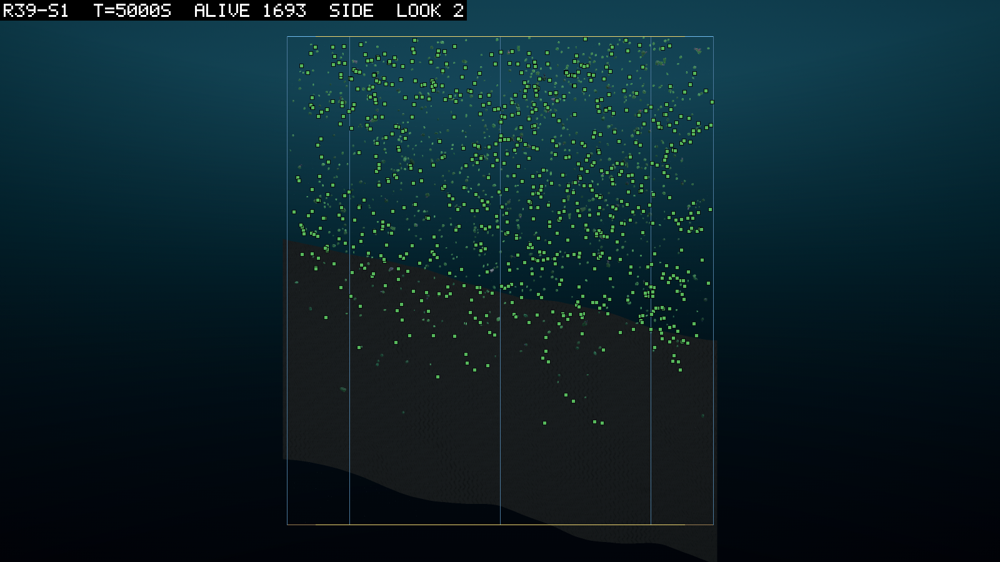
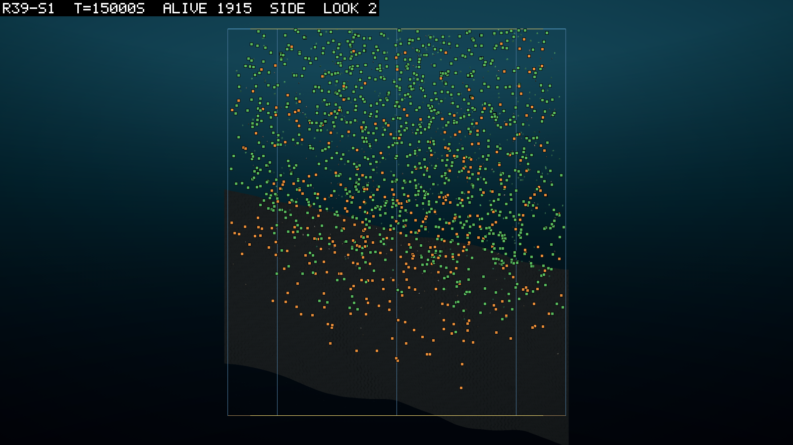
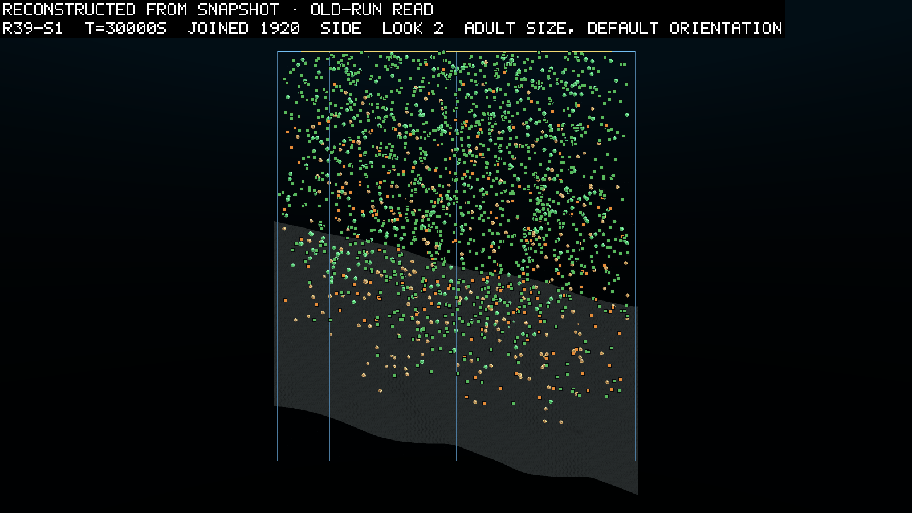

# 0105 — The shelf was never in the light

**2026-09-18, morning**  ·  round 39 read against 0102's E1 to E11. Five seeds on one build (`simHash 353e0dff…`, `coreHash 96488dec…`, `configHash 8eab1085`, `physicsJobWorkers 0`), every one at its 30,000 s budget, three of them as reruns that replayed their cut copies bit for bit. The tables and the scripts are `specs/r39-read/`.

## What was asked

Round 39 gave the tank's floor a shape (0102, D093). A 1.5 m relief of hollows and ridges
lay over a 30 m tilt across a 2,200 m² disc, so that one arc of the floor rose toward the
light and the other fell away from it. The matter was 11,000 units, scaled with the water.
The round asked three things of the shape. Whether the water makes pockets over it, whether
the sediment gathers where the floor is low, and whether the leaves and the eaters move
toward the shallow arc. It also asked the base questions of any new world. The matter and not the water should
decide the crowd, the disc should stay mixed on a slope, and the rock should throw nothing
new.

The short answer is that the crowd is the matter's, the disc is mixed, the rock throws
nothing, and the shape of the floor changed almost nothing else. The pockets are too small
to see. The sediment leans toward the low ground, but not by the twofold the entry asked
for. And the leaves went the other way from the light. That last one is the round's
finding, and it is a mistake in the round's design rather than in the world.

## The rules before scoring

All five of them hold. Every header carries the round's tokens (`space tank r=26.46 m (2200 m2),
depth 45, wall, bed relief 1.5 m tilt 30 m scale 17.64 m`, `matterBudget 11000`,
`fluidAccel 1`, `dispersal=5 m`, `corpse=0.005/s`, `dt=0.01`, `driveLimit >0.01`,
`physics jobs 0`), and every manifest carries the seven bed fields and the one build (V1).
`audit` reads 0.0000% and `mat resid` 0 on all 1,500 rows (V2). `wraps` reads 0 on all
(V3). No body diverged in any seed, so V4 holds with nothing to read. No arm was censored
(V5).

V1 carries two notes. The manifest does not hold `worldDepthMetres`, which the rule asked
for. The depth is 45 in every config and in every header token, so this is a gap in the
manifest and not in the world. And the arm-level `prereg.json` on seeds 3 to 5 names a
later commit of 0102 than seeds 1 and 2 do, because the reruns rewrote it. The two commits
differ only by 0102's appended launch section, so the rules and the predictions the seeds
ran against are the same text.

The reruns are the third note. Seeds 3 and 4 were cut at 25,175 and 27,517 s by a wall clock I had sized from a hope
rather than a measurement. Seed 5 was killed at 26,600 s when Windows restarted the
machine for an update. The story is in HANDOFF and in CLAUDE.md's gotcha on the wall. All
three were relaunched on the same build at zero physics workers, and each replayed its cut
copy identically on every shared sample. Seed 3 agreed on 251 samples to 25,100 s, seed 4
on 275 to 27,500 s, and seed 5 on 266 to 26,600 s. That is D078's replay rule
holding at 2,700 bodies across a reboot. The round's five seeds are the complete runs.

## The predictions

| # | prediction | result |
|---|---|---|
| E1 | the matter decides the crowd | **holds, 4 of 5**: `alive` at 30,000 s 1,920 / 2,276 / 2,523 / 2,550 / 2,714 against a band of 2,080 to 4,460; births by 1,000 s 313 to 745 against 40 |
| E2 | the water makes pockets | **fails**: `det cv` above round 38's maximum in 2 of 5 at 5,000 s, 4 at 15,000, 3 at 30,000; above 0.5 in one seed (seed 2, 0.561 at the end) |
| E3 | the sediment gathers where the floor is low | **splits**: `floor low %` 22 to 27 against the low quarter's own 18 to 20% share of the disc, 5 of 5 at both times; the lowest decile over the highest 1.26 to 2.01, twofold in 1 of 5 |
| E4 | the eaters find the low ground | **holds, 5 of 5**, and means nothing: the eaters sit 3.8 to 21 m under the leaves, and so did round 38's on a flat floor (below) |
| E5 | the boom and bust is not the floor's to fix | **holds, 5 of 5**: first booms of 569 to 1,287 inherited eaters, each under a sixth of its peak within 1,900 to 2,600 s |
| E6 | the disc stays mixed on a slope | **holds on the rim, 5 of 5**: the rim quarter 0.23 to 0.34 at the three times; `cols` 48 to 69% of 2,211 columns, which is 0.92 to 0.99 of what an even crowd of that size would occupy, so the 60% bar was miscalibrated as 0102 warned |
| E7 | the rock throws nothing new | **holds, 5 of 5**: no dump of any kind over 9.36 million jointed body-seconds |
| E8 | the pace is the grid's | **fails, low**: 860 to 1,204 wall seconds per 1,000 simulated seconds per 1,000 bodies against a band of 1,340 to 3,120; 0.97 to 1.35 of round 38's |
| E9 | the leaves take the shallow side | **fails with the sign reversed**: the leaves' centre along the tilt 3.2 to 5.2 m toward the deep arc at 15,000 s and 1.7 to 7.0 m at 30,000 s, in every seed |
| E10 | the floor in the light is lived on | **fails, 0 of 5**: 0.1 to 3.1% of the living within 2 m of the floor at 15,000 s against a bar of 5.6% |
| E11 | the eaters go where the leaves are | **holds, 4 of 5**: the two centres within 1.1 to 2.0 m along the tilt; seed 4's 10.7 m is 55 eaters against 2,539 leaves |

0102 expected E4, E9 and E11 to pull against each other. They do not, because they measure
different axes. E4 is vertical and E9 and E11 are horizontal, and the eaters sit under the
leaves in the same horizontal place. All three are consistent. E4 says nothing about the floor, because the same statistic on
round 38's flat floor reads 1.9 to 20.4 m in the same direction, five of five
(`e4-control-r38.tsv`). It measures where detritus sinks.

## The world, watched

Seed 1 at 5,000 s from the side, with 1,693 alive. The floor is the dark slab, high on the left and falling to the right. It runs out of the
bottom of the frame on the deep side, because the deep arc sits near 60 m in a box the
reader draws at 45. The crowd is a band in
the top twenty metres with the same top everywhere and a deeper bottom where the water is
deeper. Nothing sits on the shelf. The leaves on the shallow side float at the same depth
as the leaves on the deep side, with the floor a few metres under them and unused.

Seed 1 at 15,000 s, faithful, with 1,915 alive. The band is gone. The crowd fills the top
two thirds of the water, the leaves in a gradient from the surface to about 30 m and the
eaters, the orange markers, under them, thickest in the lower half and reaching the bed
on the deep side. That is the depth table's 3.8 to 21 m of separation drawn.

Seed 1 at 30,000 s, with 1,920 joined. This frame is not a replay. The full-length replay
was stopped three hours short of the second on 2026-09-18 night, and the picture is drawn
from the run's own snapshot and positions row by the snapshot render built that night
(`specs/snapshot-render-spec.md`), every body at its adult size and upright, which the
label says. Where the bodies are is the run's. The whole tank is in use, top to bed, the
leaves everywhere and the eaters a clear minority that thickens with depth, which is the
same world as at 15,000 s with the column a little fuller at the bottom. Nothing sits on
the shelf at either second, and nothing needed to.

## The shelf was never in the light

E9 asked the leaves to drift toward the shallow arc, and E10 asked the floor in the light
to be lived on. Both failed, and the reason is in the config. The light's attenuation depth
is 12 m. The leaves float at a median depth of 16 to 20 m at 15,000 s, where they see 0.19
to 0.26 of the surface light. The shallowest floor in the tank sits at 30 m, where the
light is 0.08 of the surface. The shelf is two to three times darker than the water the
leaves already float in. There was nothing up the ramp for a leaf to drift toward, and no
seed went.

The tilt was 30 m across a 45 m box, which puts the shallow arc at 30 m down. I wrote that
number for the geometry and never asked the light model what it thought of it. A floor that reaches the light has to come within the top ten metres. A 30 m tilt cannot
do that in a 45 m box unless the deep arc goes out of the world. The retry is a shelf, not a tilt: a
part of the floor raised into the lit band, with the rest at depth.

The sign reversal is a second fact. The crowd's centre along the tilt is toward the deep
arc at every one of the 150 sampled seed-times, by 0.5 to 9.1 m. An even crowd through
the water would also sit toward the deep arc, because the deep side holds more water, and
that null is 2.2 m. At 14 of 15 anchors the leaves sit at or beyond it. So the leaves are not merely indifferent to the ramp. Something small pushes them, or
their children, toward the deeper side, and the round did not record what. My first guess
was the placer, but the code says a child drawn under the rock is lifted onto it rather
than refused, so the shallow side loses no births that way. The excess over the null is 1
to 7 m, and the two cheap checks are births by side of the diameter from the lineage and
the positions, and the free matter by side from the grid. Both go to the next round.

## The pockets that were not there

E2 asked the water to make pockets over the relief, and it did not. The field's coefficient
of variation reads 0.10 to 0.21 at the end in four seeds, where round 38's flat floor read
0.10 to 0.14. Seed 2 reads 0.56, and its patchiness rides with its eaters. `det cv` peaks within 200 s
of the eaters' peak in seeds 1 and 2, with correlations of 0.88 and 0.62 after 6,000 s,
and near zero in the other three. Where there are pockets they are the crowd's.

The map says why they are missing. At every place it calls a hollow or a ridge the water
column is 0.7 to 1.1% thicker or thinner than its own ring. The whole 1.5 m of relief
against 30 to 60 m of water bounds the squeeze at 5%. The relief is too small by a factor
of tens to bend the streams. 0102's two-sided reading asked for the streams' speed over a
hollow against over a ridge from the field itself. That needs a Core probe the read did not
build, and the bound from the map is enough to say the relief was never going to do it.

E3 is the gentler version of the same result. The sediment does lean toward the low ground. The lowest quarter of the floor holds 22 to
27% of the floor's stock against its 18 to 20% share of the disc, in every seed at both
times. It does not gather twofold by decile in four seeds. Matter sinks at 2 mm/s, so a
particle falls 6 m in a lifetime. A slope of 30 m across 53 m gives it only a little
sideways drift on the way down. The lean is what
that arithmetic gives.

The hollows are not lived in either. Seeds 2, 3 and 4 drew hollows covering 5.6 to 8.4% of the disc. The share of the living
inside one reads 0.70 to 1.09 times the hollows' own share at every time. Seeds 1 and 5 drew none.

## The eaters, again

Every seed boomed and busted, as in round 38, and faster. The first booms peaked at 569 to 1,287 inherited eaters, a fifth to a half of the living,
at 13,000 to 24,200 s. Each fell under a sixth of its peak within 1,900 to 2,600 s, where
round 38's busts took 8,000 to 10,000 s. Both passing clades under the goal rule are fresh
lines founded after their seed's first boom collapsed, at 20,405 and 17,672 s. That is
0101's "each boom is a fresh line" again. The absorptive trait was founded 16 to 40 times per seed.

The goal rule, read and not required since D094, passes 2 of 5 against round 38's 0 of 5.
The producer clause holds on all three readings in all five. The verdict lines are in
`specs/r39-read/verdicts.txt`, quoted whole.

One lead I did not expect. The seeds split in two on the growth dials from 5,000 s, before
any of them has eaters. Seeds 1 and 2 have adults at 0.61 to 0.77 of the scale. They invest 0.27 of their tissue
in a child, in broods of 2.6 to 3.4. Seeds 3 to 5 have adults at 0.29
to 0.32, investing 0.44 to 0.73, in broods of 1.0 to 2.2. Seeds 1 and 2 are the two that
still hold an absorptive clade at the end and the two that pass. Five seeds and a
correlation, with the body plan first and the eaters second, so it is a lead and not a
reading. Round 38's five all ended with adults at 0.24 to 0.27.

## What else the round read

- The crowd is thinner than round 38's, by less than the water alone would give. The three-dimensional nearest neighbour reads 1.44 to 1.96 m against 1.22 to 1.35. At the
  five anchors where the two rounds' abundances match within 15% the ratio is 1.34 to 1.51,
  against 1.60 for the volume.
- The joint founds and goes: `jnt inh` peaks at 73 to 371 by 1,800 s and ends 0 / 0 / 1 /
  0 / 0. Round 38 ended one seed with 15. Nothing threw, over 9.36 million jointed
  body-seconds, against round 37b's 43 over 11.1 million on the flat floor. I do not know
  why, and the entry says so; the shaped floor and the larger disc are both new.
- Stillbirths 208 / 2 / 58 / 1,170 / 2,556, which is 0.1 to 258 per 1,000 births against
  round 38's 13 to 130. Seed 5 is far above anything recorded, with `crowded` at 1 for the
  run, so crowding is again excluded and the cause stays open.
- Corpses standing 750 to 1,802 at the end, in round 38's range.
- The floor's own stock peaks at 10,700 to 15,100 J between 8,500 and 14,400 s, with the
  eaters, and ends at 2,500 to 4,800. That is ten times round 38's refuge; `% on floor`
  stays under 1%.
- The matter's books close at 11,000.0 in every seed. Seventy to 75% of it is in living bodies at the end, and 2,500 to 2,600 units are free in
  99,000 m³ of water. Between 41 and 81 million conceptions were blocked on matter over a
  run.
- The pace read 860 to 1,204 wall seconds per 1,000 simulated seconds per 1,000 bodies,
  where 0102 predicted 1.5 to 3.5 times round 38's. The grid at five and a half times the
  cells is not the round's cost at the crowd. The timing split built the day after says the same thing from the other side. The world's
  step is 85% of an empty world's wall and a tenth of a full one's.

## What the round did not record

The manifest carries the bed's counts and not the tilt's bearing, so every map-based
reading rests on `specs/r39-read/bed.py`, a port of the bed's construction from the config
and seed. It reproduces every bed field the manifest records in all five seeds, to the last digit,
and the 2,211 live columns the table counts. The bearing should be in the manifest. The positions reader clips its plot at the box's 45 m. Between 0.06 and 4.9% of the
living sit below that in the deep arc's water, so the reader needs the map. And the round's build has no
`wall split` line, because the split was built after it landed.

## What follows

The shelf comes first. A floor raised into the top ten metres over part of the disc, with
the rest at depth, is the retry of E9 and E10, and whether the leaves take it is the
question 0102 meant to ask. The births and the free matter by side of the edge are the
checks on the deepward lean. Before it comes the long arm. Round 38 and this round both
show one boom and bust per 30,000 s, and whether the second boom is a cycle needs 60,000 s
or more of one seed.
