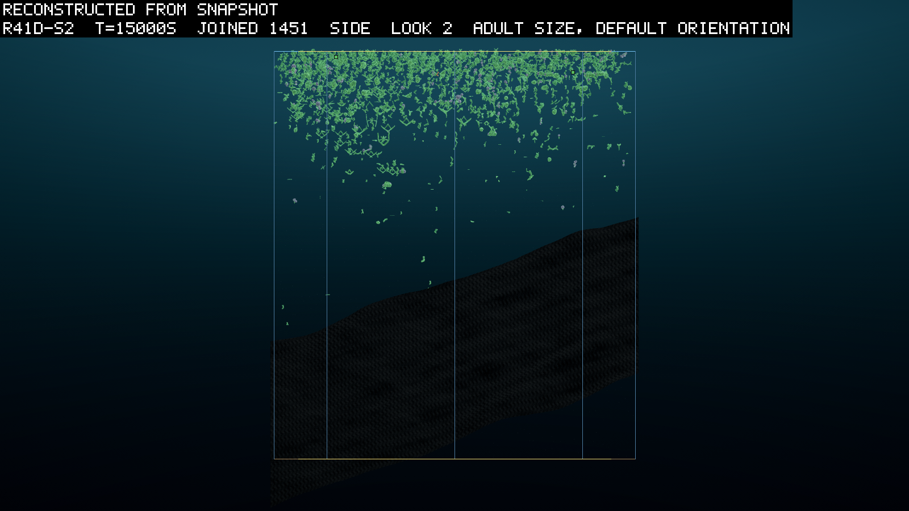
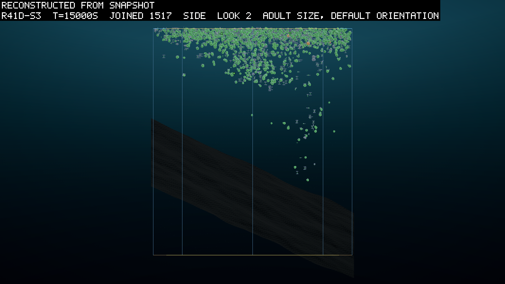

# 0108 · A body earns its outline

**2026-09-19, morning, pre-registered before launch**  ·  round 41d: round 41c's world with
D099's silhouette cap on and the joint's price back where round 41b had it, on the build in
which a terminal-only edge keeps its limit. Asked what round 41 asked, plus what round 34
asked: whether a free joint survives founding on this economy.

## What it asks

Round 41 asked whether a world with one kind of matter runs, and what it does with the
count (0107). It got two answers in six seeds and then could not run: rounds 41b and 41c
collapsed on the physics, and the cause was a body plan. A two-node genome with a
terminal-only edge to itself developed into a knot of nine or sixteen parts folded into a
ball, every part overlapping every other. It earned sixteen parts' light from one point,
because a body's income and its shadow were both the sum of its parts' projected areas
and a body never shaded itself. Under D098 a part cost the tissue price alone, so the fold was
free, and evolution found it by 2,000 s in every seed (0107's last section; the pictures
are there).

D099 closes both rules (`DECISIONS.md`; `specs/silhouette-spec.md`). A body earns no more
light than its own outline, the orientation-averaged projected area of its convex hull, and
shades what is below it by the same number; and `Developer.Expand` asks a node's recursive
limit of every edge, terminal-only included. The ledger sized the first before it was
built. Capped at its hull, the sixteen-part knot's lit area falls from 1.13 to 0.31 m²,
under a one-part leaf's 0.36, and its net at 5 m from 2.08 to 0.19 W against the leaf's
0.84. A one-part box reads hull equal to lit area to six decimals, so a body laid out in
the open is untouched (`scripts/overlap/run.ps1`). Under the second, the three knots kept under `inocula/`
develop to two or three parts.

So this round asks three things. Whether round 41's world runs to its budget with the fold
closed, read on 0107's predictions carried whole. Whether the fold is gone, read on the
contact instrument and the probe. And whether a free joint survives founding here, which round
34 asked on the grid (0080) and no round has asked on this economy. The joint was priced
in round 41c on a diagnosis the round overturned, so its price goes back to 0.0001, and
the jointed share is read and not predicted.

## The world

Round 41c's (0107's third launch note) with two dials moved and one rule added:
`EVOSIM_SILHOUETTE 1` (`lightSilhouetteCap true`; header `silhouette on`), `EVOSIM_IDLE
0.0001` (round 41b's; header `idle 0.0001 W/N·m`), and the developer's rule, which is the
build's and not a dial. Budget 3,000 units, overhead 100 J, remineralisation 0.002 /s,
ρ 100 J per unit, the tank at 2,200 m² and 45 m, the shaped bed, the streams at 0.1 m/s
with the acceleration force, corpses decaying at 0.005 /s, light reach 6 m, five seeds at
dt 0.01 for 30,000 s, three arms at a time, `rounds/launch-r41d.ps1`. The contact instrument
is in the table from the first row. Every `config.json` written before D099 is refused by
this build, as every round's tunable has refused its predecessors.

## The smoke and the screen

The 300 s smoke (`r41dsmoke`, dt 0.02, worker 6 refreshed from main after the merge) read
`silhouette on` in its header, both books at zero on every row, and 0.003 pairs a body
(`simHash 8b7653eb…`, `coreHash e1762ac5…`). The screen is seed 1 for 5,000 s at dt 0.02
on the same worker (`r41dscreen-s1`, 56 minutes, 1.5x real time overall; the Core suite ran
beside it for its first sixteen minutes).

| second | alive | jointed | `pairs/body` | pairs per touching creature | self-overlapping pairs a body, probe | parts at 8 or more | snow of budget | pace |
|---|---|---|---|---|---|---|---|---|
| 1,000 | 351 | 46% | 0.09 | 1.2 | 0.066 | 1 | 0.07 | 3.1x |
| 2,000 | 804 | 50% | 0.12 | 1.4 | 0.071 | 2 | 0.17 | 1.4x |
| 3,000 | 802 | 57% | 0.11 | 1.1 | 0.065 | 0 | 0.21 | 1.35x |
| 4,000 | 943 | 51% | 0.12 | 1.1 | 0.067 | 0 | 0.22 | 1.14x |
| 5,000 | 1,047 | 49% | 0.20 | 1.3 | 0.108 | 0 | 0.21 | 0.91x |

The fold is closed. The part histogram at 5,000 s is 360 one-part bodies, 386 of two, 159
of three, 87 of four, 38 of five, 11 of six and 6 of seven. None is at the cap and none at
eight or more, where round 41c's seed 3 had 34 of 766 at nine or sixteen by 3,000 s. The
two nine-part bodies of the first two thousand seconds, a two-node genome with mutual
edges and limits of 2, did not last. `pairs/body` held between 0.09 and 0.12 from 1,000 to
4,000 s, where round 41c's seed 1 went from 0.02 to 0.75 over the same seconds, and then
rose to 0.20 in the last thousand, with the probe's self-overlapping pairs a body rising
with it from 0.067 to 0.108. Those pairs belong to jointed bodies of three to seven parts
that the cap binds by a quarter to two fifths (`hull/lit` 0.57 to 0.74 on the largest).
The pace fell from 1.4x to 0.9x as the count went from 800 to 1,050, with the physics at
23 to 27% of the wall. I read that as the crowd's cost and the free joint's (`mean dof`
0.97 to 1.48) rather than a fold's; inference, and E9 is what tests it. The books
closed on every row, the snow sat in E4's band from 2,500 s, the water was uptake-bound
on 61 to 79% of the leaves' steps, the margin fell from 351 to 139 s, the rim quarter
read 0.26 to 0.45, and ten inherited eaters were alive at 5,000 s. E9's thresholds are set
from this plateau and not from round 40's, and E10's probe clause the same way.

## Rules, before scoring

V1: every header carries round 41c's tokens with `silhouette on` and `idle 0.0001 W/N·m`;
every config `lightSilhouetteCap true`, `idleWattsPerNewtonMetre 0.0001`, `joulesPerUnit
100`, `matterBudgetUnits 3000`, `perOffspringOverheadJoules 100`; every manifest one
`simHash`, one `coreHash`, one `configHash`, `physicsJobWorkers 0`, and `prereg.json`
naming this entry's commit beside the arm and beside the run. V2: `audit` 0.0000% and
`mat resid` 0 on every row. V3: `wraps` 0 on every row. V4: every diverged dump has its
trace. V5: a manifest reading `error` or `stopped` is censored and read at its last
sample; the wall is 1,800 minutes; a seed past 4,000 bodies is stopped under V5; and a
seed that shows the adjustment the world needs is stopped as `manual-futility`, the round
re-planned, and the entry says what it showed. The fail-fast reads are E9 and E10 from the
first hours, the snow at 5,000 s in E4's band, and the eaters by 10,000 s. The entry is not
written until the world has been watched in the theatre, and frames of a live arm are
looked at at about 3,000 and 6,000 s, drawn from the snapshots.

## Predictions

E1 to E8 are 0107's, carried whole with their thresholds, because the world they were
written for is this one with the fold closed; 0107's predictions section has the numbers
they were set from. E9 is 0107's instrument prediction with its jointed clause dropped,
since the joint is free again and its share is recorded, and its thresholds set from the
screen above. E10 is new.

| # | prediction | falsified by |
|---|---|---|
| E1 | **the crowd is the budget's**: `alive` between 350 and 1,100 at 5,000 s, and between 600 and 3,600 at 30,000 s, in 4 of 5 | the timeline |
| E2 | **the crowd grows as the holding shrinks**: `alive` at 30,000 s at least 1.3 times `alive` at 5,000 s in 4 of 5, and the table's `margin s` under 150 at 30,000 s in 4 of 5 | the timeline; `margin s` |
| E3 | **the water is a treadmill**: `upt lim` between 40 and 95% at 15,000 and 30,000 s in 4 of 5, and `mat top` no higher than `mat deep` at both in 4 of 5 | `upt lim`; `mat top` against `mat deep` |
| E4 | **the larder is the reserve**: the marine snow (`detritus J` over 100) between 0.10 and 0.40 of the budget at 15,000 and 30,000 s in 4 of 5 | `detritus J` |
| E5 | **the eaters found**: `inherit` reaches 50 after 5,000 s in 3 of 5, and in every seed where it does, `inherit` is at least 10 at 30,000 s | `inherit` at every 100 s |
| E6 | **the bust is slower**: the first boom above 300 inherited eaters falls under a sixth of its peak later than 2,600 s after it, or not before the budget, in every seed that has one | `inherit`, `booms.py` |
| E7 | **nothing throws and the disc stays mixed**: `diverged` between 0 and 10 per million jointed body-seconds in 4 of 5; the rim quarter 0.12 to 0.40 and `cols` within 0.85 to 1.05 of the uniform expectation 1 − e^(−n/2211) at 5,000, 15,000 and 30,000 s in 4 of 5 | the manifests, `diverged-read.py`; `p3` over `alive`; `cols` against `alive` |
| E8 | **the pace is affordable**: wall seconds per 1,000 simulated seconds per 1,000 living bodies between 700 and 1,800 at three arms in 4 of 5 | `run.json`, `pace-survey.py` |
| E9 | **the physics is affordable**: `pairs/body` under 0.5 at 5,000 s and under 1.0 at 15,000 and 30,000 s in 4 of 5 (the screen read 0.20 at 5,000 s; round 41c read 0.75 to 1.24 at 3,000 s and doubled every thousand seconds), and no seed's `pairs/body` doubles in each of two consecutive thousand-second windows past 0.5, which is the fold's signature and stops the seed under V5 | `pairs/body` by window |
| E10 | **the fold is gone**: in the 5,000, 15,000 and 30,000 s snapshots no living body at `maxParts` 16, fewer than 1% of the living at eight parts or more, and the probe's self-overlapping pairs per living body under 0.3, in 4 of 5 (the screen read 0.11 at 5,000 s; round 41c seed 3 read 34 of 766 at nine or sixteen parts and 1.35 pairs a body at 3,000 s) | `scripts/overlap/run.ps1` on the snapshots |

These are recorded and not predicted. The jointed share and `jnt inh`, which round 41's
screen founded at 60% under the free joint and round 41c's price took to 2%, and which
this round reads on a world where the fold no longer pays; the spread of `mean dof` with
it. Everything 0107 listed as recorded: the guilds' depths, the shading, the burn and the
remineralisation against the snow, the corpse count and the floor's holding, adult scale,
investment and brood, stillbirths and refusals against births, the wall split, the spent
water by depth. And two new ones: the part histogram of every snapshot, and
`SilhouetteFellBackToBox` if any run report ever carries it (none does yet).

## The two-sided readings

0107's readings of E1 to E8 stand. For the two new ones:

- **E9 fails with E10 holding:** the pairs are between bodies, not inside them; read
  `contactBodies` against `contactPairs` (a pair per two touching creatures is two bodies
  meeting; twenty per touching creature is a body touching itself), then the nearest
  neighbour distances from the positions, then `stuck %`.
- **E9 fails with E10 failing on the pairs but not on the parts:** bodies of few parts
  overlap themselves; read the probe's top bodies and their edges, and whether the cap
  binds on them (`hull/lit` under 1).
- **E10 fails on the parts with the pairs low:** many-part bodies that do not fold, which
  is a body plan the rules allow and the cap prices; read what they earn on the ledger
  against a leaf, and whether they spread or knot.
- **E10 fails on the parts at the cap with E9 failing:** the fold is back by another
  route (a non-terminal self-edge with a mutated limit, or two edges into one node); read
  the genome and whether the cap is binding, since a knot that pays with the cap on is the
  cap's fault and not the developer's.
- **E9 and E10 hold and E8 fails:** the pace is the world's or the harness's; the wall
  split says which.

## What the round does not ask

Whether the cap is the right silhouette for a spread body, since a chain's hull is looser
than its shadow from any one direction; the cap is an upper bound and the round reads
whether it binds. Whether a knot could pay under the cap with a dearer link; the ledger
says no at this economy's prices, and a round that changes them asks again. Whether the
free joint's share, read here, is a founder draw or a lineage; `jnt inh` says which, and
the question of what a joint is for, movement's prize, stays open (HANDOFF's frontier).

## Launch

*Appended as the seeds launch; each with its header verified and its manifest's hashes.*

*2026-09-19, 09:27 to 09:29.* Seeds 1, 2 and 3 launched on workers 2, 3 and 4, each refreshed
from the main tree first, the queue's hash check against the smoke's `simHash 8b7653eb…`
passing and `prereg.json` at this entry's commit (`1b5aa02`) beside the arm and beside the
run. Every manifest reads `simHash 8b7653eb…`, `coreHash e1762ac5…`, `configHash
630f0206`, `physicsJobWorkers 0`, `gitCommit 1b5aa02`; every config `lightSilhouetteCap
true`, `remineralisationPerSecond 0.002`, `matterBudgetUnits 3000`, `joulesPerUnit 100`;
every header `dt=0.01`, `silhouette on`, `idle 0.0001 W/N·m`, `remin 0.002 /s`, `overhead
100 J`, `matterBudget 3000`, `physics jobs 0`. The queue is `scratch/r41/queue-d.ps1`,
detached, and seeds 4 and 5 launch as arms end. The early look draws seed 1 at 3,000 and
6,000 s from its snapshots on worker 6.

## Round 41d stopped at 15,000 s: the bush

*2026-09-20, 04:15.* The owner ruled at 21:40 on 2026-09-19 that the three seeds run to their
15,000 s sample and stop, and that seeds 4 and 5 never launch. The queue was killed at 21:46. Each seed was stopped as
`manual-futility` under V5 at its 15,000 s row (seed 2 at 02:51, seed 3 at 03:17, seed 1 at
03:50), and the round is read here at 15,000 s as a short round. The reason V5 names is the one it was written for: by 12,000 s the seeds had
shown the two adjustments the world needs, and both were ruled and built that afternoon
(D100, D101; `logbook/specs/cheapening-spec.md`). At the pace they were running, 0.08x by
midnight, the wall would have censored them near 20,000 s in any case.

### The reads

The three seeds at 15,000 s, `scripts/reads/r41d-read.py 15000` and the probe on the 15,000 s
snapshots:

| | seed 1 | seed 2 | seed 3 | reads |
|---|---|---|---|---|
| E1 alive (350 to 1,100 at 5,000 s) | 1,172 | 895 | 1,209 | failed high in 1 and 3, as at 5,000 s |
| alive at 15,000 s | 1,428 | 1,451 | 1,517 | |
| E3 `upt lim`, `mat top` under `mat deep` | 78%, yes | 79%, yes | 87%, yes | holds |
| E4 snow of budget (0.10 to 0.40) | 0.19 | 0.26 | 0.20 | holds |
| E5 inherited eaters, most after 5,000 s (50) | 30 | 30 | 3 | fails in all three |
| E7 throws; rim quarter; columns of uniform | 0; 0.28; 0.96 | 0; 0.25; 0.93 | 0; 0.22; 0.98 | holds |
| E8 wall s per 1,000 s per 1,000 bodies (700 to 1,800) | 4,238 | 4,249 | 4,193 | fails, threefold |
| E9 `pairs/body` at 15,000 s (under 1.0) | 3.02 | 2.47 | 1.26 | fails |
| E10 bodies at 16 parts; at 8 or more; self-pairs a body (0; 1%; 0.3) | 0; 4.8%; 1.4 | 36; 13%; 2.7 | 2; 6.6%; 1.4 | fails |
| jointed share, `mean dof` | 79%, 2.2 | 8%, 0.45 | 88%, 4.2 | recorded |

E2 and E6 are 30,000 s clauses and are not read. The books closed on every row of every
seed and nothing threw in 31 million jointed body-seconds; the disc stayed mixed. The fold
signature never fired: no seed doubled its pairs in two consecutive windows past 0.5. Seed
1's windows from 6,000 s read 0.13, 0.19, 0.26, 0.43, 0.63, 0.89, 1.30, 1.74, 2.37 and 3.02, a
steady 1.3 to 1.6 times a window. Seeds 2 and 3 have the same shape, ending at 2.47 and 1.26.
That is not round 41c's doubling, and it is not affordable either. The pace fell from 0.34x
at 8,000 s to 0.08x at 14,000 s, with the physics a flat 28 to 31% of the wall and the
harness 65 to 68%, the split the profile measured on this world (`harness-profile-spec.md`
§6).

### What the pairs were

The probe on the 15,000 s snapshots. Seed 2's world is 36 bodies of sixteen parts, 35 of
fifteen, 96 of thirteen and 538 of seven, nearly all rigid, 801 of 1,338 rigid bodies
overlapping themselves, 3,879 self-overlapping pairs. Its largest is one node with three
self-edges and a recursive limit of 3, a photosynthetic box that branches into mirrored
copies of itself to depth 2, capped at sixteen parts (`inocula/bush-16-r41d-s2-15000.json`).
That is the route the two-sided reading above named, a non-terminal self-edge with a
mutated limit, and the cap binds it: lit area 1.15 m², silhouette 0.60 m². Seeds 1 and 3 are
the articulated version, jointed sprawls of five to fourteen parts (696 of 1,130 jointed
bodies overlapping themselves in seed 1, 600 of 1,332 in seed 3), the largest at thirteen
parts with 39 overlapping pairs and a silhouette at 0.54 of its lit area.

The ledger says why the bush wins with the cap on. Against round 41c's one-part leaf at the
same volume and tissue (0.16 m³, 81 J, the same standing cost), under round 41d's config:

| | leaf, one part | bush, sixteen parts |
|---|---|---|
| lit area, uncapped | 0.36 m² | 1.15 m² |
| silhouette | 0.48 m² | 0.60 m² |
| income at the surface | 3.6 W | 6.0 W |

The cap took two thirds of the bush's light and it still earns 1.7 times the leaf's on the
same matter, because a body spread over a volume has more hull than a body packed into it.
That is geometry, and it is what a real bush or a thin leaf is: the cap made a body earn
its outline, and a spread outline is larger. D099 read the knot losing to a leaf from birth
because the knot it was sized on was a ball folded inside a leaf's footprint; a body that
spreads is a different shape, and nothing in the light rule should stop it. What the cap
does not price is that these bodies' parts sit inside each other, thirty-nine pairs deep
in the worst, and the solver resolves every pair on every step and never separates them,
which is the physics' third of the wall and the fall of the pace. That is D101's job: a
body born inside itself is not born, the physics of self-collision stays on, and an open
bush is still allowed to earn what its outline says.

### What it looked like

Seed 2 at 15,000 s, from its snapshot: the top ten metres are jagged green bushes, branched
and mirrored, a shape the campaign had never grown, with the few eaters gone (the line
peaked at 30 inherited and died out by 13,000 s). Seed 3 is round leaves and small jointed
stacks packed into the top five metres, and seed 1 small jointed sprawls through the top
fifteen; all three even across the disc, no crust at the glass.

### The reading

The cap closed the knot's route and not the geometry. No two-node terminal-edge knot
appears in any snapshot, the developer's rule holds, and the pairs were flat for the first
seven thousand seconds. Then selection found the bush by the other route, and the jointed
sprawl beside it, and the pace fell with the pairs as it had in 41b and 41c, only slower. E5
failed in every seed: the eaters founded in seeds 1 and 2 and stayed under 50 (seed 1's line
was alive at 28 when the round stopped), which is round 40's larder question again and is
not read further here on a round stopped at half its budget. E1 failed high in two seeds as
at 5,000 s. What the round asked, whether a body that earns its outline stops folding, is
answered no, and the entry's own two-sided reading had the sentence for it: a knot that pays
with the cap on is the cap's fault and not the developer's. I would put it differently after
the ledger: the cap is right and the bush is honest, and the fault was mine in sizing the
cap on a ball rather than on a bush; inference, and round 41e reads it. Round 41e is this
world with D100's held water and D101's birth rule, pre-registered in 0109.
