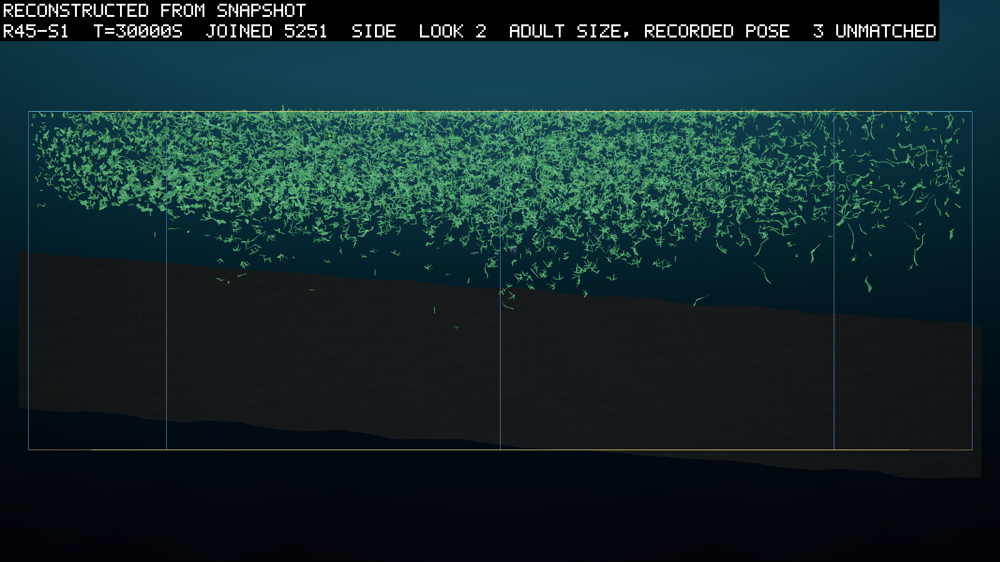
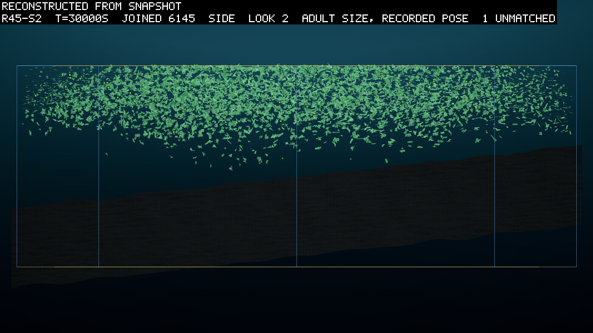
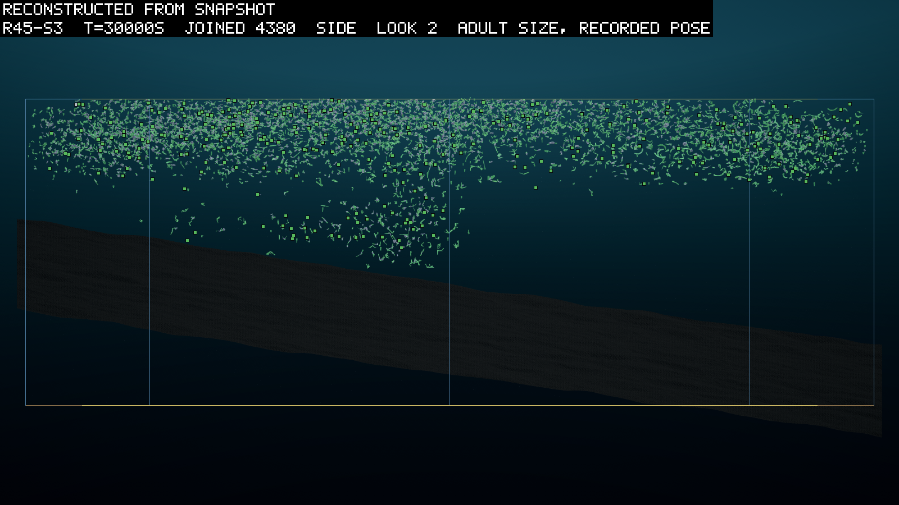
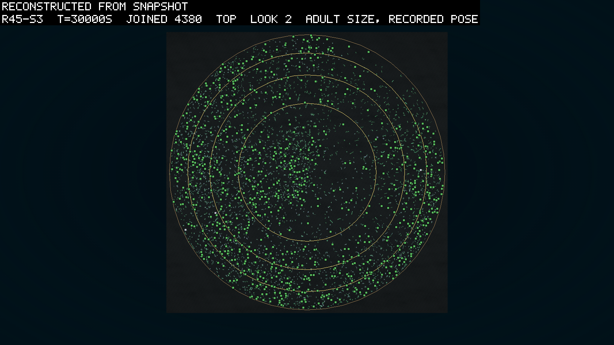
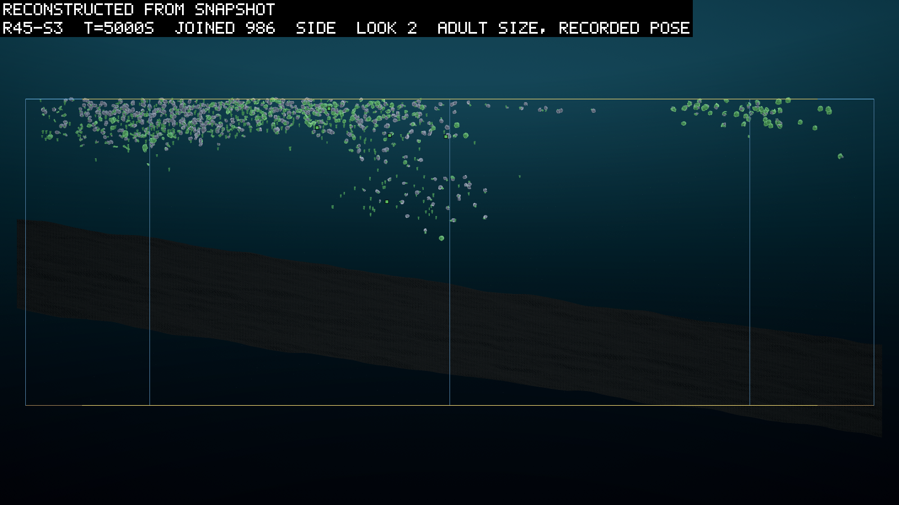
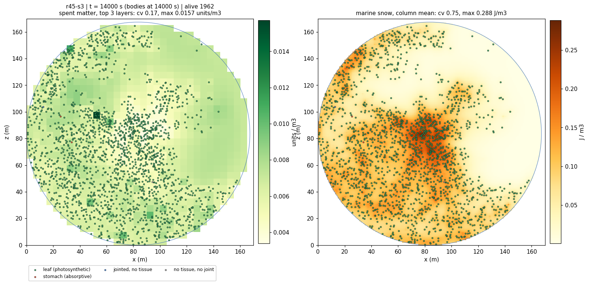
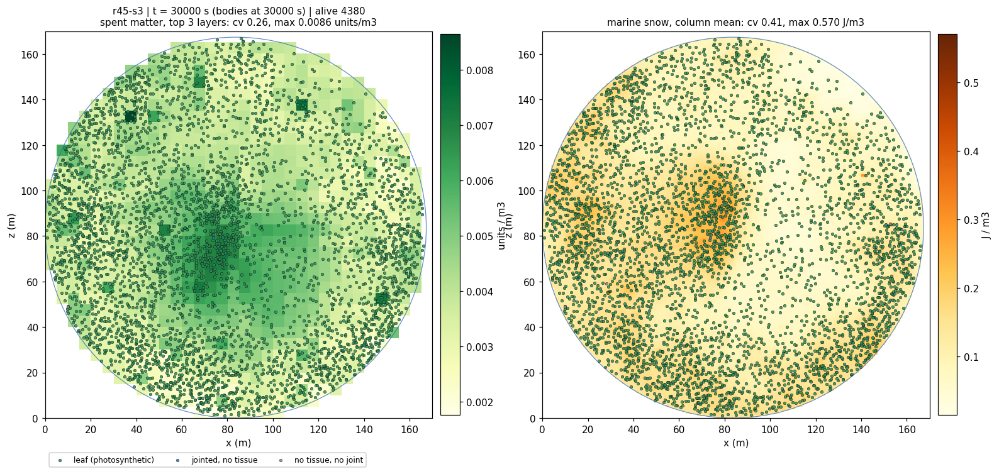

# The mouth

*2026-09-22, night; launched 2026-09-23 at 00:28 local from `35395be` (the launch section
below). Written by the agent as the pre-registration of round 45, the second rung of the
animal kit under D106: a cell is the unit of death, a mouth kills and a mouth consumes, and
every attribute that helps is priced and capped by cell type. The predictions were
committed before the three seeds launched; the island predictions (J8 to J10) were added
with the world's change (D109) the same night, before the launch.*

## What it asks

Nothing in this world has ever eaten anything alive. The eaters of rounds 14 to 43 were
absorptive tissue feeding on marine snow, and every corpse went to the water whole. D106
gives a body four attributes on any cell, each heritable, each priced, each capped by the
cell's type: attack (damage to a touched part), intake (charged units taken from a corpse
in reach), protection (damage absorbed) and toughness (health per volume). A part whose
health reaches zero leaves its body as a corpse; the killer gains nothing from the kill;
what a mouth gains is intake from corpses, its own kills or anyone's. So the round asks
whether a scavenger founds, whether a killer founds, whether a plant that can regrow its
parts (round 44's gene) survives being grazed, and whether defence arrives after offence
rather than before it, which is the order the economy should impose when armour costs and
nothing yet bites.

## The world

Round 44's (0113), ten times larger and seeded as islands (D108, D109). Round 44 was read
the same night: the gene kept in two seeds of three, jointed bodies keeping it as readily
as leaves, the books closed to 1e-06 units, and seed 1's world of module chains gone deep
and to the glass and sevenfold dearer a body-step. The mouth's dials are from the ledger
screen (`logbook/specs/mouth-spec.md`, the screen note, and `logbook/specs/r45-read/`).
The tank is 22,000 m² (r 83.7 m) at the same 45 m, the bed's wavelength held at round 44's
17.64 m rather than derived from the radius, so the rock is the same rock over a larger
floor; the owner asked for the room (2026-09-22 night), the tank having been sized for the
Unity farm's pace and never re-asked when the farm left Unity. The matter is 15,000 units,
ten times round 44's, and it is not spread evenly: a noise map of 60 m wavelength picks a
tenth of the columns, and those hold the whole budget in their top 12 m, level across each
island (0.57 units/m³ at t = 0, thirty-eight times round 44's water, in a few distinct
islands on a 167 m disc); the founders, and every body the floor spawns, are planted in
the islands and no deeper than 12 m; and the matter grid stirs at 0.02 m²/s, the snow's
rate, where every round from 32 stirred it at a hard default of 2. The light is round
44's, even everywhere; the shade map D109 built is at 0. Each number is a screen's
(D109: the even dilute tank does not found, the islands at the old stirring are gone in
800 s, a peaked profile puts founders in half-strength water, the plateau at 1,500 units
founds and then starves, and at 15,000 the world founds faster than round 44 with two
crowds on two islands and the deserts empty; `scratch/r45-build/runs/bigJ`, whose maps
are in this entry's images). What the world does after founding is the round's first
reading: the islands spread on the gyre's own smearing of the 5 m cells, about 0.1 m²/s,
into round 44's soup near 5,000 s, and whether the crowd stays on them is J8. The screen's
own maps are the entry's first pictures: the islands at 100 s with the founders on them,
the two crowds at 1,500 s, and the spread field at 3,000 s with the snow beside it
(`images/0114-islands-bigJ-t0000100.png`, `-t0001500.png`, `-t0003000.png`; `bigJ` carries
the shade map at 0.8, which the round does not, and `bigK` without it founded the same to
the body). Two things in them are read in the round and not predicted: the north-east crowd
sat on the glass in a crescent from 1,500 s with its snow piled at the rim beside it, so
`p3` over `alive` is read as in every walled world (the rim quarter held a fifth of the
crowd at 4,000 s, no crust in the aggregate); and the south-west crowd was carried toward
the centre with its water (`x sd` falling, `mean m/s` 0.15 by 4,000 s), which is what J8's
second threshold is set against. The water is not the cost: the 1.05-million-cell grid steps in about 65 ms at 4 threads
(`scratch/r45-build/runs/bigA`, a 300 s smoke); the solver is, at 1.6 to 2.7 µs a
body-step, so a seed at round 44's crowd is hours and at ten times it is two days. The
runaway ceiling is 25,000 so that neither is censored. The launch is `rounds/env-r45.ps1` through `run-farm.ps1`, seeds 1
to 3, 30,000 s at dt 0.01, on the mouth build (`8b0d798`, the cap change `e877406`, the
kill event `6fcf93b`, the centre-of-mass guard `2771bf0`, the contact grid and the
checkpoint writer's fix `1535386`, and the reach bound, off, with the re-recorded
fixtures); the first launch, from `4300278` at 20:58 local on the small tank
(`configHash 4e84dc9f1ac8ecf1`), is void, its three seeds ended by the writer's fault
within 7,000 s (`runs/r45void-s1..3`, HANDOFF). The relaunch's commit and hashes are in
the launch note below, and each seed's manifest is the record. A checkpoint is written
every 2,500 s, a recording setting, so that a slow seed's state can be profiled, which
round 44's seed 1 could not be. `HealthPerCubicMetre` 13, at which a claw at the structural cap takes three
metabolic steps to kill round 43's median leaf part; healing 1% of the pool a second at
1 J per unit; intake reaching 0.5 m past a corpse's surface with a fifth of the take to
snow; prices per unit per m² of the part: protection 1 W, attack, intake and toughness
0.1 W; attribute mutation at the cell-type rate, 0.005; `Contact` and `Damage` in the
sensor pool. The leaf's and absorptive cells' protection caps are 0.5, where a capped
cuticle doubles the steps a claw needs. Every founder is at zero attack and protection,
with intake at the consumer cell's cap on consumer nodes, so at t = 0 nothing bites and
nothing is armoured, and the organs enter by mutation alone.

## The launch

The three seeds launched together at 00:28 local on 2026-09-23: seeds 1 to 3, 30,000 s at
dt 0.01, five threads each, a checkpoint every 2,500 s, and a 1,500-minute wall set for the
slow case, a seed whose deserts fill. The run directories are
`runs/r45-s{1,2,3}/2026-09-22-232754-e51997d5`, named by the UTC clock. Every manifest
reads commit `35395be` with the tree clean and `configHash e51997d5e9237a2e`; the other
three hashes are `82457fda…` (dynamics), `45343389…` (farm) and `7ba22bc6…` (core). Every
header was read after the launch and not from the command, and carries the island tokens
(`matter islands 60 m cover 0.1 to 12 m · founders in matter · shade off`), the stirring
(`matter-mix 0.02 m2/s`), the tank (`area 22000 m2`), the founder depth (12 m), the
ceiling (25,000) and the budget (15,000).

The fixtures were re-recorded before the commit, and the new crowd fixture replays the
old one in 143 fields at 2,000 samples with the lineage byte-equal (`r45fixc-s4` against
`r45fixb-s4`): the island build with the islands off is the recorded world.

One thing to know about the directories. A first launch two minutes earlier went out from
an exe built before the shade map's second cut, which is inert at shade 0 but is not the
committed tree. The three were stopped within a minute, their directories are kept beside
the real ones with `-stale-exe` appended, and the farm was rebuilt from the commit before
the launch above. Every reader takes the newest directory.

## Two things found while it ran

Both are the agent's work between the launch and the read, on the build and not on the
arms, and neither touches a number the round records.

The farm's water pass went parallel (`c6cbba8`). At 1,800 bodies on five threads the
serial sampling of the current was 41% of a step against 27% for the bodies' own phase.
`CurrentField` now hands each sampler its memoised instant as a value and the pass runs
under a pin that fills both phases a step asks for. The check was a resume of seed 2's
2,500 s checkpoint on the old exe and on the new one: every value equal over 30 samples,
the water phase at 15%, the window 1.6 times faster per simulated second.

The same check found the other thing: both resumes parted from the live run at the first
sample, in two jointed bodies of 1,785. A resume tool written for it, `--verify-checkpoint`,
founds the world again to 2,500 s in one process, writes it, restores it and compares the
two member by member. It named `Organism.PartDamage`, the health each part has lost. The
`Damage` sense reports that number and the checkpoint did not carry it, so a restored
wounded body sensed nothing, and the two whose brains read the channel swam differently
from their first step. Sixteen bodies were wounded at 2,500 s (`attack %` 1.3). The writer
carries it from `StateVersion` 6 (`logbook/specs/checkpoint-spec.md`). The round's own
checkpoints are of the version before and the fixed build refuses them, which costs the
round nothing: a continuation from them was never the run. The reading that changes is one
the entry had not made. A profile taken from a checkpoint of this round is of a cousin.

## Rules

A manifest reading `error` or `stopped` is censored and read at its last sample. A seed
past 25,000 bodies is stopped (2,500 on the small tank). Three seeds (D095), three at once
at 5 threads. The read is `scripts/reads/r45-read.py`, written before the launch, and
every clause names its column.

## Predictions

| # | prediction | falsified by |
|---|---|---|
| J1 | **a scavenger line founds**: a lineage with intake above zero on a non-consumer node or above the founder's on a consumer node, and `corpse eat` above zero in 20 consecutive windows, in 2 of 3 | `lineage.jsonl` (`ink`), the column |
| J2 | **a killer line founds**: a lineage with attack above zero and `killed` above zero in 20 consecutive windows, in 1 of 3 or more | `lineage.jsonl` (`atk`), the column |
| J3 | **an indeterminate plant survives grazing**: among bodies that lose a non-root part, those with an indeterminate node are alive 1,000 s later more often than those without, in 2 of 3 | `partsKilled` events against `ind` and the lineage deaths |
| J4 | **defence follows offence**: the first window in which `prot %` exceeds 1% comes after the first in which `attack %` does, in 3 of 3 | the two columns |
| J5 | **the crowd survives its predators**: `alive` above 1,000 at 30,000 s in 2 of 3 (the massacre reading if not; round 44's crowd in a tenth of this water was about a thousand) | the timeline |
| J6 | **the books close**: `audit` under 0.1 J at every sample, the matter residual under 1e-5 units at 30,000 s, `diverged` 0, in 3 of 3 | `stats.jsonl`; the manifests |
| J7 | **the yield is the reserve**: `unitsEaten` per corpse eaten tracks the corpse's reserve share and not its tissue: the mean take per corpse exceeds the mean tissue of a killed part by a factor of 10 or more | the counters against the corpse rows |
| J8 | **the crowd founds in the islands and is carried off them slowly**: the share of living bodies standing in the columns that were islands at the first dump (above the mean at 100 s, about a sixth of the water with the ramp, so a crowd spread evenly reads about 0.17) is above 0.6 at 1,000 s and above 0.35 at 5,000 s, in 2 of 3 (the screen read 0.74 and 0.43 at 1,000 and 3,500 s: the water carries the crowd as it carries the stock) | `scripts/field-map.py <arm> --at 1000,5000 --layers 3 --footprint 100 --no-pictures`, the `in-footprint` column against the header's even share |
| J9 | **the islands become soup and the crowd's own field does not**: the spent field's column cv falls below 0.5 by 8,000 s in 3 of 3, and the snow's column cv is above 1 at 30,000 s in 2 of 3 | the same reader with `--snow`, `col-cv` and the snow panel's cv |
| J10 | **the crowd presses on its cells and not on the stock**: `upt lim` above 0.5 in every window after 5,000 s in 3 of 3, the matter grid at 0.02 m²/s refilling a stripped cell slower than a leaf strips it | the column |

## The two-sided readings

- **J1 holds and J2 fails:** scavenging pays before killing does, which is the order the
  prices were set to give; a claw's 5% of a leaf's income is not repaid by corpses no one
  else makes. The killer waits for a world with more carrion or a cheaper claw.
- **J2 holds:** the first predator. Read where the kills fall (`partsKilled` against
  `bodiesEaten`: grazing or predation), and what the killed carried.
- **J3 fails with kills present:** regrowth does not save a grazed plant at this
  healing and this threshold, or the grazed parts are the roots. Read the killed parts'
  depth in the body before the gene.
- **J4 fails:** armour spreads before anything bites, which at 1 W per unit per m² it
  should not; read the drift of a free-to-mutate attribute in a world of no selection
  before reading it as a fault.
- **J5 fails:** the massacre. A claw that kills in three steps against a leaf that heals
  at 1% a second is a world the prey cannot hold; the next round raises health or the
  cuticle's cap, and the entry says which the numbers point at. Or the island world's own
  failure, read first: a crowd that starved with its islands (J8 and J10 against `alive`)
  is D109's reading and not the mouth's.
- **J8 fails at 5,000 s with J9's first clause holding:** the crowd went with its matter into
  the soup. The water carries a body as it carries a stock, so a crowd that follows its
  island's spreading is the water's doing until `mean m/s` says otherwise. Read the crowd's
  spread (`x sd`, `cols`) against the field's, and say whether the crowd dispersed or
  merely drifted.
- **J9's second clause fails:** the crowd makes no patchiness of its own: its snow is as
  stirred as its water, and the "creatures create the concentration" reading of D109 is not
  in this world at this stirring.

## What the round does not ask

Whether a body can smell a corpse (rung B). Whether a mouth is a joint's reason to swim
(no body strokes, still). Whether a claw can be aimed: contact is whatever the water and
the crowd bring together.

## Read at 30,000 s, three seeds of three

*2026-09-23, morning. The three seeds ended on their budget in 8.2, 7.1 and 6.1 hours, at
1.02, 1.17 and 1.37 times real time over the run and 0.4 to 0.6 in the last windows, with
4,400 to 6,100 bodies alive. Nothing diverged. The readings are
`logbook/specs/r45-read/clauses.txt` and `islands.tsv`; the pictures are drawn from the
last snapshots.*

| # | prediction | s1 | s2 | s3 | verdict |
|---|---|---|---|---|---|
| J1 | a scavenger line founds | no | no | no | fails, 0 of 3 |
| J2 | a killer line founds (kills in 20 consecutive windows) | no attack | run of 1 | run of 2 | fails, 0 of 3 |
| J3 | an indeterminate plant survives grazing | no kills | 1 victim | 26 of 38 determinate alive; 1 indeterminate, dead | fails, 0 of 3 |
| J4 | defence follows offence | prot. only | prot. first | prot. first | fails, 0 of 3 |
| J5 | `alive` above 1,000 at the end | 5,254 | 6,146 | 4,380 | holds, 3 of 3 |
| J6 | the books close | yes | yes | yes | holds, 3 of 3 |
| J7 | the yield is the reserve | nothing eaten | nothing eaten | nothing eaten | fails |
| J8 | founds in the islands, carried off slowly | 0.74, 0.47 | 0.75, 0.34 | 0.74, 0.36 | holds, 2 of 3 |
| J9 | spent soup by 8,000 s; snow patchy at the end | 0.14; 0.31 | 0.13; 0.21 | 0.14; 0.41 | first clause holds 3 of 3; second fails 0 of 3 |
| J10 | `upt lim` above 0.5 in every window after 5,000 s | min 0.59 | 0.62 | 0.60 | holds, 3 of 3 |

The numbers are the clause reader's. J8 is the in-footprint share at 1,000 and 5,000 s
against thresholds of 0.6 and 0.35; seed 2 fails the second by a hundredth. J9 is the
spent field's column cv at 8,000 s and the snow's at 30,000 s.

### What it looked like

Every seed ends as a crowd of small leaves filling the disc in the top ten to twelve
metres. A few hundred bodies hang below that, down to about twenty metres, and nothing
stands on the bed. There is no crust at the glass: the rim ring holds 0.26 to 0.29 of the
crowd against 0.25 for an even spread, which is the tank with D090's force and not the
centrifuge of round 37. Seed 1's crowd is thickest at one side of the tank and thins to
the other; seed 2's is the densest and the most even; seed 3's is thinner at the surface
and carries a second cloud fifteen to twenty metres down under the middle of the tank.
The five-pixel squares in the pictures are bodies too small to draw at the world's scale.
Seed 3 has hundreds of them and seed 1 a handful, which is the killer clade: its bodies
are small, and by the end it is 45% of that seed's crowd.

At 5,000 s the islands are still legible from the side: seed 3's 986 bodies sit in two
clumps at the surface with a plume of them fifteen metres down between, and the eastern
half of the tank is empty. By 14,000 s the crowd has spread across the disc, and the maps
below say what the water did with the field under it.

The right panel is the marine snow, the crowd's own field, and it sits under the crowd as
a halo around the densest knot in every seed. 93% of it lies within three metres of a
living body, where the columns within three metres of a body are 67 to 79% of the live
columns.
The column correlation of body count against snow is 0.30 to 0.41. So the snow is made
where the crowd is and stirred a few metres past its makers, an enrichment and not a
tight halo. The first maps I sent the owner showed a hard-edged pile of snow at the
north-east glass in every seed, and I explained it with the gyre. It was a drawing fault
(below); the numbers had said where the snow was all along. The left panel is the
spent field, and its densest cells at 30,000 s are under seed 3's central knot. My
reading, marked as such: the knot burns and dies faster than it takes, so the crowd
refills its own cells there, and at 0.02 m²/s the refill stays.

### Nothing ate, and the reason is the founding

No corpse was eaten in any seed. Intake never rose above zero after 220, 440 and 270 s,
and the `ink` flag appears on founders only in every lineage file. Of the consumer
founders, 24, 26 and 14 a seed, every one died childless, the last at 222, 447 and 274 s,
with median ages of 20 to 55 s. At 100 s the charged field held about 1,100 J, eleven
units, over a million cells, because the matter starts spent (D098, D109) and a consumer
at founding has nothing to eat until the plants exude or die. The floor closes at 3,000 s;
the snow reaches 80 to 110 kJ only by 5,000 s. Seed 3 made 62 corpses by killing, and
none was touched. So the frontier that read "the eaters' lines stop recruiting" reads
here as "they never start": the consumer founder is priced against a world that is empty
of its food at the start. That is not a fault of the mouth. It is a founding-order fact of
the one-substance world, and the fix is a world rule: a consumer inoculum after the snow
forms, or intake drawn on non-consumer founders. Owner's, in the next proposal.

### The killer came late and was accelerating when the round ended

Seed 3 grew one killer clade from founder body 20, thirty-six generations deep by the
end, 45 distinct killers and 62 kill rows. The kills fall at 2,878, 4,874, 4,879, 11,005,
16,962, 17,337, 20,433 and 22,770 s, and then they thicken. Parts killed read 2 by
5,000 s, 4 by 20,000, 13 by 25,000 and 47 by 30,000, with the last four kills between
29,410 and 29,628 s. The clade had 1,640 attack births, 1,531 of them inherited, and was 2.63% of
the crowd at the end and climbing. J2 asks for twenty consecutive windows with a kill and
the longest run is two, so it fails as written; a longer run would meet it on this
slope, which is a reading and not a result. The top six killers are all jointed, and half
of the clade's births are. Seed 3's mean speed reads 0.122 m/s against 0.109 and 0.075
in the other two, and the water's own carry is about 0.07. Seed 2 had 169 attack mutants
founded and four killers with five kills between 3,170 and 29,087 s, the top ones jointed
at generations seven to nine, and the line faded from 1.5% to 0.02%. Seed 1 never drew an
attack node. What I want to know and cannot from this run: whether the joint makes the
killer, or the killer is the clade that happened to carry one.

### Armour before teeth, as the two-sided reading said

Protection crossed 1% of the crowd before attack did in both seeds that had attack: at
130 s against 260 in seed 2 and 690 against 8,650 in seed 3. Seed 1's protection crossed
at 29,810 s with attack never. With forty founders, 1% is one body, so the crossing is a
founder-era mutation under no selection, which the two-sided reading names. The clause
needs a crowd floor before it reads anything; the next pre-registration gives it one.

### Grazing

Seed 3's determinate victims were alive 1,000 s after losing a part in 26 cases of 38, so
a bite is survivable at this healing. The one indeterminate victim died. J3 is unreadable
at that n and fails as written.

### The islands did what the screens said

The crowd founded in the islands, 0.72 to 0.96 of it standing in them at 1,000 s, and was
carried off them by 5,000 s, when the spent field was already near soup. J8 holds in two
seeds and misses in the third by a hundredth; J9's first clause holds with the column cv
at 0.13 to 0.14 at 8,000 s; J10 holds with uptake binding in every window after 5,000 s.
The second clause of J9 fails: the snow's column cv at the end is 0.21 to 0.41 against
the 1 the prediction asked, and seed 3's read 0.75 at 14,000 s and fell as its crowd
spread. The crowd makes its own patchiness and the stirring flattens it; the prediction's
threshold was set for a world that stirs less than this one does.

### Pace

The wall went to physics at 82 to 86% and the world at 13 to 17% in every seed. The
solver cost 2.2 to 2.8 µs a body-step at five threads with three seeds sharing the
machine, and `ovl/body` stayed under 0.01. The GPU trigger the owner set, under real time
past 8,000 bodies, was never reached: the crowds peaked at 4,400 to 6,100 and the last
windows ran at 0.4 to 0.6 times real time.

### Two things found while it ran, and a third

The two are above. The third: `scripts/field-map.py`'s snow panel closed over the matter
grid's mask and cell and drew the snow field's south-west corner stretched over the tank
as a wedge at the north-east glass, which the first looks reported as a pile
(`70ebe6c`). The column sums, one query, said the snow was under the crowd. A straight
edge on a field is an index rather than a fluid; the rule is in CLAUDE.md.

### What I make of it

The mouth works and nobody uses it. The mechanism is clean: sixty-two kills, every one
with tissue, both books closed at every sample, and the corpses lie where they fell
because the one guild that could eat them died in the first five minutes of every seed.
That is the round's result, and it is a result about founding and not about teeth. The
killer is the part I did not expect: late, jointed, and accelerating on a slope that
would have met the prediction with another few thousand seconds. I want to know whether
the joint is what makes the killer.

### What follows

The next base round's proposal, for the owner as world rules, carries three things. A
consumer that can found (an inoculum after the snow forms, or intake on a non-consumer
founder). The support cost with the screen's numbers
(`logbook/specs/r45-read/support-cost-screen.txt`: the square form at about 0.1 W per m²
per m² puts round 44's giant under water and costs a metre-scale body a seventh). And
per-part contact. J2's window is re-asked on a longer
run; J4 gets a crowd floor. Between rounds, the GPU port (D105) with the machine to
itself.
