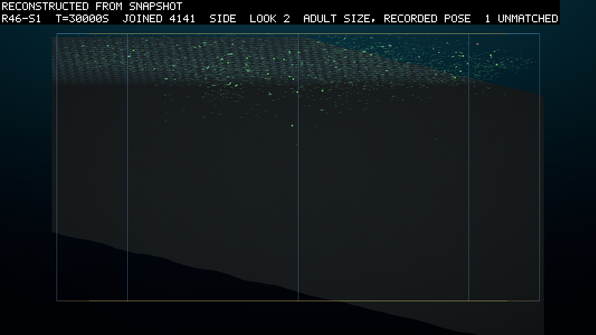
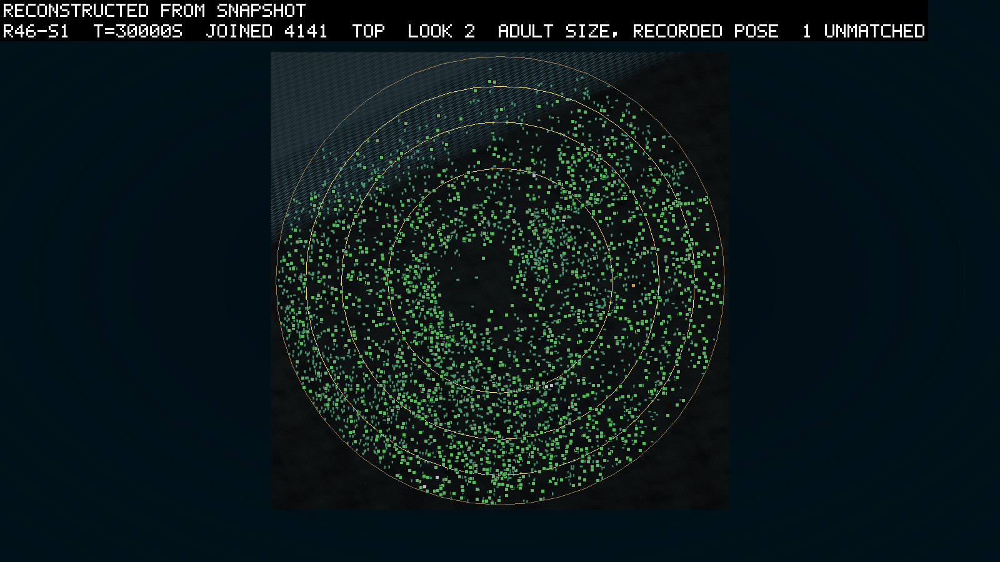
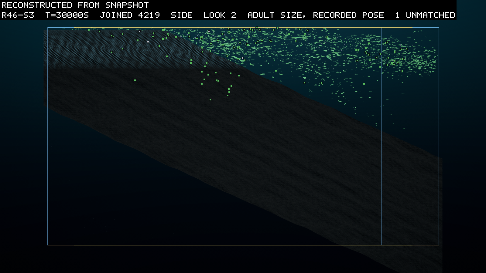
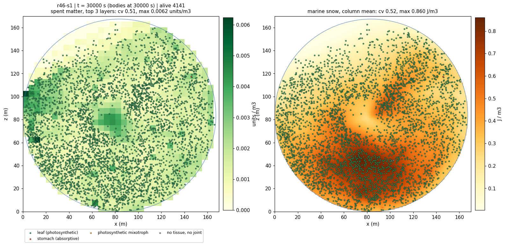
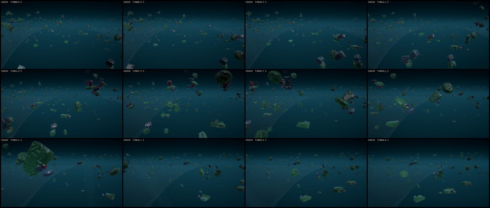
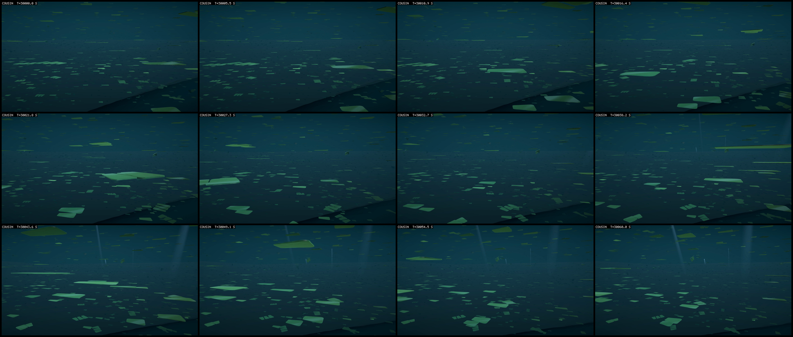
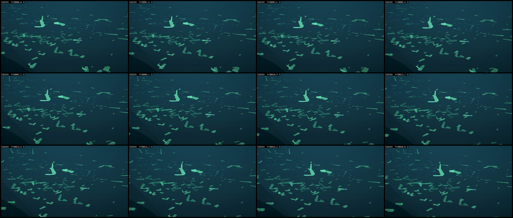

# The angle, the price, the second founding

*2026-09-23, evening. Written by the agent as the pre-registration of round 46, the base
round after the mouth (0114): seven rules land together under D110 to D116 and the beach,
every one built, screened and merged the same day, and the predictions were committed
before the three seeds launched (the launch section below). The build's specs are under
`logbook/specs/` and named in the world section; the ledger and the screen are read here
before the predictions so that a reader knows what the thresholds were set against.*

## What it asks

Seven rules land together (D110's light by exposure with the buoyancy offset; the founding
trickle with founders that follow their food, D115 and D116; the support cost, D113;
per-part contact, D114; the two repaired clauses; the beach; the snow's life, D112), and the
round asks one thing of each: does the crowd use it. A leaf that can lie flat and is paid
for it; founders that keep arriving and land where their food is, over a floor that holds
the food in the light; a price that stops the fan; a contact that touches with the part; a
killer read on a window it can meet.

## The world

Round 45's (D108, D109: 22,000 m², 45 m, 15,000 units as islands, matter-mix 0.02, remin
0.0005 by D112 (the snow's life, a quarter of round 45's rate), shade
off, the mouth's prices) with the five rules on at the ruled values: `light by exposure`,
`buoyancy offset 0.02 W/m3`, `trickle 1/30 s`, `founders in their food`, `support
0.1 W/m2/m2`, `contact per part`, the bed's `tilt 96 m shore 1 m fade 15 m`. Three seeds, 30,000 s at dt 0.01, five threads each,
the runaway ceiling 25,000, checkpoints every 2,500 s, the fields dumped with the snapshots,
poses recorded. The header is read after the launch and every token above is checked
against it before the queue is left to run.

## The ledger at the round's prices

The leaf of the growth ledger (`inocula/growth-ledger-genome.json`, two parts, 0.56 m² lit)
through `scripts/ledger.ps1` against the round's own `config.json` (the dt 0.02 screen
`r46scr-s1`'s, every rule on) at 0.5 J/m³ of snow and 0.25 units/m³ of spent matter. The
support term is 1% of its standing cost (5.4 mW of 0.55 W at a reach of 0.18 m), so the
price is nothing to a leaf and only the fan's. The pose is the whole of a leaf's margin at
the light's reach:

| depth | random pose: net W, R0 | flat: net W, R0 |
|---|---|---|
| 0 m | 3.43, 60 | 7.40, 189 |
| 3 m | 1.87, 21 | 4.28, 84 |
| 6 m | 0.92, 6 | 2.38, 33 |
| 12 m | −0.01, 0 | 0.53, 0 |

Lying flat doubles the income at every depth and turns a loss at 12 m into a living, which
is what K1 and K2 are betting the crowd finds. The offset's price is not in these rows (the
ledger's leaf carries an offset of 0); at the full offset it is 0.02 W per m³, 3.7 mW on
this body, a tenth of the support term's order and a thousandth of the flat premium.

## Predictions

| # | prediction | falsified by |
|---|---|---|
| K1 | **the crowd lies down**: `expo` (1 = random, 2 = every leaf flat) above 1.3 at 30,000 s in 2 of 3, from a founding that read 0.88 to 0.95 in the screen (a body is born at its birth rotation, not at a random one) | the column; `scripts/reads/tilt.py`'s flat factor as the check from the poses |
| K2 | **the offset is the way**: among the living root leaves at 30,000 s, those with `|buoyancyOffset|` above 0.2 have a mean exposure factor above those without by 0.3 or more, in 2 of 3 | the root leaves' exposure from `poses.jsonl` against the snapshot's node (`r46-read.py` K2; the recording carries no per-part factor, so the root leaf stands for the body) |
| K3 | **the trickle founds an eater's line**: an inherited consumer birth (`ink` inherited) whose ancestor is a trickle founder, and `corpse eat` above zero in 20 windows before 30,000 s, in 2 of 3 | `lineage.jsonl` (`src: trickle`, `ink`), the column |
| K4 | **a killer line founds**: attack above zero with a kill in 20 windows inside the last 10,000 s, in 1 of 3 or more (J2 re-asked on the repaired window) | `lineage.jsonl` (`atk`), the `killed` column |
| K5 | **defence follows offence, read above a crowd floor**: with 500 alive or more, the first window with `prot %` above 1% comes after the first with `attack %` above 1%, in 3 of 3 with attack present | the two columns |
| K6 | **the price stops the fan**: `reach m` (the area-weighted mean part distance from the root) below 2 m at every sample after 5,000 s in 3 of 3, and the ledger's `farthest part` under 6 m on the ten largest bodies of each 30,000 s snapshot | the column; `scripts/ledger.ps1` on the snapshot rows |
| K7 | **the crowd survives the price**: `alive` above 1,000 at 30,000 s in 3 of 3 (round 45 read 4,380 to 6,146) | the timeline |
| K8 | **the books close**: `audit` under 0.1 J at every sample, the matter residual under 1e-5 units at 30,000 s, `diverged` 0, in 3 of 3 (the offset's torque is the new term the divergence check watches) | `stats.jsonl`; the manifests |
| K9 | **contact is on the part**: `ovl/body` at 30,000 s under round 45's 0.01 in 3 of 3 | the column; the kill row carries no part index in this build, so the clause that a kill names the touching link is an instrument owed to the next build and not a prediction here |
| K10 | **the cost is small**: each seed's pace within a factor of 1.5 of round 45's at the crowd (round 45's footers read 1.0 to 1.4 times real time at five threads), in 3 of 3; the exposure pass and the support term have no timer of their own | the footer's `x real time` against 0114's |
| K11 | **the shelf holds the larder in the light**: at 10,000 s and after, the snow's column mean over the columns whose floor lies within 12 m of the surface reads above 0.4 J/m³ (the stomach's break-even; the snow is dumped as column sums, and it settles, so the floor cell holds at least the mean) in 3 of 3; and the consumer births of the trickle's line, where K3 holds, lie over that shelf in 2 of 3 | `fields/*.snow-columns.f32` with `fields/bed.f32` (`r46-read.py` K11); the births' positions against the floor under them |

## The two-sided readings

- **K1 fails with K8 holding:** the pay for lying flat did not move the crowd. Read `float
  off` first: if the offset never rose, the mutation rate or the price kept it out (a reading
  about the kit); if it rose and `expo` did not, the torque is not righting the leaves in this
  water (a reading about the physics, checked on one leaf alone).
- **K1 holds and K2 fails:** the crowd lay down another way (a float part, rising, a joint);
  the entry says which from the genomes of the flat bodies.
- **K3 fails with trickle stomachs present:** the founders starved with food present. Read
  their ages at death against the first cohort's (20 to 55 s): the same means the mouth's
  economy is short at this snow, and longer means they ate and did not breed.
- **K4 fails:** the killer of round 45 was that seed's; the two-sided reading stands.
- **K6 fails:** the price is too low or the copies earn past it; read `reach m` against the
  screen's `sqrt(10 / price)`.
- **K7 fails:** the price took the crowd; read `support W` against income before reading the
  mouth into it.
- **K9 fails:** the sphere on the part is holding bodies together that the body's sphere
  parted; read `ovl held %` and the pairs' parts before the price.

## What the round does not ask

Whether a leaf turns toward a sun it does not have (the light is straight down). Whether the
angle costs anything to hold (no price on the pose). Whether the reef would shade anything
(held for 47). Whether a body can live in air (the shoal is wet, and the terrestrial round is
later).

## The screen

A 3,000 s screen of the round's own launcher at dt 0.02, seed 1, every rule on
(`r46scr-s1`, `configHash e32cf74f6b0c8712`, under `scratch/r46-build/runs/`; its
header carries every token: `light by exposure`, `buoyancy offset 0.02 W/m3`, `trickle
1/30 s`, `founders in their food`, `support 0.1 W/m2/m2`, `contact per part`, `remin
0.0005 /s`, `tilt 96 m shore 1 m fade 15 m`). It ran at 5 times real time with the grid at
85% of the wall. Both books closed at every row, nothing diverged, and 882 were alive at
the end from 1,180 births. What each rule read:

| rule | the screen at 3,000 s |
|---|---|
| exposure | `expo` 0.88 at founding, 0.98 at 3,000 s, rising every window (1 is a random pose, 2 every leaf flat) |
| the offset | `float off` 0 at founding, 0.028 by 2,000 s and holding: the field enters by mutation and is not yet selected |
| support | `support W` 1.3 over 882 bodies, `reach m` 0.06: the price is a rounding on a crowd of small leaves |
| contact | `ovl/body` under 0.003 in every window |
| the trickle | `trickle` 0 throughout, because the floor closes at 3,000 s and the screen ended there; the second screen below |
| the beach | the shelf (the tenth of the columns whose floor is within 12 m) held 3.3% of the snow at 1,000 s and 3.75% at 3,000 s, against 0.01% on the old floor (`field-map.py`'s `snow-shelf12`); 4.4% of the bodies stood over it |
| the mouth | `killed` 0, `attack %` 0: nothing bit in 3,000 s, as in round 45's first 3,000 s |

The pictures are the map at 3,000 s, the spent matter in the top three layers with the
bodies on it beside the snow's columns, and the theatre's top and side views drawn from
the snapshot with the recorded poses. The crowd is one clump at the south-west
in the top five metres, where an island was seeded. The snow under it reads 1.9 J/m³ at
its densest column. A thin arc of bodies rides the north rim over the shelf. The rim
quarter held 47% of the crowd at 1,000 and 2,000 s and 33% at 3,000 s, against round 45's
fifth. I read that as the island's position at the south-west rim plus the arc along the
glass, and not as a crust: the arc is one body deep and the share fell as the clump
spread. The shore is at the north-west, the pale shelf in the top view, and the crowd is
on the deep side over a floor at 50 m. A leaf has no reason to be anywhere but where it
was born, and the light is even, so the shelf stays empty of bodies until an eater wants
it.

A second screen read the trickle, since the first ended the second its floor closed:
seed 2 of the same launcher at dt 0.02 for 1,500 s with the floor closing at 300 s
(`r46trk-s2`, `configHash 64f72b5a649b77f6`). The trickle began the step after the floor
closed and drew 35 founders over the next 1,200 s against an expected 40, never more than
two a window, every one on a lineage row reading `src: trickle`, with both books closed at
the end (the audit at 1e-6 J, the matter residual at 6e-7 units). Twelve of the 35 carried a
stomach, and the food rule put them where the snow was: the snow's column stock under a
trickle stomach's first recorded place read 20.9 J on average against a field mean of 5.7,
with 82% of them in a column above the mean, while the trickle's leaves, which follow the
dissolved matter instead, stood over 7.0 J of snow and 36% above the mean. One in ten
trickle founders stood over the shelf. So the mechanism is in and does what D115 and D116
asked; whether a stomach founder placed on its food leaves a line is K3.

## The launch

Three seeds launched 2026-09-23 at 15:22 local from `7bf9064` (this entry's commit; the
tree clean, so every manifest's `gitCommit` is the pre-registration's), through
`run-farm.ps1 -Launcher rounds/env-r46.ps1` on `artifacts/Evosim.Farm/bin/Release-r46`:
seeds 1 to 3, 30,000 s at dt 0.01, five threads each, a 900-minute wall (round 45's
footers read 365 to 489 minutes and contact per part costs a fifth more in the body
phase), the runaway ceiling 25,000, a checkpoint every 2,500 s. `configHash
7300c71be3b6b453`, `coreHash 429c8674…`, `dynamicsHash 41387d2b…`, `farmHash a5477389…`.
The header of each seed was read after the launch and carries every token the world
section names: `dt=0.01`, `light by exposure`, `buoyancy offset 0.02 W/m3`, `founders in
their food`, `remin 0.0005 /s`, `tilt 96 m shore 1 m fade 15 m`, `trickle 1/30 s`,
`support 0.1 W/m2/m2`, `contact per part`. The clause reader is
`scripts/reads/r46-read.py`, the watch is `scripts/watch-round.py r46 --read` it, and the
read section is written when the seeds end.

## The read

*Written the same night, after the three seeds ended on budget (seed 1 at 226 minutes of
wall clock, seed 3 at 263, seed 2 at 308). The reader's output for each seed at 30,000 s is
under `logbook/specs/r46-read/`, with the three reads this section added while it was
written (`r46-founding.py`, `r46-tilt-age.py`, `r46-selection.py`) and the stomachs'
ledgers.*

The crowd lay down, and the offset had nothing to do with it. Every leaf in every seed ends
the round flat to the surface, earning about 1.5 to 1.8 times what a random pose earns, and
the leaves that carry a buoyancy offset are no flatter than the leaves that do not. In seed
1 the whole crowd is descended from founders the trickle brought between 3,000 and 5,000 s,
the floor's lines having died out; in seed 3 the trickle's 897 founders left nothing that
lived. No stomach founder of either source lived longer than a few seconds, and the ledger
says why: a random stomach cannot live on any snow this world holds. Nothing bit anything
in 90,000 seed-seconds. The fan did not return, the books closed, contact sat on the part,
and the price cost nothing the pace could see. The shelf holds a snow column mean under the stomach's break-even in seed 1
and over it in seed 3, and the clause as written cannot be decided from what the farm dumps.

The predictions, seed by seed. A clause holds or fails on the pre-registered wording; where
the run's files cannot answer the wording, the cell says so and the verdict is *not decided*.

| # | clause | seed 1 | seed 2 | seed 3 | verdict |
|---|---|---|---|---|---|
| K1 | `expo` above 1.3 at 30,000 s, 2 of 3 | 1.77 | 1.82 | 1.51 | holds |
| K2 | offset leaves flatter by 0.3, 2 of 3 | −0.03 (1.74 against 1.77) | +0.01 (1.83 against 1.82) | −0.05 (1.49 against 1.55) | fails |
| K3 | an inherited consumer birth of the trickle's line and `corpse eat` in 20 windows, 2 of 3 | none; 2 windows | none; 1 window | none; 1 window | fails |
| K4 | attack with a kill in 20 windows after 20,000 s, 1 of 3 | no kill in the run | no kill in the run | no kill in the run | fails |
| K5 | defence rises after offence, 3 of 3 | defence first (7,720 s against 8,420) | defence first (3,170 against 3,950) | defence first (2,480 against 7,220) | fails |
| K6 | `reach m` under 2 m after 5,000 s and the farthest part under 6 m, 3 of 3 | reach at most 0.10 m; largest body 1.5 m across | reach at most 0.15 m; largest 2.4 m | reach at most 0.29 m; largest 3.3 m | holds |
| K7 | `alive` above 1,000 at 30,000 s, 3 of 3 | 4,142 | 5,892 | 4,220 | holds |
| K8 | `audit` under 0.1 J, matter residual under 1e-5 units, `diverged` 0, 3 of 3 | 1.0e-5 J, −1.2e-6 units, 0 | 9.7e-6 J, 9.6e-7 units, 0 | 2.7e-5 J, −1.5e-7 units, 0 | holds |
| K9 | `ovl/body` under 0.01 at 30,000 s, 3 of 3 | 0.0035 | 0.0019 | 0.0004 | holds |
| K10 | pace within a factor of 1.5 of round 45's, 3 of 3 | 2.2 times real time | 1.6 | 1.9 | holds |
| K11 | the shelf's lowest snow cell above 0.4 J/m³ from 10,000 s; the trickle's consumer births over it | column mean 0.35 J/m³ at 30,000 s | column mean 0.41 | column mean 0.47 | not decided |

K6's second clause was written for a ledger column that does not exist: `ledger.ps1` prints
one body's farthest part and has no way over a snapshot. So I read it from the solver
bench's rebuild of each crowd at 30,000 s, which prints the bounding radius of every body.
The largest is 1.5 m in seed 1 and 3.3 m in seed 3, both under the clause's 6 m. K9's kill-row
clause and K10's timer were declared instruments owed rather than predictions, and stay so.
K10 holds on the clause's intent and not on its arithmetic: the seeds ran faster than round
45's, at 1.6 to 2.2 times real time against 1.0 to 1.4, and the two rounds ran under
different loads, so the number bounds the cost from above and measures nothing. K11's cell
could not be read because the snow is dumped as column sums; the column mean over the shelf
is the reading the dump allows, and the two seeds sit on either side of the break-even.

### The angle

The exposure column climbed every window from a founding near 0.8 to 1.5 in seed 3, 1.8
in seed 1 and 1.8 in seed 2. The column is the leaves' lit area in their poses over their
lit area averaged over every pose, so 1 is a random crowd and 2 a crowd of leaves lying
flat with the light straight down. The poses say the same thing another way: `tilt.py`
reads a median tilt of 0 degrees in seeds 1 and 2 and 1 degree in seed 3 at 30,000 s, from
66, 76 and 59 degrees at 100 s.

I expected the offset to be the way there. It was in the crowd, at an area-weighted mean of
0.12 to 0.16 by 15,000 s and flat after, and it bought nothing. The leaves whose root carries
an offset above 0.2 read a flat factor of 0.999 in seed 1, 0.994 in seed 2 and 0.950 in seed
3; the leaves without read 0.995, 0.995 and 0.949. The pre-registration's two-sided reading
for this case says the crowd lay down another way and the entry has to say which, from the
genomes. There are two ways, and neither is the physics of the torque.

In seed 1 the leaves are born flat and stay flat. The genome gives a part its three
dimensions in the developer's own frame, and a body is put into the world at the developer's
rotation, which is the identity for the root. A root whose thinnest dimension is its y is
therefore born lying flat, and a root whose thinnest is x or z is born on edge. At 100 s, 14 of seed
1's 40 roots were thin on y; at 5,000 s, 401 of 742; at 30,000 s, 4,139 of 4,142. And the
water never turned them: 92% of the living roots at 30,000 s are still at the identity
rotation, to the last digit, after lives of up to 4,000 s in a current of 0.1 m/s. The flat
pose in seed 1 is a genomic trait, the orientation of the root's thin axis, carried
through the whole crowd by descent from the trickle's founders (the next section) and never
touched by the water.

Seed 2 went the same way from its own floor founding, with no trickle in it: 15 of 41
roots thin on y at 100 s, 877 of 1,127 at 5,000 s, 5,889 of 5,892 at 30,000 s, and two
thirds of the living roots still at the identity at the end. So the frame's route is not
seed 1's founder effect alone.

The owner asked whether that is selection, and it is, measured inside the crowd rather
than inferred from the sweep. The table compares the leaves born flat with the leaves born
on edge in the same windows of seed 1, counting each body's births over the seconds it was
alive in the window.

| window | flat-born: bodies, births per body-hour | edge-born: bodies, births per body-hour |
|---|---|---|
| 3,000–6,000 s | 816, 1.30 | 896, 1.37 |
| 6,000–10,000 s | 1,224, 1.42 | 798, 1.02 |
| 10,000–15,000 s | 3,063, 1.80 | 631, 1.04 |

The flat-born out-bred the edge-born by 1.4 to 1.7 times once the crowd was established,
which is the ledger's doubled income showing as offspring. In the first window they did
not, and my reading is that the founding crowd was bound by matter uptake and not by light,
so a better pose paid nothing yet. Part of the sweep is also descent: the dozen trickle
founders whose lines took the world carried the trait along with everything else they had,
and this table cannot separate the two, only say that the trait paid within the crowd. Seed
2 separates them, since its crowd is one floor founding with no refounding in it: there the
flat-born bred at two to three times the edge-born's rate in every window from 3,000 s
(1.48 against 0.74 births per body-hour in the first, 1.54 against 0.50 in the third), and
the edge-born were 116 bodies of 20,800 by the last (`r46-selection.py`, the three seeds'
tables under the read directory).

In seed 3 the leaves are born on edge and turn. One root in 4,220 is thin on y at 30,000 s,
no root is at the identity, and the crowd is 0.95 flat. The turn is over before the pose
file first sees a body. A newborn's first pose row is within 100 s of its birth at the
stride the read used, and it already reads 0.90; its parent in the same row reads 0.91. The
bodies first seen in the round's last 10,000 s read 0.90 at their first row and 0.93 at
their last, so the water finishes the turn slowly over a life but does not begin it. What
begins it I do not know from the run's files. The offset is excluded by the comparison above. A
lone leaf placed on edge in still water at neutral weight does not turn in the solver's own
test (`WithoutThePriceTheSameLeafStaysOnEdge`), and the bench's trace of a lone body starts
it at rest in still water, where nothing moves at all. Seed 3's bodies are two-part chains
where seed 1's are single leaves, 2.2 links a body against 1.1. My guess, unmeasured, is
that a chain whose parts differ in density hangs into its flat pose under its own weight
and buoyancy in the first seconds. The check is one seed-3 body stepped alone in the round's
water from its developed pose, which the bench does not do yet and the next build should.

So K1 holds and K2 fails, and the failure is the finding. Lying flat doubles a leaf's income
at every depth, and in this world the pose is either inherited through the genome's frame at
no cost or reached by the physics for free, so a torque that costs 0.02 W per cubic metre
has nothing to sell. Whether the offset earns its place in a world where the water tumbles
bodies is a question this world cannot ask, since the water here turns nothing.

### The second founding

The trickle was built to keep founders arriving after the floor closes at 3,000 s, one every
30 s, placed where their food is. It brought 921 founders to seed 1 and 897 to seed 3, from
3,015 s to the last minute, every one on a lineage row marked `trickle`, about 4% of all
births. What each seed did with them could not differ more, and `r46-founding.py` is the
read.

Seed 1's crowd fell from its founding to 741 at 5,000 s and 789 at 10,000 s, and the
floor's lines were dying out under it: every one of the 88 floor founders was dead, and their
last descendants with them. At 30,000 s all 4,142 living bodies descend from trickle founders
born between 3,015 and 5,000 s, apart from four trickle founders born in the last minute.
Twenty-four of the trickle's 921 founders bred at all, and about a dozen of those are the
ancestors of the whole crowd. The title's second founding is literal in this seed: the
world was refounded in its second hour by the trickle, and the first founding left nothing.

Seeds 2 and 3 kept their first founding. 5,888 of seed 2's 5,892 living bodies and 4,216 of
seed 3's 4,220 descend from floor founders; the trickle's 919 and 897 arrivals left 171 and
191 births and no line, though 23 and 29 of them bred. The same trickle in the same world
was the whole crowd in one seed and noise in the other two, and the difference is whether
the first founding held: seeds 2 and 3's floor lines were breeding when the trickle began
(21 and 10 floor founders bred, 30% and 14%), and seed 1's were dying out.

The stomachs are the part the trickle was for, and none of them left a line. The founder
kit draws two kinds. A consumer mouth scavenges at one body volume of water a second and
bites; an absorptive stomach clears ten volumes a second and cannot bite. Seed 1's trickle
brought 228 consumers and 234 absorptive stomachs among its 921 founders, seed 2's 211 and
230 among 919, seed 3's 219 and 223 among 897, and the floor's first cohorts held 14 to 32
consumers and 2 to 14 absorptive stomachs. The consumers died at a median of 5 or 6 s,
quartiles 4 to 50 s, from both sources in every seed, which is shorter than the first
cohort's 20 to 55 s that the two-sided reading named. The absorptive stomachs lived longer:
medians of 26, 20 and 14 s, a quarter of them past 130 to 200 s, the longest 2,215 to
2,663 s. Not one of the 1,350 stomachs of either kind bred, in any seed, from either
source.

The ledger says why, kind by kind, against the round's own config. A trickle consumer
pulled from the snapshots (a consumer with a link, 0.09 m³) nets −0.43 W at birth at
0.5 J/m³ of snow and has no break-even at any density up to 10 J/m³; its ledger lifetime is
7 s, the lineage's median to the second. The consumer's mouth is the wrong organ for snow.
The absorptive stomach is the right one, and the stomach screens' inoculum
(`inocula/r45s1-stomach-100.json`, `logbook/specs/stomach-screens.md`) breaks even at
0.44 J/m³, which is about what the crowd's underside holds: at 0.5 J/m³ it nets 0.045 W and
never saves a child's price, at 1 J/m³ its R0 is 2 with a first child at 410 s, and at
2 J/m³ its R0 is 12. So an absorptive founder placed in the snow lives as long as its luck
holds, which the record shows, and breeds only where the snow reaches twice the underside's
density, which the densest columns under the crowd did at the screen (1.9 J/m³) and the
shelf did not. The two-sided reading's first branch applies to the consumers outright, and
to the absorptive stomachs in the form the screens found: the food is too thin to pay for a
child except in the thickest columns. (My first ledger runs that night read every stomach at
a clearance override of 1, a tenth of the config's, and put the inoculum's break-even at
4.4 J/m³; the runs above are at the config's own rate.)

### The mouth

Nothing killed anything in 90,000 seed-seconds. The attack share rose to 2% of the crowd in
seed 1 near 10,000 s and 1.8% in seed 3, and fell to 0 in both by 25,000 s. The protection
share sat between 0.6% and 2.8% throughout, and crossed 1% before the attack share did in
both seeds, so K5 fails as worded. My reading is that with no prey the claw is a price and
nothing else (the ledger bills it at about 18% of a stomach's standing cost) and selection
prunes it, while a cuticle with nothing to defend against rides mutation at a percent. The
two-sided reading for K4 stands: round 45's killer was that seed's.

### The price

The fan of round 44 did not come back, and the price was never tested. Seed 1's crowd is
leaves of one or two parts, 1.1 links a body, reach 0.005 m, the support bill 0.49 W over
4,142 bodies. Seed 3 grew: the module rule added parts in 106 bodies by 30,000 s, links per
body reached 2.2, the reach climbed from 0.18 m at 15,000 s to 0.29 m at the end and the bill
to 29 W, still 7 mW a body. The largest body in either crowd spans 3.3 m. The jointed share
fell from about half at founding to 2.5% and 4.8%, as it has in every round since the
eaters left. Both crowds are uptake-limited, 68% to 82% of leaf-steps bound by uptake rather
than light, and the crowd sank as it grew, from a mean depth of 3 or 4 m at 5,000 s to 10 or
11 m at the end. I read the sinking as the top stripping first and the crowd spreading into
water that still holds matter, and have not checked it against the field's layers.

Why no fan, when the owner asked: three reasons, in the order I trust them. The water
starves growth: round 44's fan grew in matter stirred at 2 m²/s, and since D109 the grid
is stirred at 0.02, so a body that cannot take matter in cannot build parts. The
part-adding gene is rare in these crowds: 12% and 22% of bodies carry an indeterminate
node at the end against 82% in round 45 seed 1, in seed 1 by descent from a dozen
founders, and nearly every addition attempted was refused on shape (135 to 210 a window
against 0 or 1 accepted), which is D101's overlap rule at work. And the price did nothing,
because at 7 mW a body nothing reached it.

### The books, the contact, the cost

Both books closed at every sample, no body diverged, and the overlap count sat under a
hundredth of round 45's at the end in every seed, with a peak of 0.0035 in seed 1's last
window. Contact per part is dearer per step and the seeds still ran at 1.6 to 2.2 times real
time, three arms and then fewer on the machine beside a film render; the footers put the
wall half to three fifths in the solver and the rest in the grid, with the harness at 1%.

### The shelf

The beach holds snow in the light and the stomachs never reached it. The tenth of the
columns whose floor lies within 12 m of the surface held 2.6% to 2.8% of the snow at
15,000 s and 1.5% to 2.2% at 30,000 s, against 0.01% on round 45's flat floor. Their column
mean reads 0.35 J/m³ in seed 1, 0.41 in seed 2 and 0.47 in seed 3 at the end, around the
inoculum stomach's break-even of 0.44; 42%, 59% and 75% of the shelf columns are above 0.4.
The clause asked for the lowest cell of each column, which the farm does not dump, so the
verdict is not decided rather than failed; the reading is that the shelf keeps a stomach
alive and, at these densities, gives it no child. The matter's islands were soup by the end,
as D109's entry said they would be: the bodies stand over the seeded islands' footprint at
the water's own share (0.12 to 0.16 of the bodies over 0.16 to 0.17 of the water).

### What it looked like

I looked at the world drawn from its own files at 30,000 s before writing this, and at the
films. From the side, each seed is a pancake of leaves in the top ten metres of a 45 m
tank, a thin scatter below it, the bed sloping from the shore's shoal at one side to the
deep wall at the other, and the shoal itself nearly empty. From above, the crowd fills the
whole disc, seed 1 with a thinner centre and seed 3 evenly. Every leaf is drawn face up in
its recorded pose. Where a jointed body stands out it is one in fifty.

The films are new this round: `scripts/theatre-film.ps1` restores a checkpoint in the
theatre's live mode and steps the world itself, so every clip is a labelled cousin of the
run and not the run (CLAUDE.md's film paragraph has the tool and what bit while it was
built). Two shots per seed at 5,000, 15,000 and 30,000 s, an orbit that keeps the bed and
the glass in frame and a close portrait held still, under `scratch/films/`, not committed.
Each clip has a contact sheet of twelve frames beside it, and three of the sheets are
committed here as the films' record. What I saw in them. At 5,000 s seed 1 is a founding
crowd: rounded balls and blocks of several sizes, most of them dark green with a red rim on
a part, drifting past the camera in the current with nothing swimming, the bed's tilt a
pale band behind them. At 30,000 s seed 2 is a field of flat, pale slabs lying in the
shelf's light over the tilted bed, a crowd of leaves face-up to the sun with the marine
snow falling through the shafts, and over a minute of the orbit the slabs drift together as
one carpet. Seed 3's close portrait at 30,000 s holds still on two-part bodies, a leaf and a
link, several of them bent into an L, none of them moving in twenty seconds except a slow
drift. The reading is the tilt table's: a world that lies flat, and lies still. Every frame
carries the word COUSIN because the Editor's Mono does not replay the farm's RyuJIT.

### What changes

Three things for the owner, none of them a new world rule.

- **The trickle's stomachs** die in seconds at any snow this world holds, so the second
  founding can only ever bring leaves. The options are a trickle that draws from a pool of
  inoculated bodies, the stomach screens' body among them, or a stomach founder placed with
  a reserve sized to its bill. That is a world rule and the owner's.
- **The offset** has no work here. K2 fails in every seed because the pose is free. I would
  keep the field in the genome at its price and not build on it until a world tumbles
  bodies.
- **The shelf** reads, and the eaters are not there to read it with. K11 can be decided
  next round if the farm dumps the snow by cell rather than by column, which is an
  instrument and mine to add.

The check I owe is the one seed-3 body stepped alone in the round's water, to say what turns
a leaf born on edge; and the check the pre-registration owes is a kill row that names the
part.
