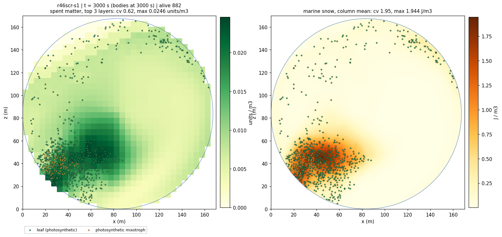
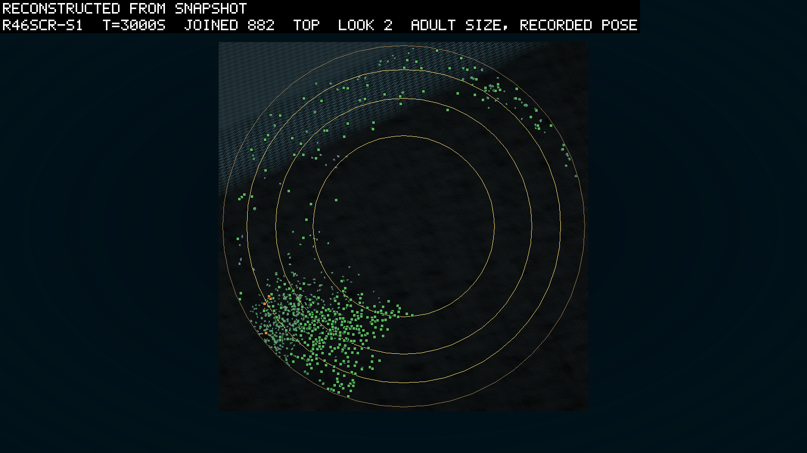
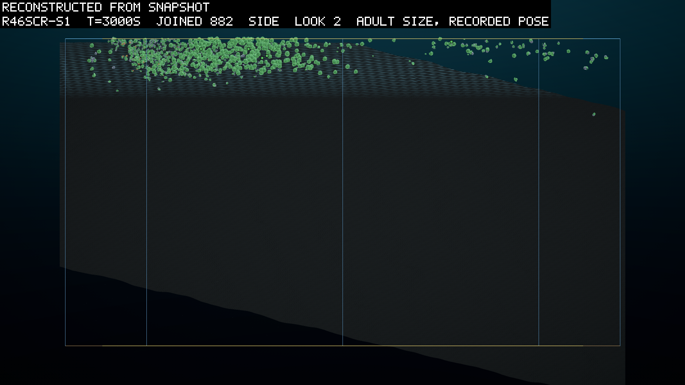

# The angle, the price, the second founding

*2026-09-23, evening. Written by the agent as the pre-registration of round 46, the base
round after the mouth (0114): seven rules land together under D110 to D116 and the beach,
every one built, screened and merged the same day, and the predictions were committed
before the three seeds launched (the launch section below). The build's specs are under
`logbook/specs/` and named in the world section; the ledger and the screen are read here
before the predictions so that a reader knows what the thresholds were set against.*

## What it asks

Seven rules land together (D110's light by exposure with the buoyancy offset; the founding
trickle with founders that follow their food, D115 and D116; the support cost, D113;
per-part contact, D114; the two repaired clauses; the beach; the snow's life, D112), and the
round asks one thing of each: does the crowd use it. A leaf that can lie flat and is paid
for it; founders that keep arriving and land where their food is, over a floor that holds
the food in the light; a price that stops the fan; a contact that touches with the part; a
killer read on a window it can meet.

## The world

Round 45's (D108, D109: 22,000 m², 45 m, 15,000 units as islands, matter-mix 0.02, remin
0.0005 by D112 (the snow's life, a quarter of round 45's rate), shade
off, the mouth's prices) with the five rules on at the ruled values: `light by exposure`,
`buoyancy offset 0.02 W/m3`, `trickle 1/30 s`, `founders in their food`, `support
0.1 W/m2/m2`, `contact per part`, the bed's `tilt 96 m shore 1 m fade 15 m`. Three seeds, 30,000 s at dt 0.01, five threads each,
the runaway ceiling 25,000, checkpoints every 2,500 s, the fields dumped with the snapshots,
poses recorded. The header is read after the launch and every token above is checked
against it before the queue is left to run.

## The ledger at the round's prices

The leaf of the growth ledger (`inocula/growth-ledger-genome.json`, two parts, 0.56 m² lit)
through `scripts/ledger.ps1` against the round's own `config.json` (the dt 0.02 screen
`r46scr-s1`'s, every rule on) at 0.5 J/m³ of snow and 0.25 units/m³ of spent matter. The
support term is 1% of its standing cost (5.4 mW of 0.55 W at a reach of 0.18 m), so the
price is nothing to a leaf and only the fan's. The pose is the whole of a leaf's margin at
the light's reach:

| depth | random pose: net W, R0 | flat: net W, R0 |
|---|---|---|
| 0 m | 3.43, 60 | 7.40, 189 |
| 3 m | 1.87, 21 | 4.28, 84 |
| 6 m | 0.92, 6 | 2.38, 33 |
| 12 m | −0.01, 0 | 0.53, 0 |

Lying flat doubles the income at every depth and turns a loss at 12 m into a living, which
is what K1 and K2 are betting the crowd finds. The offset's price is not in these rows (the
ledger's leaf carries an offset of 0); at the full offset it is 0.02 W per m³, 3.7 mW on
this body, a tenth of the support term's order and a thousandth of the flat premium.

## Predictions

| # | prediction | falsified by |
|---|---|---|
| K1 | **the crowd lies down**: `expo` (1 = random, 2 = every leaf flat) above 1.3 at 30,000 s in 2 of 3, from a founding that read 0.88 to 0.95 in the screen (a body is born at its birth rotation, not at a random one) | the column; `scripts/reads/tilt.py`'s flat factor as the check from the poses |
| K2 | **the offset is the way**: among the living root leaves at 30,000 s, those with `|buoyancyOffset|` above 0.2 have a mean exposure factor above those without by 0.3 or more, in 2 of 3 | the root leaves' exposure from `poses.jsonl` against the snapshot's node (`r46-read.py` K2; the recording carries no per-part factor, so the root leaf stands for the body) |
| K3 | **the trickle founds an eater's line**: an inherited consumer birth (`ink` inherited) whose ancestor is a trickle founder, and `corpse eat` above zero in 20 windows before 30,000 s, in 2 of 3 | `lineage.jsonl` (`src: trickle`, `ink`), the column |
| K4 | **a killer line founds**: attack above zero with a kill in 20 windows inside the last 10,000 s, in 1 of 3 or more (J2 re-asked on the repaired window) | `lineage.jsonl` (`atk`), the `killed` column |
| K5 | **defence follows offence, read above a crowd floor**: with 500 alive or more, the first window with `prot %` above 1% comes after the first with `attack %` above 1%, in 3 of 3 with attack present | the two columns |
| K6 | **the price stops the fan**: `reach m` (the area-weighted mean part distance from the root) below 2 m at every sample after 5,000 s in 3 of 3, and the ledger's `farthest part` under 6 m on the ten largest bodies of each 30,000 s snapshot | the column; `scripts/ledger.ps1` on the snapshot rows |
| K7 | **the crowd survives the price**: `alive` above 1,000 at 30,000 s in 3 of 3 (round 45 read 4,380 to 6,146) | the timeline |
| K8 | **the books close**: `audit` under 0.1 J at every sample, the matter residual under 1e-5 units at 30,000 s, `diverged` 0, in 3 of 3 (the offset's torque is the new term the divergence check watches) | `stats.jsonl`; the manifests |
| K9 | **contact is on the part**: `ovl/body` at 30,000 s under round 45's 0.01 in 3 of 3 | the column; the kill row carries no part index in this build, so the clause that a kill names the touching link is an instrument owed to the next build and not a prediction here |
| K10 | **the cost is small**: each seed's pace within a factor of 1.5 of round 45's at the crowd (round 45's footers read 1.0 to 1.4 times real time at five threads), in 3 of 3; the exposure pass and the support term have no timer of their own | the footer's `x real time` against 0114's |
| K11 | **the shelf holds the larder in the light**: at 10,000 s and after, the snow's column mean over the columns whose floor lies within 12 m of the surface reads above 0.4 J/m³ (the stomach's break-even; the snow is dumped as column sums, and it settles, so the floor cell holds at least the mean) in 3 of 3; and the consumer births of the trickle's line, where K3 holds, lie over that shelf in 2 of 3 | `fields/*.snow-columns.f32` with `fields/bed.f32` (`r46-read.py` K11); the births' positions against the floor under them |

## The two-sided readings

- **K1 fails with K8 holding:** the pay for lying flat did not move the crowd. Read `float
  off` first: if the offset never rose, the mutation rate or the price kept it out (a reading
  about the kit); if it rose and `expo` did not, the torque is not righting the leaves in this
  water (a reading about the physics, checked on one leaf alone).
- **K1 holds and K2 fails:** the crowd lay down another way (a float part, rising, a joint);
  the entry says which from the genomes of the flat bodies.
- **K3 fails with trickle stomachs present:** the founders starved with food present. Read
  their ages at death against the first cohort's (20 to 55 s): the same means the mouth's
  economy is short at this snow, and longer means they ate and did not breed.
- **K4 fails:** the killer of round 45 was that seed's; the two-sided reading stands.
- **K6 fails:** the price is too low or the copies earn past it; read `reach m` against the
  screen's `sqrt(10 / price)`.
- **K7 fails:** the price took the crowd; read `support W` against income before reading the
  mouth into it.
- **K9 fails:** the sphere on the part is holding bodies together that the body's sphere
  parted; read `ovl held %` and the pairs' parts before the price.

## What the round does not ask

Whether a leaf turns toward a sun it does not have (the light is straight down). Whether the
angle costs anything to hold (no price on the pose). Whether the reef would shade anything
(held for 47). Whether a body can live in air (the shoal is wet, and the terrestrial round is
later).

## The screen

A 3,000 s screen of the round's own launcher at dt 0.02, seed 1, every rule on
(`r46scr-s1`, `configHash e32cf74f6b0c8712`, under `scratch/r46-build/runs/`; its
header carries every token: `light by exposure`, `buoyancy offset 0.02 W/m3`, `trickle
1/30 s`, `founders in their food`, `support 0.1 W/m2/m2`, `contact per part`, `remin
0.0005 /s`, `tilt 96 m shore 1 m fade 15 m`). It ran at 5 times real time with the grid at
85% of the wall. Both books closed at every row, nothing diverged, and 882 were alive at
the end from 1,180 births. What each rule read:

| rule | the screen at 3,000 s |
|---|---|
| exposure | `expo` 0.88 at founding, 0.98 at 3,000 s, rising every window (1 is a random pose, 2 every leaf flat) |
| the offset | `float off` 0 at founding, 0.028 by 2,000 s and holding: the field enters by mutation and is not yet selected |
| support | `support W` 1.3 over 882 bodies, `reach m` 0.06: the price is a rounding on a crowd of small leaves |
| contact | `ovl/body` under 0.003 in every window |
| the trickle | `trickle` 0 throughout, because the floor closes at 3,000 s and the screen ended there; the second screen below |
| the beach | the shelf (the tenth of the columns whose floor is within 12 m) held 3.3% of the snow at 1,000 s and 3.75% at 3,000 s, against 0.01% on the old floor (`field-map.py`'s `snow-shelf12`); 4.4% of the bodies stood over it |
| the mouth | `killed` 0, `attack %` 0: nothing bit in 3,000 s, as in round 45's first 3,000 s |

The pictures are the map at 3,000 s, the spent matter in the top three layers with the
bodies on it beside the snow's columns, and the theatre's top and side views drawn from
the snapshot with the recorded poses. The crowd is one clump at the south-west
in the top five metres, where an island was seeded. The snow under it reads 1.9 J/m³ at
its densest column. A thin arc of bodies rides the north rim over the shelf. The rim
quarter held 47% of the crowd at 1,000 and 2,000 s and 33% at 3,000 s, against round 45's
fifth. I read that as the island's position at the south-west rim plus the arc along the
glass, and not as a crust: the arc is one body deep and the share fell as the clump
spread. The shore is at the north-west, the pale shelf in the top view, and the crowd is
on the deep side over a floor at 50 m. A leaf has no reason to be anywhere but where it
was born, and the light is even, so the shelf stays empty of bodies until an eater wants
it.

A second screen read the trickle, since the first ended the second its floor closed:
seed 2 of the same launcher at dt 0.02 for 1,500 s with the floor closing at 300 s
(`r46trk-s2`, `configHash 64f72b5a649b77f6`). The trickle began the step after the floor
closed and drew 35 founders over the next 1,200 s against an expected 40, never more than
two a window, every one on a lineage row reading `src: trickle`, with both books closed at
the end (the audit at 1e-6 J, the matter residual at 6e-7 units). Twelve of the 35 carried a
stomach, and the food rule put them where the snow was: the snow's column stock under a
trickle stomach's first recorded place read 20.9 J on average against a field mean of 5.7,
with 82% of them in a column above the mean, while the trickle's leaves, which follow the
dissolved matter instead, stood over 7.0 J of snow and 36% above the mean. One in ten
trickle founders stood over the shelf. So the mechanism is in and does what D115 and D116
asked; whether a stomach founder placed on its food leaves a line is K3.

