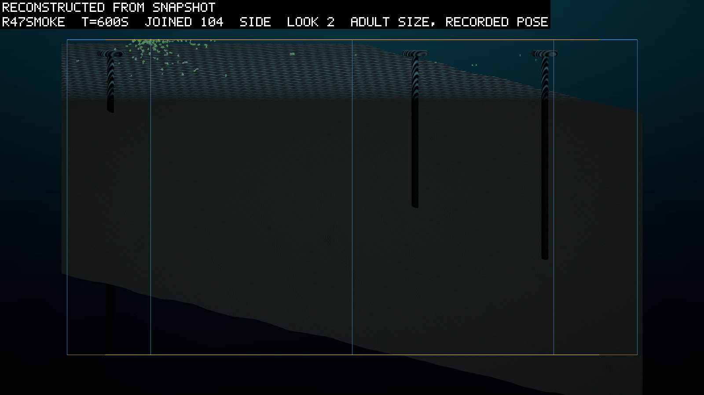
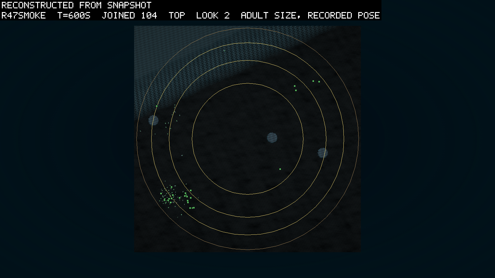
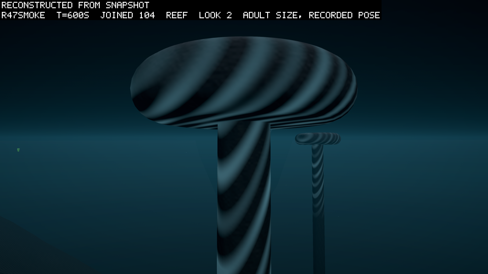

# The reef and the second chance

*2026-09-23, night. Written by the agent as the pre-registration of round 47, the round
after the base round 46 (0116): the mushroom reef (`logbook/specs/reef-spec.md`) and the
trickle's pool (D117) land together, both built the same night by subagents in worktrees,
merged with the four instruments and the safari director, and screened before the
predictions were committed (the launch section below). The owner asked for the reefs to be
looked at before the round ran, and for the caps to block the sun under them, and
delegated the review of the pictures to the agent (the evening's conversation); the smoke
section is that review.*

## What it asks

Two things land together, and the round asks one question of each. The mushroom reef (the
owner's shape: rock columns with overhanging caps, a lit table on top where snow lands, a
shaded room underneath) asks whether the crowd uses a place that differs from the open
water: does the snow pile on the tables, does anything live in the dark under a cap, and
does the shade show in the crowd. The pool (D117: one trickle founder in ten is a copy of an
evolved stomach that once lived) asks the question round 46 could not: given a stomach
that can live on this snow, does an eater's line found.

## The world

Round 46's (0116's world section: 22,000 m², 45 m, 15,000 units as islands, matter-mix
0.02, remin 0.0005, the beach at tilt 96 m with a 1 m shore and a 15 m fade, light by
exposure, the offset at 0.02 W/m³, the trickle at 1/30 s with founders in their food, the
support cost at 0.1 W/m²/m², contact per part) with two rules on: `reefs 3 cap r=4 m at 3 m
t=2 m stem r=1 m fade 15 m` (the fade from the build's fastest-water reading: at 10 m the
fade's own term puts the water beside a reef at 0.89 m/s, over the grid's Courant bound of
0.83; at 15 m the fastest water within a cap radius is 0.24 m/s and at 20 m 0.13, against
0.39 to 0.46 unfaded at the same points; the caps are placed at least 38 m apart, so 15 m
is under half the spacing), the cap opaque to the light under it and `pool 0.1 of 4` (the four bodies of `inocula/pool-r47/`). Three seeds, 30,000 s
at dt 0.01, five threads each, two arms at a time (the owner's cap), the runaway ceiling
25,000, checkpoints every 2,500 s, the fields and the poses dumped.

## The ledger at the round's prices

The pool's four bodies against the round's config, at the config's clearance of ten volumes
a second (`logbook/specs/r46-read/ledger-stomachs.md`; an earlier pass at a clearance of 1
is withdrawn there):

| body | standing W | break-even J/m³ | net W at 0.5 | R0 at 1 (first child) | R0 at 2 (first child) |
|---|---|---|---|---|---|
| the screens' inoculum, one part | 0.36 | 0.44 | +0.05 | 2 (410 s) | 12 (122 s) |
| seed 1's 1182, stomach and link | 0.80 | 0.17 | +0.49 | 2 (847 s) | 16 (262 s) |
| seed 3's 1513, stomach and link | 0.46 | 0.29 | +0.20 | 3 (338 s) | 15 (123 s) |
| seed 3's 2156, stomach and link | 0.59 | 0 | +0.58 | 2 (568 s) | 12 (269 s) |

None breeds at 0.5 J/m³, about what the crowd's underside held in round 46. All breed from
1, and the densest columns under the crowd reached 1.9 at round 46's screen. So the pool's
bet is on where a founder lands, which D116's food rule decides by the snow's columns, and
not on whether the body can live.

## Predictions

| # | prediction | falsified by |
|---|---|---|
| L1 | **a pool stomach lives**: the median age at death of the pool founders that have died is above 300 s in 3 of 3 (founders still alive at the read are counted beside the median and left out of it; round 46's random absorptive founders read 14 to 26 s; the ledger's lifetimes at 0.5 J/m³ are 420 to 3,400 s) | `lineage.jsonl` (`src: pool`, the death rows) |
| L2 | **a pool stomach breeds**: at least one pool founder has a child in 3 of 3 | the birth rows whose parent is a pool founder |
| L3 | **an eater's line founds**: ten or more living bodies rooted in pool founders at 30,000 s in 1 of 3 or more | the parent walk (`r46-founding.py`, the pool source) |
| L4 | **it breeds where the ledger says**: every pool founder that breeds stood, at its first positions row, in a column whose snow read 1 J/m³ or more (the column's joules over its water depth, rock removed) in the nearest dump at or before that second, in 3 of 3 where any breeds | the founder's place from the first positions row against `fields/*.snow-columns.f32` and `bed.f32` |
| L5 | **the tables hold snow**: the columns within a cap radius of a reef's axis hold more snow per cubic metre of water (the column's joules over its water, the rock removed) than the open floor's columns (at least two cap radii plus the fade from every axis, off the beach's shelf) at every dump from 10,000 s, in 3 of 3. The dump is column sums, so a table's column holds the snow on the table and the room under it together, and the reading cannot separate the two; the joules per square metre are printed beside it | the snow dumps against `run.json`'s `reefs` |
| L6 | **the shade shows**: fewer bodies per cubic metre under the caps (within a cap radius of an axis, from the cap's underside down 10 m, the stem's columns left out) than beside them (between one and two cap radii, the same band) at every 500 s from 10,000 s, in 3 of 3 | `positions.jsonl` against `run.json`'s `reefs` |
| L7 | **nothing lives in the dark room** at these prices: no photosynthetic body under a cap (the light's rule: within a cap radius of an axis and below the cap's top) at 30,000 s in 3 of 3, and any body there is a stomach by its lineage row (`ink` 1, or `abs` 1 with `pho` 0) | `positions.jsonl` with the flags, joined to `lineage.jsonl` |
| L8 | **the rock is a wall, not a trap**: (a) no root inside a reef by more than 0.5 m at any positions sample, and no divergence dump naming the reef guard, in 3 of 3; (b) a reading, not a clause: `bedOrGlassBodiesPerStep` over the last 2,000 s against round 46's same seed at the window with the nearest crowd, since the rock sets the same flag as the bed and the glass and the column is the three together | `positions.jsonl` with the ported signed distance; `diverged/`; `stats.jsonl` |
| L9 | **the books close**: `audit` under 0.1 J, the matter residual under 1e-5 units, `diverged` 0, in 3 of 3 | `stats.jsonl`; the manifests |
| L10 | **the water at the rock is sane**: (a) the fastest water within a cap radius of a reef under three times the tank's RMS, from the build's own test at the round's fade (`ReefStreamsTests`; no run record carries it), printed in the smoke section before the launch; (b) the footer's whole-run pace within 1.5 of round 46's mean (2.2, 1.6 and 1.9x), a reading confounded by the load (round 46 ran three arms at once and round 47 runs two), with the last 2,000 s window against round 46's at the nearest crowd printed beside it | the test's output; the footers and `wallTotalMs` |
| L11 | **the angle holds**: `expo` above 1.5 at 30,000 s in 3 of 3 (round 46 read 1.5 to 1.8) | the column |

## The two-sided readings

- **L1 holds and L2 fails.** The stomach lives and saves nothing, as the ledger says at
  0.5 J/m³. Read the snow at each pool founder's column at birth (L4's join) and say whether
  any stood above 1. None above 1 means the food rule never placed one where the ledger
  breeds it, which is a placing question. Some above 1 and no child means the ledger
  over-reads the world's snow at the body, which is a ledger question.
- **L2 holds and L3 fails.** A line starts and dies. Read the children's ages and the snow
  under them: either the larder was eaten out (the snow's columns fall under the line) or
  the children were placed off it (dispersal).
- **L3 holds.** The first eater's line since round 41. Read whether it is one body's clade
  or several, and whether the plants' count moves under it.
- **L5 fails.** The tables shed or the settling misses them. Read the cap columns' totals
  against the dump's layout before reading the crowd.
- **L6 fails with L5 holding.** The shade is not read by the crowd at this price. The
  light under a cap from the build's own test says how dark it is.
- **L8a fails.** A body inside a reef is a contact fault and the round is read with it.
- **The reader is `scripts/reads/r47-read.py`**, written against the two builds' records
  before the merge and checked on a hand-built run (`scratch/r47-read/fake-expected.txt`);
  its first read of the merged smoke is what confirms the names above.

## What the round does not ask

Whether a reef could be colonised by anything that wants shade (nothing here does).
Whether the pool's bodies would out-compete a random stomach in a richer larder. Whether the
offset earns anything (its price stays, its share is watched).

## The screen and the smoke

The smoke is 600 s of `rounds/env-r47.ps1` at dt 0.02 on the merged build (`r47smoke`,
`configHash a908f742…`, under `scratch/r47-build/runs`). The header reads `reefs 3 cap r=4 m
at 3 m t=2 m stem r=1 m fade 15 m` after the bed's shore token and `pool 0.1 of 4` after the
trickle's, the run directory holds `pool/00.json` to `03.json`, and the manifest places
the three reefs at (102, 85), (13, 98) and (140, 73) m in the tank's frame, one near the
axis and two toward the glass, none on the shoal. Both books closed: the audit under 1e-6 J
and the matter residual at −1.9e-7 units at 600 s, no divergence, no root inside a reef by
the reader's 0.5 m tolerance in 60 positions samples. No pool founder appears, and none
can: the trickle starts when the floor closes at 3,000 s, and the smoke ends at 600.

**The screen** is the same launcher to 4,000 s at dt 0.02 (`r47scr-s1`), past the floor's
close, so that the trickle and the pool fire: 48 trickle founders in the last thousand
seconds, six of them from the pool (four copies of the screens' inoculum, one of seed 1's
1182, one of seed 3's 2156; `src: pool` with the index on their lineage rows), which is one
in eight against the dial's one in ten. One of the six bred, a copy of the inoculum placed
where the snow column read 1.74 J/m³, and it had two children inside 700 s; five living
bodies at 4,000 s are rooted in the pool, all of them stomachs, against 24 rooted in the
random trickle and 717 in the floor. The ledger's prediction that this body breeds from
about 1 J/m³ held on its first try. Against L1 the screen reads the other way: four of the
six had died by 4,000 s, at 18, 20, 42 and 318 s, so the median is 30 s and not the
ledger's hundreds, and the same placer that put one founder in 1.74 J/m³ put three in water
that starved them in under a minute. The clause stays at 300 s, because it is the ledger's
claim and the round is the test of it; the reading L1 and L2 together give is already
written in the two-sided section, and the screen says it is the likely one. No body under
a cap, none inside a reef, and both books closed at 4,000 s (audit under 2e-6 J, matter
residual −1.5e-7 units).

**The pictures.** Three, drawn from the 600 s snapshot (`theatre-snap.ps1 -From snapshot`
with a new `reef` view that stands two and a half cap radii from the first reef's axis, a
metre under its cap). From the side the three caps sit just under the surface with their
stems running down to the bed, the nearest one short because the floor under it, on the
beach's side, is shallow; from above they are three discs in the rings of the tank, the
founding crowd in one corner of the lit shelf, one cap beside it. From under the cap the
rock is what the owner described: a thick rounded table on a column, its underside dark,
the second reef standing beyond it in the open water. My reading is that the shape is
right and the placement is right, and that the pictures cannot show whether the sun is
blocked, which is the light field's business and is read from the build's own test.

**The light.** The build's test (`ReefLightTests`, round 46's light: 200 W/m² at the
surface, attenuation 6 m; the cap 4 m in radius with its top at 3 m and 2 m thick) prints
the water beside the cap unshaded and the water under it at zero: 79.97 W/m² in the open
at 5.5 m against 0.00 under the cap's centre, under its rim and beside the stem, and the
same at 8 and 15 m; the cap's top at 2.99 m is lit as any water is, 121.5 W/m². The first
cut let e⁻¹ through, the canopy's own arithmetic at a cover of 1, and I made the cap
opaque on the owner's words ("make sure they block the sun under them"): one constant,
`ReefGeometry.CapTransmission`, and its test. **The water at the rock.** The same test
family prints the fastest water within a cap radius of the rock at three fades on round
46's tank (`ReefStreamsTests`): 0.72 m/s at 10 m, where the fade's own term puts the
fastest water anywhere in its cylinder at 0.89 m/s, over the grid's Courant bound of
0.83; 0.24 m/s at 15 m and 0.13 at 20 m, against 0.39 to 0.46 unfaded at the same points.
The round runs at 15 m, which is L10a's number: 0.24 m/s, 2.4 times the tank's RMS knob
of 0.1 and under the clause's three.

## The launch

Three seeds of `rounds/env-r47.ps1` on the farm out of Unity, 30,000 s at dt 0.01, five
threads each, two arms at a time by the owner's ruling on the machine's heat (2026-09-23
evening) and the third when one ends, checkpoints every 2,500 s, the fields and the poses
dumped. This entry is committed on a clean tree before the first launch, and each run's
manifest names that commit as `gitCommit` with no `(DIRTY)` beside it: that is the
pre-registration's record, as CLAUDE.md's farm rule has it. The build is the merged main
of the night (the instruments, the pool, the reef, the safari), Core 916 of 916, Farm 85
of 85 and Dynamics 101 of 101 on the re-recorded fixtures, the crowd regress identical in
149 fields with the positions byte-equal, and a checkpoint of the screen's reef-and-pool
world verified member by member (`--verify-checkpoint` at 2,500 s). The wall limit is
600 minutes a seed, from round 46's slowest seed at 308 minutes beside two others. The
read is `scripts/reads/r47-read.py`, and the watch calls it at every mark.
