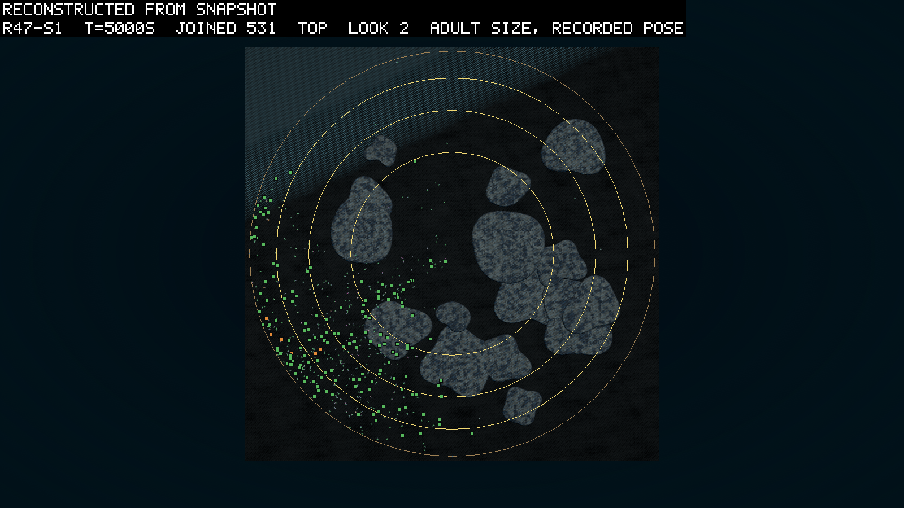
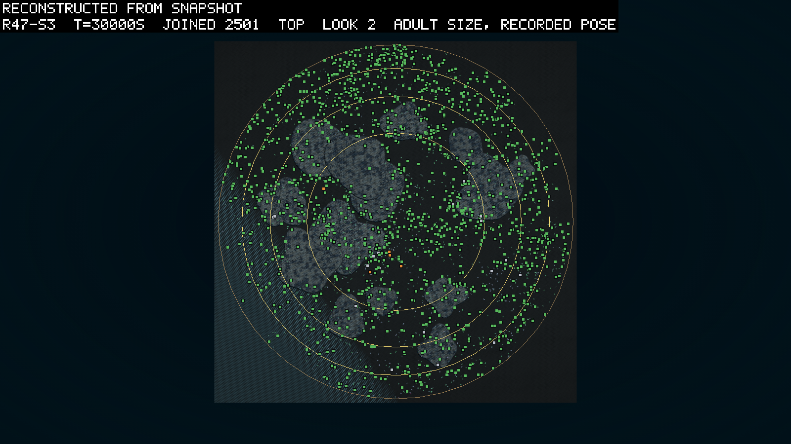
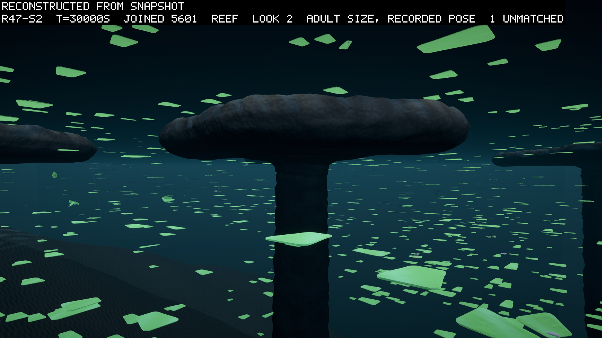

# The reef read, and the stomachs dissected

*2026-09-24, morning. Written by the agent after round 47's three seeds ended (0117 is the
pre-registration; this is the read). The round asked two things: whether the crowd uses a
reef, and whether a pool of evolved stomachs founds an eater's line. It answered the first
in every seed and the second in the negative, and the negative was interesting enough that
the owner asked why, and a dissection of every stomach ever born in the round followed. The
verdicts stand as pre-registered; two clauses turn out to have been drawn wrong, and the
entry says which and why rather than bending them.*

## The verdicts

Three seeds of `rounds/env-r47.ps1` from `50102ba` (seed 3 from `d7e3b6e`, the same tree
with one HANDOFF commit on it), 30,000 s each at dt 0.01, `configHash 7a7f5d41…`, fifteen,
twenty-one and sixteen reefs at a cover of 0.25. Nothing was censored: no divergence, both
books closed in every seed, and the wall clock read 177, 357 and 279 minutes at 2.8, 1.4 and
1.8 times real time. The reads are `logbook/specs/r47-read/r47-s{1,2,3}-30000.txt`.

| # | asked of | seed 1 | seed 2 | seed 3 | result |
|---|---|---|---|---|---|
| L1 | pool founders' median age at death above 300 s | 46 s of 99 | 24 s of 78 | 42 s of 84 | fails 3 of 3 |
| L2 | a pool founder breeds | 3 bred, 6 children | none | none | holds 1 of 3 |
| L3 | ten living rooted in the pool at the end | 0 | 0 | 0 | fails 3 of 3 |
| L4 | every breeder stood in a column of 1 J/m³ or more | 3 of 3 (1.99, 1.65, 1.23) | no subject | no subject | holds where asked |
| L5 | tables hold more snow per m³ than the open floor at every dump from 10,000 s | 37 of 201 | 192 of 201 | 201 of 201 | holds 1 of 3 |
| L6 | fewer bodies per m³ under the caps than beside them at every 500 s | 41 of 41 | 41 of 41 | 41 of 41 | holds 3 of 3 |
| L7 | no photosynthetic body under a cap at the end | 256 | 591 | 92 | fails 3 of 3 |
| L8a | no root inside a reef, no reef dump | 0 in 3,000 rows | 0 | 0 | holds 3 of 3 |
| L9 | books closed, no divergence | audit 9e-6 J, matter 1e-7 | 9e-6, 1e-6 | 3e-5, 1e-7 | holds 3 of 3 |
| L10b | pace within 1.5 of round 46's | 2.8x | 1.4x | 1.8x | holds 3 of 3 |
| L11 | `expo` above 1.5 at the end | 1.62 | 1.87 | 1.16 | holds 2 of 3 |

L8b and L10a were readings. The bed-or-glass column, which counts the rock with the bed and
the glass, read 1.1 to 4.6 times round 46's at matched crowds once the crowds had settled,
and nine to seventeen times during founding, when the baseline windows compare a founding
crowd with a settled one. The faded water's fastest sample, 1.0 m/s beside a cap, did
nothing the guard or the divergence count could see.

## The pool

The round's second question was whether an evolved stomach, given a second chance, founds.
The ledger said the four pool bodies breed from about 1 J/m³ of snow and starve under 0.44
(0117's table), and the round said the ledger was right about the bodies and wrong about
nothing: 261 pool founders arrived across the seeds, three of them landed above 1 J/m³, all
three bred, and the other 258 died at a median of 35 s. Seed 1's line, twelve stomachs alive
at 5,000 s, was gone by 9,027 s. The pre-registered reading for "L2 holds and L3 fails" was
"a line starts and dies; read whether the larder was eaten out or the children were placed
off it", and the dissection below answers it: neither, quite.

**The dissection** (an Opus subagent, 2026-09-24 morning, on the owner's question "why are
stomachs not evolving?"; `logbook/specs/r47-read/tables.txt` and `ages.txt`, made by
`scripts/reads/stomachs.py`, `tables.py` and `ages.py` from `lineage.jsonl`, `positions.jsonl`,
the snow dumps and `absorptive.jsonl`, whose `densityHere` is the snow each eater was actually
fed at). Every stomach born in the round, 1,110 of them, by source and fate:

| source | births | mixotrophs | median lifetime | bred | R0 by seed |
|---|---|---|---|---|---|
| child of a plant (a mutation) | 90 | 26 | 270 s | 18 | 0.61, 0.30, 0.28 |
| child of a pure stomach | 17 | 0 | 2,155 s | 5 | 0.42, 0, 0 |
| child of a mixotroph | 87 | 86 | 2,456 s | 43 | 0.44, **0.98**, 0.44 |
| floor founder | 29 | 0 | 8 s | 0 | 0 |
| trickle founder | 626 | 0 | 22 s | 2 | about 0.01 |
| pool founder | 261 | 0 | 35 s | 3 | 0.06, 0, 0 |

Four things the numbers say, and one inference.

- **Stomachs do evolve**, about one per thousand plant births, and a leaf carrying a small
  stomach is the form nearest replacement: 112 mixotrophs, living 2,400 s, R0 0.98 in seed 2.
  A pure stomach line reaches 0.4 at best; the longest pure chain is four generations.
- **The larder is transient.** Snow above 1 J/m³ existed under the founding bloom from about
  2,000 to 8,000 s; after 10,000 s the tank mean is 0.14 to 0.39 J/m³, the plant columns hold
  no more than the rest, and at most 3% of columns exceed 1. A stomach born above 1 J/m³
  lives 2,500 s and still averages 0.8 children.
- **Senescence closes the window from both sides.** `Metabolism.StepAt` multiplies upkeep by
  `1 + age/3,000 s` and divides intake by the same factor, so the break-even of 0.44 at birth
  is about 1.0 by 1,500 s and 1.8 by 3,000 s; the absorptive log shows the intake per unit of
  density falling from 9.95 at birth to 4.6 past 3,000 s. A lucky stomach's net income runs
  +0.34 W in its first 20 s, +0.09 by 1,000 s and negative after, with a reserve that peaks at
  100 to 150 J against a child's price of 100 J of overhead plus tissue.
- **The founders were wasted.** Eight in ten stomach births were trickle and pool founders,
  placed by column stock at a random depth, so into cells of about 0.12 J/m³ with 10 to 45 J
  of reserve. They lived 20 to 35 s.
- **Dispersal is exonerated.** Seed 1's twelve pool children were born 1.9 to 4.8 m from
  their parents in columns matching the parents' (0.81 to 1.47 against 0.90 to 1.47 J/m³)
  and in cells richer than their columns. The birth columns fell from about 1.0 to 1.5 to
  about 0.5 to 0.9 while they lived, and several never read under 0.44 and still died
  childless at 2,100 to 2,800 s. The inference the agent drew and I share: income at 0.5 to
  0.9 J/m³ nets about zero to +0.07 W, and wear takes it negative before a child's price can
  be saved.

And a reservoir: seed 2's snapshots carry about a hundred plant genomes with a reachable
absorptive node that no developed body expresses. The cause is not readable from the JSON
and is the first thing round 48's build finds.

## The reef

**The rock is a wall.** No root inside a reef by the reader's 0.5 m in 9,000 positions rows
across the seeds, no dump naming the reef guard, no divergence at all. The pre-registered
worry about the faded water, which the rebuilt build measured at ten times the RMS knob
beside a cap, came to nothing the counts can see.

**The shade reads in the crowd, everywhere.** Fewer bodies per cubic metre under the caps
than beside them at 123 samples of 123 (L6). The absence clause, L7, fails in every seed with
92 to 591 photosynthetic bodies under caps at the end, and the pictures say what those are:
the crowd is a sheet at the caps' depth and the sheet passes under the rims on the current, so
the count rises with the crowd and never holds a stomach. L7 asked for an absence and
counted a flow; L6 measured the thing. I would draw L7 as a density next time and I leave it
failed as written.

**The tables gather snow under a crowd.** Seed 3's tables held more snow per cubic metre of
water than the open floor at every one of 201 dumps (0.34 against 0.27 at the end), seed 2's
at 192 (0.53 against 0.47), and seed 1's at 37, with the gap closing from the moment its
crowd spread out of the corner it founded in (0.13 against 0.21 at 10,000 s, 0.39 against
0.36 at 30,000). My reading, an inference: a table is fed by the plants above it shedding,
not by what drifts past, and seed 1's tables were bare while its crowd was elsewhere. The
"every dump" clause is failed by nine dumps in a seed whose tables lead by every honest
reading, and I would draw it as a median next time. The number I find most interesting in
the round: the richest columns in seeds 2 and 3 are the tables, at about 0.5 J/m³, which is
the inoculum's break-even almost to the digit.

**Nothing lives in the dark**, at these prices, in three seeds. That is what the entry
expected ("nothing here wants shade") and it is now measured rather than assumed.

## The water, the pace, the angle

The grid never refused a substep at any resume, and the pace came in at 2.8, 1.4 and 1.8
times real time, seed 2 at 5,600 bodies the slowest. Exposure read 1.62, 1.87 and 1.16 at
the end; seed 3's leaves lay flatter late, at 1.12 at 25,000 s, and the clause at 1.5 was
not reached. Two seeds of three hold, as in round 46.

## The pictures and the films

The round was watched at every mark. From above, seed 1 founded in one corner of the lit
shelf and spread into a ring round the rim and a cloud among the caps by 15,000 s, the
fused eastern mass keeping a clear ring round it to the end; seed 2 filled the disc with
5,600 bodies and every cap read as a hole in the green; seed 3 rimmed the disc and sat over
the western caps in numbers. Under a cap, in every seed, the sheet of flat leaves runs level
at the caps' depth on every side, thinner beneath the table and never empty, with a few
bodies over the tables' lit tops in seed 1's last frame.

**The safari.** The director filmed all three seeds (`scratch/safari/r47-s*/2026-09-24/`,
24 clips each, videos not committed). Seed 1's first pass found four defects of the
director on this world, fixed the same morning (`419cb4f`; HANDOFF has the list): the eye
entered the reef rock, the surface crowd threw the camera against the surface bound at up
to 5 m/s, a scene moved to a checkpoint kept its best second's caption, and the arrival
was dim. The refilm reads 15,935 frames with no dark frame and none over the ceiling.
Watching the films, the owner saw jointed bodies wag and stay in place, and asked why. Two
reasons are known: nothing pays for going anywhere in this world (joint work is priced at
zero and no prize reads position), and a single joint driven back and forth meets the same
drag both ways under a lift-free fluid, so a wag is not a stroke. Whether these bodies
produce any thrust at all is being measured in the farm's own solver as this is written,
and the result is HANDOFF's until it is an entry's.

## What the round taught

- The reef does what it was placed for and the crowd reads it; the instrument for shade is a
  density ratio, not an absence.
- The pool answered the placement question, not the viability one: the bodies can live on
  this snow, and the world puts them where it is not.
- The path to an eater in this world is a leaf with a small stomach, and the world's rules
  cut it at three places: a type change that converts a whole leaf, a fee that is eight
  times a small child's substance, and a senescence that wears both sides of the ledger.
- Every one of those is a generic rule with a guild-shaped effect. Round 48 (D119 to D122)
  changes the rules, not the guild.

## Sources

The three run directories under `runs/r47-s{1,2,3}/` (manifests, reports, records); the
reads and the dissection under `logbook/specs/r47-read/`; the scripts under
`scripts/reads/`; the pictures under `logbook/images/r47-s*`; 0117 for the world and the
predictions; D118 for the reef, D119 to D122 for what follows.
