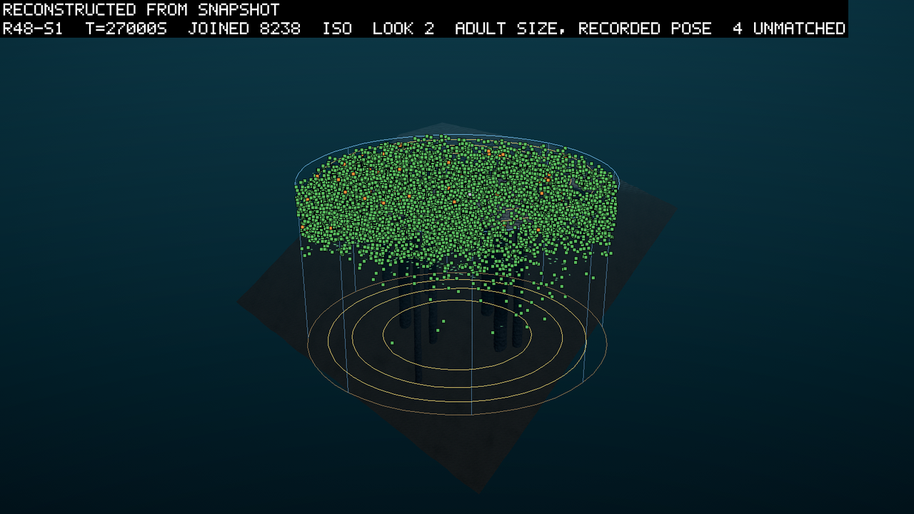
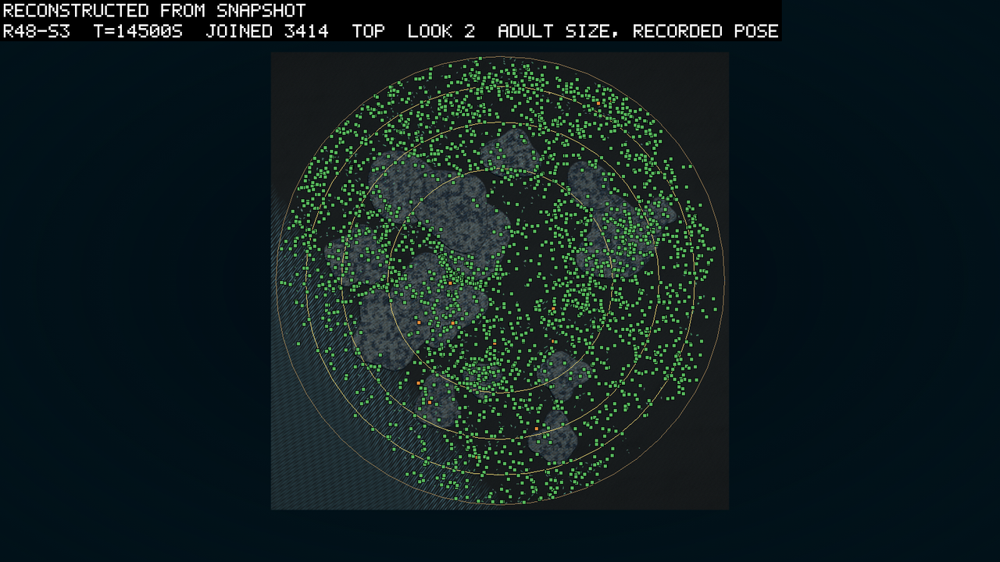
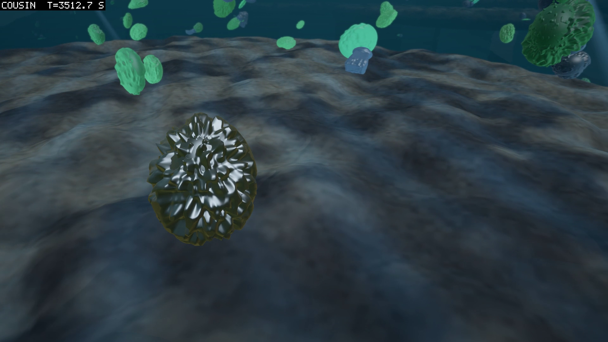
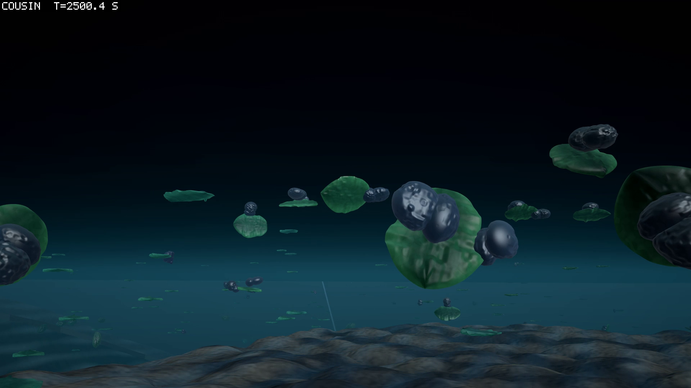

# The eaters spent their endowment on one child, and a leaf kept a speck of stomach

*2026-09-25. Written by the agent (Opus 5.5, as a subagent of the session) as the read of
round 48, whose pre-registration is 0119. Seeds 1 and 3 ran their 30,000 simulated seconds.
Seed 2 stopped on an error at 13,700 s and is read censored at its last sample, 13,690 s.
A full re-run of seed 2 from its first second, made while this was written, matched it bit
for bit to 13,690 s and ran cleanly past the fault. The verdicts are the round's own
reader's. Everything else comes from small reads written for this entry, listed in the
sources table.*

Round 48 changed four rules to let an eater of dead matter in, and no eater's line lasted
in any seed. The rules did what they said. Buds were born and built, children got smaller
and cheaper, old bodies lived longer, and the crowd grew to more than three times round
47's. The eaters drawn from the pool lived about five minutes where round 47's lived under
one, and they bred. They bred because the endowment every founder now carries paid for one
child at the founder's first half-second. Then the founder starved on the water it had
landed in. Two of those children founded lines of a few dozen, and both lines died out
within 4,200 s of their founders' landing. The one pre-registered hope that came true is
narrower: late in seed 1 a leaf grew a small stomach as a bud and founded a line of 38.
That stomach brings its bearers a quarter of a percent of their food. Gestation, a new way
of paying for a child as you go, was pushed down by selection in every seed. Seed 2 stopped
at 13,700 s on a snow reading of minus infinity, and an identical re-run did not repeat it.

## The round asked whether an eater could get in

A few words first, for a reader new to the project. The world is a round tank of water
167 m across and 45 m deep on average. Its floor slopes from a beach 1 m deep on one side
to about 93 m on the other. A reef of rock columns
stands in it, their flat caps just under the surface over a quarter of its area.
Every creature grows from a genome that encodes both its body and its brain. A leaf is a
part that earns energy from light. A stomach is a part that earns it by absorbing the snow,
the matter that drifts and settles through the water. Living leaves leak about three
quarters of it and the dead shed the rest. Bodies and snow alike are built
of matter, seeded at 15,000 units, to which only the newcomers add. A founder is a body
placed in the world from outside rather than born of a parent. For the first 3,000 s the
population floor adds random founders whenever the count runs low. After it closes, the
trickle drops in one random founder every 30 s. One trickle founder in ten comes from the
pool instead. The pool is four stomach bodies stored from earlier rounds, chosen because the
ledger said they could live on this snow. The ledger is a calculator of one body's energy
account.

Round 47 found four rules standing between a stomach and a line of eaters (0118). The owner
ruled on each, and round 48 ran round 47's world with the four rulings on:

- **D119** makes a new cell type arrive only as a bud, a small part of the new kind welded
  onto a body that already works. The floors that used to refuse a born-small part now
  weigh a welded group of parts as one.
- **D120** lets a lineage pay for a child as it goes. A gene sets it to bank a share of
  every positive income in an account that upkeep cannot touch, and to conceive from it. We
  call that gestation, and the old way, saving a reserve and paying for a child at once, the
  lump. A child's fee, the overhead, is now twice the child's tissue with a floor of 50 J.
  Every round from 41 charged 100 J flat.
- **D121** makes age raise a body's upkeep and no longer cut its intake.
- **D122** lands every founder at the richest cell of its food in its column, depth
  included, with an endowment of energy. The endowment is 600 s of the body's own standing
  costs.

So the round asked whether a stomach on a plant founds a line, and whether an eater's line
founds from the pool. The fifteen predictions and two readings, M1 to P1, are 0119's.

## Seed by seed, the crowd grew and the joints went

Seeds 1 and 2 started at 12:51 on 2026-09-24 from the pre-registration's commit, `d35c248`,
on a clean tree. Seed 3 started at 17:06 in seed 2's freed slot, on the same build and the
same world (`configHash e5a30c15…`). Each ran at five threads on the farm, the program that
steps the world outside the Unity editor, two at a time. Seed 2 stopped at 16:05. Seed 1
finished at 20:44 and seed 3 at 00:27 the next morning.

The table puts the three side by side. Look first at the crowd at the end against round
47's, and then at the jointed bodies.

| | seed 1 | seed 2 | seed 3 |
|---|---|---|---|
| how it ended | budget, 30,000 s | error, 13,700 s | budget, 30,000 s |
| wall clock, pace | 474 min, 1.06x | 194 min, 1.18x | 441 min, 1.13x |
| the founding bloom | 1,830 at 2,120 s, down 20% by 3,250 s | 3,527 at 1,320 s, down 33% by 4,630 s | 1,709 at 1,360 s, down 44% by 3,020 s |
| alive at the last sample (round 47's same seed at 30,000 s) | 8,618 (2,619) | 4,583 at 13,690 s (5,602; 3,145 at 13,690 s) | 8,589 (2,501) |
| jointed bodies, most and last (round 47 at the end) | 403 at 2,100 s, 3 (268) | 1,315 at 1,320 s, 680 (82) | 1,064 at 1,300 s, 7 (1,422) |
| mean birth investment at the last sample (round 47) | 0.077 (0.82) | 0.19 (0.48) | 0.56 (0.78) |
| a child at birth over its adult body, median of the last 5,000 s of births (round 47's last 5,000 s) | 0.06 (0.67) | 0.14, the 5,000 s before its cut (0.33) | 0.51 (0.62) |
| bodies without a leaf, most and last | 76 at 5,910 s, 3 | 15 at 30 s, 5 | 39 at 4,310 s, 4 |
| bodies with a stomach at the last sample (born of a stomach-bearing parent) | 121 (95) | 35 (19) | 29 (8) |

Seed 1 bloomed to 1,830 bodies in its first 2,000 s and lost a fifth of them as the bloom's
cohort died. Then it grew for the rest of the run, to 8,618. Two leaf lines founded 1.5 s
apart split the tank near 10,000 s, one making two large children at a time and the other
one small child. The small-child line won. At the end 8,610 of the 8,618 living descended
from one floor founder, body 43, which landed at 16.5 s. The tank's mean birth investment,
the share of a parent's tissue spent on a child, fell from 0.50 at 10,000 s to 0.077.
Nearly every child in the last 5,000 s was born at under a tenth of its adult size. Joints
went from 403 bodies to 3.

Seed 3 bloomed faster and fell harder, to 950 bodies at 3,020 s. It then grew as seed 1 did,
to 8,589. Here the big-child line kept most of the tank, and children stayed large: the
median child was born at half its adult size. Joints went from 1,064 to 7.

Seed 2 bloomed fastest, to 3,527 at 1,320 s, and kept its joints: 680 jointed bodies at
13,690 s, when seeds 1 and 3 had a handful. Its crowd was 4,583 then, against round 47's
seed 2 at the same second of 3,145. It stopped at 13,700 s, and a section below says how.

The count screen of 0119, on seed 2 at the coarse step, had the crowd settling near 2,450
by 4,000 s. Seed 2 did sit near there until about 5,000 s, and then every seed climbed for
the rest of its run. Both full seeds ended within thirty bodies of each other, from opposite
children. I do not know what sets that number. At the end seven leaf-steps in ten were
still limited by uptake rather than light. The living held 3,927 and 4,142 units of the
world's matter, against round 47's 2,459 and 2,041. The founders brought in 1,917 and 1,809
units over the run, against round 47's 928 and 878, and I take the difference to be mostly
the endowments. At the crowd's mean depth the other bodies' shade took 15% and 8% of the
light, against round 47's 4% and 2%.

## Five clauses hold, three fail and eight are censored

Seed 2's clauses need a rule of their own, and this is the one I used. A count that can
only grow, and had passed its bar by 13,690 s, is decided on seed 2 (M1, G1, F2). A
clause that asks for the state at 30,000 s is censored on seed 2. The clause as a whole is
then censored whenever seed 2 could still have decided it, and decided whenever the two
full seeds settle it alone. Where a clause is censored, the table gives seed 2's reading at
its cut, which is a state and not a verdict.

The table is 0119's predictions in order, the number that decides each, and the verdict.

| # | asked | seed 1 | seed 2, at 13,690 s | seed 3 | needs | verdict |
|---|---|---|---|---|---|---|
| M1 | 50 births carrying a bud | 987 | 301 | 491 | 3 of 3 | holds, 3 of 3 |
| M2 | half the bud births built the bud | 986 of 987 | 252 of 301 | 481 of 491 | 3 of 3 | censored; holds in both full seeds and in seed 2 at its cut |
| M3 | a line from a stomach bud on a leaf has 10 living | 38 | 9 | 6 | 1 of 3 | holds, seed 1 |
| G1 | births paid from a gestation account | 7,234 | 3,158 | 3,683 | 3 of 3 | holds, 3 of 3 |
| G2 | gestation's share of children late at least its share early | 0.27 → 0.13 | 0.19 → 0.17 | 0.20 → 0.12 | 2 of 3 | fails, 0 of 3 |
| O1 | mean birth investment below round 47's same seed | 0.077 vs 0.82 | 0.19 vs 0.48 | 0.56 vs 0.78 | 3 of 3 | censored; holds in both full seeds |
| O2a | alive above round 47's same seed | 8,618 vs 2,619 | 4,583 vs 5,602 | 8,589 vs 2,501 | 2 of 3 | holds, seeds 1 and 3 |
| O2b | under the 25,000 ceiling at every sample | at most 8,634 | at most 4,602 | at most 8,589 | 3 of 3 | censored; holds at every sample recorded |
| S1 | mean age above round 47's same seed | 1,998 vs 1,459 s | 1,511 vs 1,891 s | 2,006 vs 1,778 s | 3 of 3 | censored; holds in both full seeds |
| S2 | stomach children's median age at death above 600 s | 1,118 s (140) | 95 s (16 dead of 17) | 455 s (73) | 2 of 3 | censored; seed 2 decides |
| F1 | pool founders' median age at death above 300 s | 312 s (97 dead of 99) | 298 s (28 of 29) | 335 s (84 of 84) | 3 of 3 | censored; holds in both full seeds, seed 2 2 s short at its cut |
| F2 | a pool founder has a child | 30 of 99 | 8 of 29 | 18 of 84 | 3 of 3 | holds, 3 of 3 |
| F3 | 10 living rooted in the pool | 2 | 1 | 0 | 1 of 3 | censored; fails in both full seeds |
| F4 | every pool founder's first snow reading at or above its column's mean | 19 of 99 | 6 of 29 | 16 of 84 | 3 of 3 | fails, 0 of 3 |
| E1 | the endowment against age and breeding | reading | reading | reading | a reading | read below |
| B1 | audit under 0.1 J, matter residual under 1e-5 units, nothing diverged, nothing broke | 2.2e-4 J, −4.5e-6, 0 | 1.9e-5 J, −7.2e-7, 0, broke | 2.0e-4 J, 6.4e-7, 0 | 3 of 3 | fails, 2 of 3 |
| R1a | the tables' snow against the open floor's, J/m³ at the end | 0.59 vs 0.52 | 0.56 vs 0.55 | 0.63 vs 0.50 | a reading | read below |
| R1b | bodies per m³ under the caps against beside them | fewer at 41 of 41 | 8 of 8 | 41 of 41 | a reading | read below |
| P1 | whole-run pace at or above real time | 1.06x | 1.18x to its cut | 1.13x | 3 of 3 | censored; holds in both full seeds |

Five hold, three fail and eight are censored. Of the censored eight, seed 2 read as holding
at its cut on four (M2, O1, O2b, P1) and as failing on four (S1, S2, F1, F3). S1's failure
there is a comparison of seed 2 at 13,690 s with round 47's seed 2 at 30,000 s. At the same
second the two read 1,511 and 1,473 s.

### Buds were born and built, and one stomach bud founded a line

The bud works as the ruling meant. Seed 1 had 987 births carrying a bud, the first at 523 s.
They spread over every cell type: 181 neural, 174 consumer (the mouth of 0114), 168 link,
161 stomach, 151 structural, 100 float and 58 leaf. All but one were born with the bud
built. Seed 3 built 481 of 491. Seed 2 built 252 of 301, and I have not read why it lost
more. Every stillbirth in every seed was a body refused at birth for overlapping itself,
2,299, 988 and 2,042 of them.

M3 held in seed 1 alone, and four times over. A line counts as a stomach on a plant when its
first member was born with a stomach bud on a leaf. Four such lines had ten or more living
members at 30,000 s, and none of them descends from another: 38, 31, 10 and 10. The largest
began at 23,300.5 s, when leaf 44820 of the winning small-child line budded body 48048.
That body lived 5,854.5 s, about three times the average body's age at the time, and had
six children by 27,500 s. Its line counted 114 bodies over seven generations. At the end 29
of its 38 living carried the stomach and 9 had shed it. Not one of them was a pure stomach,
a body with a stomach and no leaf.

The stomach in those 29 is 0.17% of the body's volume and brings in 0.24% of its income,
medians over the living. They feed on snow at a median 0.91 J/m³, about twice the one-part
stomach's break-even, the density at which eating pays for upkeep. The clade scorer asks
the four clauses of D063, the old goal rule and now the first rung of the ladder, of every
line with a stomach. It passes this one on three. It fails the
fourth, ten members at every sample of the last 6,000 s, because the line only began at
23,300 s. Seed 2's best such line had 9 living at its cut and seed 3's had 6.

*Added the same afternoon.* None of the four lines grew its stomach while it lasted. I read
the members logged with a stomach in each 1,000 s window. In the line of 48048 the stomach
stayed at 0.17% of the body from 23,000 s to the end. Its share of the income went from
0.1% to between 0.2% and 0.3%. The line of 52803 held 0.11 to 0.14% of the body and under 0.2%
of the income. The line of 61200 held 0.4% of the body and under 0.6% of the income. The
line of 59978 carried the largest stomach, 0.7 to 0.9% of the body and 1.1 to 1.7% of the
income. Six of its ten living had shed it. Four to seven thousand seconds is short, but
nothing in these numbers says selection had started on the stomach.

### Gestation entered every seed, and selection pushed it down

G1 held in every seed: 7,234 births in seed 1 were paid from gestation accounts, a tenth of
its births. G2, the weak clause, failed in every seed. It compares the share of children
carrying the gestation gene in the 5,000 s after the floor closed with the last 5,000 s. In
seed 1 that share fell from 27% to 13%. In seed 3 it fell from 20% to 12%, and in seed 2
from 19% to 17% by its cut. The strong reading printed beside it says why. In the last
window a gestating lineage made 0.47, 0.64 and 0.46 births for every death of its own mode. A lump lineage made 1.13, 1.19 and 1.22.
The gene keeps coming back by mutation, and that is probably what holds the share above
zero.

0119's two-sided reading for this outcome asks whether the gestating bodies died with their
accounts unspent. The living held 23 kJ, 17 kJ and 26 kJ in accounts at the last sample.
I have not read the accounts at death, so that question is still open.

### Children got smaller and the crowd bigger, and the old lived longer

O1 held in both full seeds, in opposite measure: seed 1's mean investment fell to a tenth of
round 47's, seed 3's to seven tenths. O2a held: the crowd at the end was 3.3 and 3.4 times
round 47's same seed. O2b held at every sample recorded, with the highest count 8,634, a
third of the ceiling. S1 held in both full seeds. The mean age at the end was 1,998 s
against round 47's 1,459 s in seed 1, and 2,006 s against 1,778 s in seed 3.

### The pool's eaters bred on their endowment and starved on their water

This is the round's main finding, and I did not expect it. Across the three seeds 212 pool
founders landed. Of the 54 that were copies of the one-part stomach, every one bred, and
every one had its child at its first metabolic step, half a second after landing. At its
first logged sample, four to six seconds later, it held about 40 J. It was feeding at a
median 0.20 to 0.27 J/m³, under its break-even of 0.44, and losing 0.15 to 0.20 W. It died
at a median 167 to 186 s. The other three pool bodies, which carry a link beside the stomach
and hold back a larger reserve before they breed, landed 158 times and bred twice. They lived
longer, 240 to 720 s at the median, on an endowment they did not spend on a child.

So F2 held because the endowment pays for a one-part stomach's child. Only 8 and 5 children
of pool founders, in seeds 1 and 3, came more than ten seconds after landing, when saving
could have paid for them. F1's rise is mostly the endowment too. Round 47's pool founders
died at a median 46, 24 and 42 s, and round 48's at about five minutes. The bodies that
spent their endowment on a child died sooner, and the bodies that kept it lived longer.

Two of the endowment's children founded lines that grew. In seed 1, pool founder 4185 landed
at 4,057 s and read 1.27 J/m³ at its first sample. Its line reached 45 living at 5,903.5 s,
the largest line of pure stomachs in any seed, and counted 55 descendants before the last
died at 8,214 s. In seed 3, pool founder 3318 landed at 3,343.5 s at 2.2 J/m³. Its line had
24 living at 4,000 s and ended at 6,544.5 s. Both landed above 1 J/m³, where the ledger says
the one-part stomach breeds, and round 47's three breeders had stood in columns that rich
too.

Landing rich was not enough on its own. Twelve of the 212 pool founders read 1 J/m³ or more
at their first sample. The two whose lines grew landed early, at 3,343.5 s and 4,057 s. The
snow under the founding bloom was richest then, and 0118 found the same window in round 47.
Three more one-part stomachs landed at 1.03 to 1.17 J/m³ after 10,000 s. Each had its
endowment's child and died within 134 to 185 s, and I do not know why.

The last of 3318's line was body 3559. At 6,500 s it was 2,655 s old, eating 0.55 W and
paying 0.73 W, with 9 J left, and it starved 44.5 s later. D121 took the wear off the
intake and left it on the upkeep, which rises as one plus the age over 3,000 s. Take the
ledger's break-even and assume intake grows in step with the snow's density. Then the
one-part stomach breaks even at 0.44 J/m³ at birth, about 0.59 at 1,000 s and 0.88 at
3,000 s. That is a calculation and not a measurement.

S2 reads the same thing from the children's side. Pure stomachs born of a parent died at a
median 1,118 s in seed 1, where the largest pool line lived. In seed 3 they died at 455 s.
Seed 2 had seventeen by its cut, and they died at a median 95 s. F3 failed in both full
seeds. At the end the only living bodies rooted in the pool were two pool founders in seed
1, and none in seed 3. Both were copies of the body whose link earns enough light to pay
its standing cost.

E1 was pre-registered as a reading of whether the endowment is spent or hoarded. It is
spent, and by the cheapest bodies, at once. The founders' endowments had a median of 72 to
78 J, over a range of 1.7 to 953 J. Founders of every source died at a median 134 to 166 s,
and a tenth of them bred. Of the 214 trickle and pool founders that bred, 207 had their
first child within one second of landing. The floor's founders, who land during the first
3,000 s, bred later, a median two to five minutes after landing, and I have not read why.

### The placing rule failed its own check

F4 asked that every pool founder's first reading of the snow at its body be at least its
column's mean, which the rule should give by construction. It failed in every seed: 19%,
21% and 19% of pool founders read at or above the mean. The median first reading rose to
0.22, 0.25 and 0.18 J/m³ from round 47's 0.12. The column means rose with it, to 0.56, 0.46
and 0.39 from round 47's 0.30. The first reading stayed at four to five tenths of the
column's mean, and round 47's random depth had put it at four. So I cannot say from this
run's files that D122 moved a founder to richer water within its column. The rise in the
first reading matches the richer tank.

Two causes are ruled out. Crowding is one: a crowded cell shares its snow among the bodies
in it, and every one of the 212 first readings was taken at a full share. The reef's tables
are the other. In seeds 1 and 3 a quarter of the pool founders stood over a table at their
first positions row, about the tables' share of the surface. They read 0.18 and 0.20 J/m³
there, against 0.24 and 0.17 in open water.

Late founders read thinner water than early ones, 0.18 and 0.15 J/m³ after 20,000 s. The
open floor's columns held about 0.5 J/m³ by then. No file holds the snow by layer. So
whether the rule put founders where it says, or the body's own reading five seconds later
is the wrong witness, cannot be read from the run.

*Added the same afternoon.* The run can say which after all, and it is the witness. A
founder's first row reads the snow in its own 1 m cell, one cubic metre of water. In each
half-second step it draws at least its food income times half a second from that cell,
since the rest of the draw is waste. Over the pool founders' first rows, that is at least
45% of the cell's snow per step in seeds 1 and 2 and 52% in seed 3, as medians. The lowest
quarter draws 40% or less in seeds 1 and 2 and 45% or less in seed 3, and none more than 81%. At the median share, with nothing flowing
back in, the cell would hold under three thousandths of its landing stock after the ten
steps before the first row.
So the first reading is what the water brought back into a cell the founder was emptying,
and it cannot show what the placement found. F4 rested on a wrong premise, and it was mine:
"by construction" held at the instant of landing and at no sample after it. Round 47's
founders read four tenths of their column's mean for the same reason. The check was blind,
so its failure says nothing either way about whether D122 put founders in richer water. It
also says what the richest cell buys a founder: its first meal, and after that the flow
into its cell. My reading is inference: a placing rule aimed at a cell's stock aims at the
wrong quantity, and the flow round the cell is the one to aim at.

How far a feeder empties its own cell I then measured outside the run. The experiment built
round 48 seed 1's world from its config and filled the snow evenly. Eight mouths drew from
their cells by the world's rule, at 3 and 10 m and at 0.8 and 1.6 m³/s. An untouched
copy of the world stepped beside it. After a minute each mouth's cell held 5 to 25% of what
the same cell held in the copy. With the water's transport off it held 5 to 11%, refilled
by the stirring alone at 0.06 to 0.1 of the gap a second. The transport lifted it to 20 or
25% where the water moved at 3 to 6 cm/s, and not at all where it stood still. A mouth that
drifted with the water did no better, because the hole went with it. Before the experiment
I had told the owner the refill was mostly the grid's own smearing of the current. At these
water speeds it is not.

Two readings follow, and both are inference. The founders read four tenths of their
column's mean, and a mouth's cell holds a twentieth to a quarter of its water. So the water
round them held 1.6 to 8 times their column's mean, and D122 was meant to give that.
That rests on an even field, and round 48's was not. The second is about the ledger. A
break-even density from `ledger.ps1` is a density at the mouth, in the emptied cell. Set
against a field's density, as the stomach screens of 2026-09-23 did, it overstates what an
eater gets by four to twenty times.

### The books closed, the reef read as before, and the pace fell with the crowd

B1 fails on seed 2, which broke. The books themselves closed in all three. The largest
energy audit residual, the joules the world's books cannot account for, was 2.2e-4 J
against a bar of 0.1 J. The matter residual at the last sample was 4.5e-6 units at most
against a bar of 1e-5, and nothing diverged in any seed. The audit residual grew with the
crowd, from 2e-6 J at 2,500 s to 2e-4 J at the end.

R1 carried round 47's two reef readings. The tables are the lit tops of the reef's caps.
They held more snow per cubic metre than the open floor at the end of both full seeds. Over
the run they led at 61 and 201 of the 201 dumps of the snow, where round 47's same seeds
read 37 and 201. The snow was richer everywhere. The open floor's columns held 0.50 to
0.52 J/m³ at the end, against 0.27 to 0.36 in round 47's same seeds. The shade still showed
in the crowd, with fewer bodies per cubic metre under the caps than beside them at every
sample in every seed. At the end the ratio was about one half in seed 1 and two fifths in
seed 3, as in round 47.

P1 held on the whole run in both full seeds, at 1.06x and 1.13x real time, and the
whole-run number hides a fall. The last 2,500 s ran at 0.47x and 0.67x as the crowd kept
growing. A round that starts where this one ended will take longer than a working day a
seed.

## Seed 2 stopped on a minus infinity

Seed 2 stopped at 13,700 s. The farm was writing the absorptive log, one row a sample for
every body with a stomach. The row's field for the snow density at the body read minus
infinity, and the log's writer refuses a number JSON cannot hold, so the run ended with
`status error`. Eight rows of that sample were written, so the ninth body with a stomach in
the living list carried it. HANDOFF names body 23037 as the likeliest, and I have not
checked that.

Nothing before it looks wrong. The last full sample, at 13,690 s, is ordinary: the audit
residual at −8.5e-6 J, nothing diverged, 35 bodies with a stomach. The session's own reading
adds two things I have not re-checked. The snow's column totals, written to disk every
150 s, hold no negative or non-finite column at 13,600 s. And the field's deposit and take
are both guarded against a bad amount. If both hold, a snow cell could reach minus infinity only through the grid's own passes,
which carry, stir, settle and dissolve the snow. That is an inference from reading the
code, and the bad cell has not been found.

A checkpoint is the whole world's state saved to disk, from which a run can be continued. A
replay from the 12,500 s checkpoint ran clean past 13,700 s. It settled nothing, because it
parted from the recording at its first sample, as the next section describes. So the
test is a full re-run of seed 2 from its first second on the same build. It runs at eight
threads, since the farm gives the same bits at any thread count. It started at 10:29 on
2026-09-25 and has matched the recording so far.

The re-run ran clean. Its four source hashes equal the recording's, and every stats field of
every sample agreed with the recording's to the bit through 13,690 s. It then ran on to
13,800 s with every row finite and the audit closed. The recording's last sample shows what
went wrong in it. At 13,690 s, 31 of the 35 bodies it logged carried a leaf and earned light.
At 13,700 s every one of the eight rows it wrote read no light at all, where the re-run's same
bodies earned 0.2 to 0.56 W. Two bodies alive ten seconds earlier were gone, and the next row
read a snow density of minus infinity. So in one ten-second window the recording's world lost
its light and a cell of snow broke. From the same state on the same build it did not happen
again.

A program that gives the same bits at any thread count cannot do that by itself. My reading,
which is inference, is that the recording's process computed something wrong once. Either the
processor miscalculated, the fault the machine's current ruling watches for, or two threads
raced in a way the thread tests have never caught. The recording ran at five threads beside
seed 1, and the re-run at eight threads alone. Windows logged no hardware error, but a silent
miscalculation would not log one. Either way the fault is not the round's code as written, and
no fix for it is owed to round 49.

Seed 2 is read censored at 13,690 s here. A full re-run from founding reproduces it bit for bit
and carries it past the fault. So the seed could still be finished, at a cost of about a day
of the machine. Whether to do that, once the machine has been checked, is the owner's.

## A resume parts from its recording

One more limitation, found while testing seed 2. A resume of round 48 from one of its own
checkpoints parts from the recording at its first sample. It does so on the run's own build,
with all four fingerprints of the source code equal. The stocks differ by about one part in
a hundred million, and the jointed bodies' mean speed by two parts in ten thousand at
12,510 s. The rigid bodies agree to one part in ten billion.

A second read-only subagent found the cause the same morning, and I checked it against the
code. It is the contact sense, the channel through which a brain learns whether a part is
touching another body. A checkpoint does not save which parts have been touched. A restored
body's senses of contact and of damage also stay disconnected until its first metabolic
step. The runs bear it out: at 12,510 s only four bodies of about 4,220 differ at the precision
the poses are written at. Each has one joint whose driving neuron reads contact, and each
joint sits at the opposite stop from the recording's. The checkpoint checker skipped both.
It took the first for a value refilled every step, and it skipped the second with a whole
class of sensor fields. A fix that saves and restores them, and moves no trajectory, is
built and waits for its acceptance runs. Round 48's own checkpoints lack the contact history,
so no build can resume them faithfully.

Reading the cause turned up a second fault. The contact sense is sticky: once a part has
touched another body it reads as touching until the body's plan changes. The mouth's
specification asked for contact now. Rounds 45 to 48 all ran with the sense on, so every
brain in them that read contact read a history. Whether to change it is the owner's,
because it changes the world.

It matters in three places. A film window is a stretch of a run replayed by the farm for the
camera, and it starts from a checkpoint. No window of round 48 can be a faithful copy of the
run. The seed 2 replay above parted at its first sample in the same way. The story film below
is a cousin twice over, a cousin being a run of the same world that is not the recorded one.
The Editor steps the world on another runtime, and it starts from a checkpoint that does not
restore the run bit for bit.

## The world was a sheet of leaves with a few dark balls in it

The round was watched twice: in reconstructions drawn from the recorded run while the seeds
ran, and in the owner's story film, made overnight after they ended.

The reconstructions place every recorded body where the run had it, drawn at its adult size
in its recorded pose, so they show the run itself. Seed 1 at 27,000 s is a solid sheet of
leaves across the whole disc, in the top fifteen metres or so. It thins downward among the
reef's stems. A sprinkling of orange, the camera's colour for a stomach, marks the bodies
that carry one. From the side the caps sit at the surface with the crowd around and between
them, and the deep water holds almost nobody. Seed 3 at 14,500 s, seen from above, has 3,414
bodies over the whole disc. They are thickest in a ring inside the glass and among some of
the caps. From the side they sit in the top few metres, over the tables and over the shoal,
where the floor rises to meet the surface.

The story film (22 scenes and a title, 8 min 47 s) was made for the owner overnight, and I
read it from its 22 contact sheets. Every frame is a cousin, stepped live from the nearest
checkpoint. A body or a birth on screen is therefore a body of that world and not the
recorded one, and the captions quote the run where it matters. In seed 1 at 2,500 s the
camera looks up from below. Green blades, lit through, stand against the bright disc of the
surface, and darker lumps float among them. I read the lumps as the parts that are not leaf.
Seed 2 at 2,500 s is leaves carrying dark knobbed parts on hinges, drifting over the rock
tables. Seed 3's pool founder 3318 at 3,500 s is a single dark knobbed ball hanging
just over the sand, with leaves above it. Seed 1's pool line at 6,000 and 7,500 s is a few
dark balls in a field of flat leaves. The bud-born line at 30,000 s cannot be told from its
neighbours, since its stomach is a speck. The end of seed 1 is layer on layer of flat leaves
among the stems. The seed 3 scenes at 1,500 and 3,000 s show almost empty water among the
stems. At 954 bodies in 22,000 m², that is what the tank looks like.

My reading of the pictures is that the world is a sheet of leaves at the top of the water,
with the reef standing through it. The eaters are a handful of dark balls in the sheet, easy
to find because they are rare. Round 47's crowd at the end was a third of this one, and 0118
describes its sheet at the caps' depth.

## The endowment, the placing and the wear stood between the eaters and a line

Most of this is inference, and I mark it where it is.

The endowment is what F1 and F2 measured. It was meant to let a founder live while it found
its feet. For the cheapest stomach it bought a child in the first half-second, and the
founder then lived on what was left. I think a founder's endowment, as built, tests whether
a child of a founder can live where its parent landed. It does not test whether the founder
can. The two differ for any body whose endowment covers a child.

The placing rule is the open question. The pool's bodies breed from about 1 J/m³. Twelve of
212 founders landed that rich, and only the two that landed early, in the founding bloom's
snow, made lines. F4 says the rule did not change where in its column a founder reads its
first meal. Whether the rule misplaces founders, or the run's files cannot see where it put
them, is agent work, and it comes before anyone rules on the next placing rule. *Added the
same afternoon:* it is the second, and F4's section gives the reason. A first reading is the
refill of a cell the founder is emptying. So the twelve that first read 1 J/m³ stood in
water richer than that, which is my inference and not a measurement.

The wear is smaller and still there. An eater that lands well lives a thousand seconds or
two, and its break-even climbs toward the density of its patch as it ages while the patch
thins. The two pool lines died that way. My guess, from two lines and the arithmetic above,
is that D121 moved the eaters' window and did not open it.

The bud gave the form 0118 found nearest to an eater, a leaf with a stomach, in lines of 38
and 31 bodies. The stomach in them costs almost nothing and earns almost nothing. I read the
line as a leaf carrying a free passenger, so selection has no reason to remove it and none
yet to grow it. Whether a longer run would grow it is open.

The crowd grew because children got cheaper, and it had not stopped growing when the budget
ran out. Joints disappeared in both full seeds by about 22,500 s, as they did in three seeds
of round 42. In this world nothing pays for a joint (0118's swim probe), so I read their
loss as this world's default rather than as something round 48 did.

## A fix, a check of the machine, three reads and the owner's rulings come next

- **Seed 2's fault** did not repeat on an identical re-run, so it is a one-off in the
  recording's process and not the round's code. It is one of the warning signs the owner
  asked to be told of under the machine's current ruling, and the owner was told the same
  hour. Checking the machine comes before the next long run.
- **The resume's fix** is built. Its acceptance is a founding of seed 2 to 1,000 s and
  a resume from 800 s that must match the founding row for row. Round 49's film windows can
  be faithful on it, and round 48's cannot.
- **Agent work** comes before the next round. F4's cause needs the placer read against a
  founding in a small test world, and the snow recorded by layer at a founder's birth. The
  cause was found the same afternoon: the check read the wrong witness, as F4's section now
  says. A record of the landing cell's snow is still owed to any check of a placing rule. G2's
  open half needs the gestating bodies' accounts at death. The stomach's share in the bud
  lines wants reading over time, and was read the same afternoon (the bud section).
- **The owner rules** on what round 49 changes, since that is a world rule. This read raises
  three questions for it: whether an endowment should be able to pay for a child, and
  whether an eater's upkeep should still wear with age. The third is whether the contact
  sense should read contact now, as its specification says. The reactive-thrust proposal also still
  waits.

## Sources

Every number above traces to a file and a query. The helper reads are small Python scripts
written for this entry, and the run directories are under `runs/`, round 48's and round
47's alike.

| numbers | file | query |
|---|---|---|
| every verdict, M1 to P1, and the per-seed numbers in the verdicts table | `logbook/specs/r48-read/read-end.txt`, `logbook/specs/r48-read/clauses.tsv` | `python scripts/reads/r48-read.py --out logbook/specs/r48-read/clauses.tsv` |
| the seed table: alive, jointed, investment, pace per 2,500 s; round 47 every 5,000 s | `logbook/specs/r48-read/timeline-r48-s*.tsv`, `timeline-r47-s*.tsv` | `python scripts/reads/r48-entry/timeline.py <arm> 2500` |
| the blooms, the leafless and jointed maxima, founders by source and their first child's lag, the pool lines' sizes, the bud lines (38, 31, 10, 10; 114 ever; seven generations) | `logbook/specs/r48-read/founders.txt` | `python scripts/reads/r48-entry/founders.py <arm>` |
| the pool founders' first logged rows by body (about 40 J, 0.20 to 0.27 J/m³, −0.15 to −0.20 W), the bud lines not nested, the stomach's share (0.17%, 0.24%, 0.91 J/m³) | `logbook/specs/r48-read/checks.txt` | `python scripts/reads/r48-entry/checks.py <arm>` |
| the full share on all 212 first readings; age at death by pool body | `logbook/specs/r48-read/poolshare.txt` | `python scripts/reads/r48-entry/poolshare.py <arm>` |
| round 47 seed 2 at 13,690 s; pool founders by arrival window | `logbook/specs/r48-read/late.txt` | `python scripts/reads/r48-entry/late.py` |
| pool founders over a table | `logbook/specs/r48-read/overtables.txt` | `python scripts/reads/r48-entry/overtables.py r48-s1 r48-s2 r48-s3` |
| the twelve pool founders that first read 1 J/m³ or more, their children and lines; the bud lines 59978 and 61200 not nested | `logbook/specs/r48-read/richlanders.txt` | `python scripts/reads/r48-entry/richlanders.py` |
| a mouth's own cell against an untouched copy of round 48 seed 1's water, transport off and on, standing and drifting | `logbook/specs/r48-read/refill-table.txt` | `./scripts/core-test.ps1 -All -Filter FeederRefillExperiments` (`src/Evosim.Core.Tests/FeederRefillExperiments.cs`, about ten minutes, reads `runs/r48-s1`) |
| the stomach's share of body and income by 1,000 s window in the four bud lines | `logbook/specs/r48-read/budshare.txt` | `python scripts/reads/r48-entry/budshare.py r48-s1 <root> --every 1000` for 48048, 52803, 59978, 61200 |
| F4's witness: the share of its 1 m cell a pool founder draws per step (45%, 45%, 52% at least), the landing stock left after ten steps | `logbook/specs/r48-read/f4draw.txt` | `python scripts/reads/r48-entry/f4draw.py r48-s1 r48-s2 r48-s3` |
| a child's birth fraction early and late | `logbook/specs/r48-read/birthfraction.txt` | `python scripts/reads/r48-entry/birthfraction.py` |
| matter locked, the shading share, uptake-limited share, snow totals | `logbook/specs/r48-read/context.txt` | `python scripts/reads/r48-entry/context.py` |
| the clade scorer's reading of the bud line and the dominant clades (8,610 from body 43) | `logbook/specs/r48-read/clade-score.txt` | `./scripts/clade-score.ps1 r48-s1 r48-s2 r48-s3` |
| the pool's four bodies by index | `runs/r48-s1/*/pool/0*.json` against `inocula/pool-r47/` | the reserve margin in each genome |
| the one-part stomach's break-even and first child at 1 J/m³ | `logbook/specs/r48-read/ledger-pool.md` | as its header |
| lines' peaks and ends (45 at 5,903.5 s, gone at 8,214 s; 24 at 4,000 s, gone at 6,544.5 s), body 3559, bodies 44820 and 48048, the two leaf lines of seed 1 | `logbook/specs/story-r48-v2/checks.tsv`, with the first film's `scratch/story/r48/checks.tsv` | the story writers' walks over `lineage.jsonl`, `absorptive.jsonl` and the guides (`logbook/specs/story-r48-v2/runlib.py`) |
| seed 2's stop | the manifest's `ending`; `logbook/specs/r48-read/r48-s2.err`; `absorptive.jsonl` (eight rows at 13,700 s); `stats.jsonl` at 13,690 s | direct read |
| body 23037, the snow dump at 13,600 s, the guarded deposit, the probe replay, the re-run, the resume parting | `HANDOFF.md`, the state block of 2026-09-25 | the session's own reads, not re-checked here |
| the resume's cause | `src/Evosim.Core/Ecosystem/WorldState.cs` (`WriteOrganism` writes health and damage, not contact), `src/Evosim.Farm/Metabolise.cs` (`HandBackWhatWasFelt`, the only place the senses are wired), `src/Evosim.Farm/CheckpointFidelity.cs` (the skip list and the sensor-field clause), `WorldMouth.cs` `NoteContact` (the sticky flag); `poses.jsonl` of the resume against the recording at 12,510 s to 12,600 s; the 12,500 s snapshot's genomes | read by a subagent and checked by the session, 2026-09-25 |
| the launch times and hashes | the three manifests (`startedAt`, `endedAt`, `source`) | direct read, local time is UTC+1 |
| the film | `scratch/owner/round-48-story.mp4`, `round-48-story.md`, `round-48-story.scenes.tsv`; contact sheets under `scratch/wt-safari2/scratch/safari/r48-s*/story-final/` | read by eye |
| the pictures | `logbook/images/r48-s1-t27000-recon-iso.png` and `r48-s3-t14500-recon-top.png` from `scratch/owner/`, downsized; the two film frames by `ffmpeg -ss 12.7` on scene 6's clip and `-ss 0.4` on scene 4's | as named |
