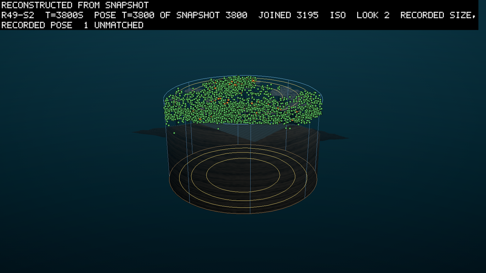
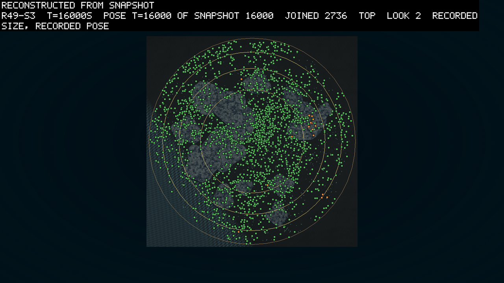
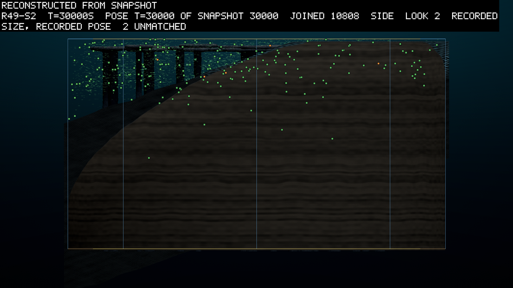

# The eaters that lasted were stomachs on a link that caught light

*2026-09-26. Written by the agent (Opus 5.5, in the session that launched the round) as the read of
round 49, whose pre-registration is 0121. All three seeds ran their 30,000 simulated seconds. The
verdicts are the round's own reader's (`scripts/reads/r49-read.py`), and everything else comes from
small reads written for this entry. The outputs of both are kept under `logbook/specs/r49-read/`,
and the sources table names each.*

Round 49 capped every founder at nine tenths of what it needs for its first child, so that a stomach
from the pool would have to earn the last tenth. The cap worked as ruled. No founder had a child
within ten seconds of landing, and the one-part pool stomachs lived about twice as long as round
48's. But only one of 63 of them earned its child. The eater lines that lasted came from elsewhere,
from random founders that happened to be a stomach on a link. In this world a link catches light at
half a leaf's rate, so those bodies were part plant. The largest, in seed 2, ran eleven generations
and faded as its members with the link died out first (corrected 2026-09-26, below). The depth rule
set the trickle's leaves where their matter was richest, deep in the dark, and they died in about a
minute and a half. A fault in the placer held most of them at 44 m, and it is fixed. The round's own
checkpoints gave the first faithful film windows.

## The round asked whether a founder could earn its last tenth

A few words first, for a reader new to the project. The world is a round tank of water 167 m across.
Its floor slopes from a beach 1 m deep on one side to about 93 m on the other, and a reef of rock
columns stands in it. Every creature grows from a genome that encodes both its body and its brain. A
leaf is a part that earns energy from light. A stomach earns it by eating the snow, the dead matter
that drifts and settles through the water. A link is a part whose job is to carry a joint; in this
world it also catches light, at half a leaf's rate. A founder is a body placed in the world from
outside rather than born of a parent. For the first 3,000 s the population floor adds random
founders whenever the count runs low. After that the trickle drops in one random founder every 30 s,
and one in ten of those comes from the pool instead, four stomach bodies stored from earlier rounds.

In round 48 every pool stomach landed with more than its first child cost, had the child half a
second later and then starved (0120). The owner ruled a cap for round 49 (D124): a founder starts
with at most 0.9 of its own breeding gate, once grown, and has to earn the rest. The round also
checked new code that changes no price. The senses read the last step (D123), and a bitten body is
rebuilt at once. The files are smaller, and a film window should now copy the run bit for bit. Every
clause below was pre-registered in 0121.

## Seed by seed, one floor founder's family took each tank

The seeds ran one at a time on sixteen threads, overnight, from the pre-registration's commit
`8860180` on a clean tree, on one build and one world (`configHash f0794a8b…`). Seed 1 ran from
20:08 to 23:25 on 2026-09-25, seed 2 from 23:31 to 04:49 and seed 3 from 04:50 to 08:45. In the
table, look first at the line that held each tank, and then at the joints.

| | seed 1 | seed 2 | seed 3 |
|---|---|---|---|
| how it ended | budget, 30,000 s | budget, 30,000 s | budget, 30,000 s |
| wall clock, pace over the run and over its last 2,500 s | 196 min, 2.55x, 1.14x | 318 min, 1.57x, 1.03x | 235 min, 2.12x, 1.02x |
| alive at the end (round 48's same seed) | 8,410 (8,618) | 10,810 (4,583 at its cut, 13,690 s) | 7,220 (8,589) |
| births | 53,430 | 108,209 | 53,334 |
| the line holding the tank at the end: its members, its founder | 8,405: a leaf with no joint, from the floor at 15.5 s | 10,803: a leaf with a joint, from the floor at 11 s | 7,209: a leaf with a joint, from the floor at 15 s |
| bodies with a joint at 4,000, 16,000 and 30,000 s | 187, 30, 3 | 1,864, 349, 134 | 888, 2,221, 226 |

In every seed the founding lottery of the first sixteen seconds decided the tank. By 16,000 s one
floor founder's descendants were nearly everyone alive, and by the end they were all but a handful
of newcomers. Whether the tank kept joints followed from that founder. Seed 1's winner had no joint,
so the joints went with the losing lines, 187 at 4,000 s and 3 at the end. Seeds 2 and 3's winners
had one, and their lines shed it from within. Seed 2's line fell from 58% jointed at 4,000 s to 1%
at the end, and seed 3's from 85% at 16,000 s to 3%. Nothing I read says the joint paid for itself,
which fits 0118's swim probe, and I do not know why seed 3's line shed it more slowly.

0121 said a failing O3 should send me to the jointed bodies' brains, since D123 changed what the
contact sense reads (`jointsense.py`). Mostly they read it no more than the rigid bodies did. In
seed 1 at 5,000 s none of 219 jointed bodies read contact or damage, against 22% of the rigid.
Elsewhere at 5,000 and 16,000 s both read one in 2 to 8% of bodies. The exception is seed 3's end.
There 39 of the 226 jointed bodies read one of the two, 17%, against 4% of the rigid. That is too
few bodies to call a cause, and it is the one place to look first in round 50.

Seed 2 grew the largest crowd and made twice the births of the others, and it was the slowest: at
10,810 bodies the farm ran at about real time. The pace over the last 2,500 s is what 0121's wall of
780 minutes was set against, and every seed finished with hours to spare.

## Twenty-five clauses hold, six fail and four are readings

The table is 0121's clauses in order, the number that decides each in every seed, and the verdict.
Read the verdict column first; the six that fail each have a section below.

| # | asked | seed 1 | seed 2 | seed 3 | needs | verdict |
|---|---|---|---|---|---|---|
| W1 | every founder that eats one food lands at or above its column's mean of it | 39 of 743 below | 28 of 733 | 34 of 737 | 3 of 3 | fails, 0 of 3 |
| W2 | a pool founder's first mouth reading over its landing density, median in 0.02 to 0.3 | 0.21 | 0.20 | 0.17 | 3 of 3 | holds |
| W3 | the landing cell over its column's mean, median at least 1.6 | 2.18 | 1.79 | 2.47 | 3 of 3 | holds |
| G1 | births paid from a gestation account | 2,493 | 7,408 | 3,560 | 3 of 3 | holds |
| G2 | the share of gestating children lower in the last 5,000 s than in 3,000 to 8,000 s | 0.175 → 0.101 | 0.160 → 0.125 | 0.167 → 0.138 | 2 of 3 | holds, 3 of 3 |
| G3 | accounts held at death at least a fifth of what was banked | 51% | 37% | 45% | 2 of 3 | holds, 3 of 3 |
| G4 | banked, less held, per gestation birth, at least 50 J | 65 J | 56 J | 69 J | 3 of 3 | holds |
| C1 | the senses' neighbours | reading | reading | reading | a reading | read below |
| C2 | no checkpoint waits, and 300 checkpoints | 0, 300 | 0, 300 | 0, 300 | 3 of 3 | holds |
| C3 | no starved body dies solvent | 0 of 45,992 | 0 of 98,362 | 0 of 47,060 | 3 of 3 | holds |
| B1 | audit under 0.1 J, matter residual under 1e-5 units, nothing diverged, ends on budget | 1.8e-4 J, 1.7e-6 | 1.3e-3 J, −3.7e-6 | 5.4e-5 J, 3.1e-7 | 3 of 3 | holds |
| V1 | a faithful film window from the round's own checkpoints | 11 of 11 rows | 11 of 11 | 11 of 11 | 3 of 3 | holds |
| V2 | the member check names nothing, and a resume agrees with the run | one member named; resume identical | | | seed 1 | fails |
| V3 | a seed's directory under 2 GB | 3.7 GB | 5.4 GB | 4.7 GB | 3 of 3 | fails |
| M1 | at least 100 births carrying a bud | 518 | 1,168 | 541 | 3 of 3 | holds |
| M2 | at least three quarters of bud births built the bud | 99% | 98% | 94% | 3 of 3 | holds |
| M3 | a line from a stomach bud on a leaf has ten living | 11 | 321 | 1,273 | 1 of 3 | holds, 3 of 3 |
| M4 | in each such line, the stomach brings under 2% of the income | 0.4%, 0.6% | 2.7% in the largest | 0.25%, 0.27% | every seed M3 holds in | fails in seed 2 |
| O1 | alive at the end between 4,000 and 16,000 | 8,410 | 10,810 | 7,220 | 3 of 3 | holds |
| O2 | under the 25,000 ceiling at every sample | at most 8,410 | 10,825 | 7,253 | 3 of 3 | holds |
| O3 | fewer than 100 bodies with a joint at the end | 3 | 134 | 226 | 2 of 3 | fails, 1 of 3 |
| S1 | mean age at the end above 1,500 s | 1,954 s | 2,157 s | 1,551 s | 3 of 3 | holds |
| F3 | no line rooted in a pool founder has ten living at the end | largest 1 | 1 | 1 | 3 of 3 | holds |
| E1 | what the endowment buys | reading | reading | reading | a reading | read below |
| R1 | the reef's two readings | reading | reading | reading | a reading | read below |
| P1 | the whole run at or above real time | 2.55x | 1.57x | 2.12x | 3 of 3 | holds |
| EK1 | no founder has a child within 1 s of landing | 0 of 972 | 0 of 963 | 0 of 949 | 3 of 3 | holds |
| EK2 | the cap's counters agree with the rows, a one-part stomach cut 17 to 18.5 J | 130 = 130, 17.76 J | 97 = 97, 17.76 J | 94 = 94, 17.76 J | 3 of 3 | holds |
| EK3 | the one-part pool stomachs' median age at death above 300 s | 371 s | 359 s | 338 s | 2 of 3 | holds, 3 of 3 |
| EK4 | at most a fifth of them breed, pooled | 0 of 28 | 1 of 17 | 0 of 18 | pooled | holds, 1 of 63 |
| EK5 | all pool founders' median age at death above 300 s | 391 s | 333 s | 348 s | 3 of 3 | holds |
| EK6 | the pool founders that bred landed in richer snow, pooled | | | | pooled | holds: 3.99 against 0.95 J/m³ |
| EK7 | what the cap takes | reading | reading | reading | a reading | read below |
| S2 | stomach children's median age at death under 1,500 s | 2,228 s (12 dead) | 2,927 s (171) | 2,395 s (115) | every seed with ten dead | fails, 0 of 3 |
| X1 | the snow's patchiness at the end between 0.4 and 1.0 | 0.66 | 0.57 | 0.63 | 3 of 3 | holds |

Two of the six failures are faults the round found in its own machinery, and both are repaired and
merged. W1's leaf misses are a clamp in the placer, and V2's member is one the check forgot to skip.
V3 was a guess, short by a factor of two to nearly three, and the owner's storage ruling of this
morning answers it. O3, S2 and M4 are the world disagreeing with me, and those are the interesting
ones.

## The cap held, and one pool stomach in 63 earned its child

The cap did what the owner ruled. No founder of any source had a child within ten seconds of
landing, where round 48 had dozens within one. Every one-part pool stomach was cut by 17.755 J,
against the 17.74 J of 0121's arithmetic. The cap's two counters matched the founder rows to the
joule. The pool bodies with a link were not cut at all, as 0121 guessed: after their growth they
keep less than the cap allows.

The one-part stomachs lived about twice as long as round 48's, a median 338 to 371 s at death
against 168 to 186 s. Of 63 of them, one bred, in seed 2, twenty seconds after it landed. That is a
true answer to the round's first question, and one of 0121's two-sided readings named it in advance.
The flow into the cell where a stomach lands does not pay for the last tenth of its child. The six
pool founders that bred, of 261, landed in snow at a median 3.99 J/m³, four times the 0.95 J/m³ of
the rest. A stomach that falls into rich water can breed; the ordinary landing cell cannot feed it.

W2 and W3 say why the ordinary cell fails, and both held. The depth rule put each pool founder in a
cell holding 1.8 to 2.5 times its column's mean. Five or six seconds later the founder's first
feeding row read a fifth of that, 0.17 to 0.21 at the median. The mouth had emptied its own cell
faster than the stirring refilled it. That is the refill 0120 measured outside the run, 5 to 25% of
an untouched cell after a minute, now measured inside it.

The longest-lived pool body was the fourth, a stomach on a link. It lived a median 825 s in seed 1
and 633 s in seed 3, and five of the six breeders were of that body. The next section says why a
link matters.

## The eaters that lasted came from random founders, each a stomach on a link

The round was built around the pool, and its eater lines came from somewhere else. I looked for
every line with ten or more members that had a stomach and no leaf, and found three
(`eaterlines.py`). All three began with a random founder, and every one of those founders was a
stomach on a link, with a joint between them.

| line | seed | founder | members, generations | most living at once | end |
|---|---|---|---|---|---|
| 48 | 2 | the floor, 53.5 s | 173, eleven | 100 at 3,760 s | gone at 18,251 s |
| 29 | 3 | the floor, 9.5 s | 59, four | 37 at 2,611 s | gone at 6,700 s |
| 5854 | 3 | the trickle, 5,967.5 s | 54, thirteen | 19 at 7,491 s | one alive at the end |

Round 48's two best eater lines peaked at 45 and 24 living and were gone by 8,214 and 6,544.5 s
(0120). Both were founded by the pool's one-part stomach, on a first child its endowment paid for at
landing. No pool founder's line in round 49 grew past five members.

The three have one thing in common that the lineage file does not show. A body's flags count a
stomach and a leaf, and in this world a link also catches light, at half a leaf's rate (the
launcher's `EVOSIM_LINK_PHOTO` 0.5). So a stomach on a link is part plant, and the feeding log shows
it. In line 29, 97% of the logged rows earned some light, a median 0.19 W beside 0.66 W from the
snow. Line 5854 kept its link for 24,000 s, and 83 to 100% of its rows earned light in every window
to the end. Its snow income fell from 0.40 W in its first full window to 0.10 to 0.19 W after 16,000
s. Its light fell from 0.16 W to 0.03 W.

Line 48 is the clearest case, because it lost its link. Body 48 was a stomach shaped like a squashed
ball about half a metre across, on a box of the link type. It spent 0.85 of its tissue on each child
and had them two at a time. In outline that is the plan of three of the pool's four bodies, drawn by
chance. It landed at 53.5 s, in the founding, and no pool founder lands before the floor closes at
3,000 s. The table follows its members through the feeding log in 2,000 s windows (`eaterfeed.py`).
Look at the share earning any light against the living count.

| window | rows logged | living at its end | two parts or more | earning light | snow income | light income | net |
|---|---|---|---|---|---|---|---|
| 0 to 2,000 s | 2,381 | 26 | 77% | 77% | 0.47 W | 0.38 W | +0.23 W |
| 2,000 to 4,000 s | 12,851 | 94 | 62% | 60% | 0.37 W | 0.29 W | +0.09 W |
| 4,000 to 6,000 s | 14,955 | 51 | 53% | 52% | 0.31 W | 0.15 W | −0.05 W |
| 6,000 to 8,000 s | 7,455 | 33 | 25% | 25% | 0.28 W | 0 | +0.01 W |
| 8,000 to 10,000 s | 6,150 | 30 | 8% | 8% | 0.19 W | 0 | −0.01 W |
| 10,000 to 12,000 s | 4,486 | 16 | 14% | 14% | 0.21 W | 0 | +0.00 W |
| 12,000 to 14,000 s | 2,738 | 10 | 17% | 17% | 0.18 W | 0 | −0.01 W |
| 14,000 to 16,000 s | 1,339 | 3 | 18% | 18% | 0.16 W | 0 | −0.05 W |
| 16,000 to 18,000 s | 240 | 1 | none | none | 0.12 W | 0 | −0.06 W |
| 18,000 s to the end | 27 | 0 | none | none | 0.12 W | 0 | −0.08 W |

The incomes and the net are medians over the rows logged in the window.

The share with the link fell over its first 8,000 s (corrected 2026-09-26, below). A one-part
stomach cannot pay its way on this snow, as the pool's one-part stomachs showed. After that the line lived on its savings and
shrank for 10,000 s. I read the loss of the link as the cause of the decline; I have not tested it.
Nor do I know why the members with the link stopped breeding.

*Correction, 2026-09-26.* This section and the summary said the line's members shed the link. The
lineage says they did not. Round 49's story writer counted body 48's descendants by their parents,
and I read the counts again: 173 bodies, 69 with the link and 104 without. Of the 73 children of
parents with the link, 9 were born without it, and 4 of the 99 children of parents without it were
born with one. The share fell because the members with the link died first. Of their 69 deaths, 57
came between 4,000 and 8,000 s, and they had 2 children after 6,000 s, the last at 11,887 s. The last
of them died at 15,186 s, and the last of the family at 18,251 s. The table above stands, since it
counts the living. "Line 48" in this entry means all of body 48's descendants.

S2 fails for this reason, and it fails the other way from 0121's worry. It asked that stomach
children die young under the wear, the rule that raises a body's upkeep with its age. In seeds 2 and
3 nearly every stomach child was a member of these lines, and seed 1's twelve were the children of
pool founders. They lived full lives, a median 2,228, 2,927 and 2,395 s at death. That is near the
age at which the wear has doubled a body's upkeep. A reader of S2 should know that "stomach child"
means a birth row with a stomach and no leaf, which in this world includes every stomach on a link.

So the question round 47 asked, whether an eater can found a line, has a narrower answer than I
expected. A body that eats the snow and also catches some light can, for thousands of seconds. A
body that only eats the snow did in round 48, when its endowment paid for its first child. It has
not since the cap made it earn that child.

## The depth rule sent the trickle's leaves into the dark, and a clamp held most of them at 44 m

W1 asked that every founder eating one food land in a cell holding at least its column's mean of
that food. Here a leaf's food is the dissolved matter it charges with light. The stomachs met it but
for one body in seed 1. It sat at 1.7 m, in the layer below its richest snow, held off the surface
by its own size. That is the case 0121 foresaw, and it read 1% under the mean. The leaves missed in
every seed, 38, 28 and 34 of about 420 from the trickle and none from the floor.

The leaves' misses come from a fault in the code. Round 48's rule holds a founder above the bed, and
it asked for the bed at the tank's centre. On a flat floor that is the bed everywhere, and round
49's bed is not flat. It slopes from a 1 m shore to about 93 m at the deep rim, and at the centre it
lies at 45 m. So a founder whose food lay deeper was lifted to the centre's bed, held above it by
its own size. A dump of one such founder's column from the field files showed its richest matter at
the bed, 70.5 m down, and the founder 26 m above it. The table sorts the leaf founders placed within
10 s of their birth by where they first sat (`w1clamp.py`).

| leaf founders | seed 1 | seed 2 | seed 3 |
|---|---|---|---|
| placed, with a position within 10 s | 334 | 362 | 315 |
| over a bed more than 1 m deeper than the centre's | 258 | 286 | 239 |
| of those, sitting 0 to 1.5 m above the centre's bed | 212 | 250 | 218 |
| W1 misses among those | 31 | 20 | 26 |
| W1 misses anywhere else | 0 | 0 | 0 |

The clamp was not a corner case. It held more than four in five of the leaves over the deep side,
and it made the trickle's median depth of 44 m. Every miss with a recorded place is in that pile. A
miss is a leaf whose cell at 44 m held a little less matter than its column's mean. The rest of the
pile passed W1 without being where the rule meant, so W1 as written saw only part of the fault.

The fix reads the bed under the founder. On a flat floor it changes nothing. A new test puts
founders over a tilted bed and asks that each land above the bed under it. It fails on the old
placer ("lifted toward the bed at the centre, −59.89") and passes on the fix. The Dynamics suite's
other 112 tests and the Farm suite's 175 pass (`founder-depth-bed`, merged as `bd4427b`).

The clamp was not what killed them, though. Late in a run the leaves have stripped the matter from
the lit water, so a column's richest matter lies deep, where the leaves are not. The rule set each
trickle leaf at that depth. Light fades by a factor of e every 6 m, so at 20 m it is 3.6% of the
surface's and at 44 m under a thousandth. Without the clamp these leaves would have been set deeper
still, at the bed.

| leaf founders | seed 1 | seed 2 | seed 3 |
|---|---|---|---|
| from the floor, first 3,000 s: count | 27 | 26 | 32 |
| median first height | −7.7 m | −4.0 m | −7.4 m |
| median age at death | 1,241 s | 1,432 s | 679 s |
| bred | 9 | 16 | 11 |
| from the trickle: count | 419 | 436 | 401 |
| median first height | −44.0 m | −44.1 m | −43.6 m |
| set below 20 m, of those with a place | 296 of 308 | 327 of 336 | 281 of 285 |
| median age at death | 81 s | 99 s | 68 s |
| bred | 1 | 0 | 1 |

So after the floor closed, a leaf from outside had almost no chance, and this was the placing rule
and not the leaf. Round 50's rule, which the owner ruled this morning, places a leaf where its own
income, light and matter together, is highest (D125). The stomachs were not affected, because the
snow's richest cell lies in the upper water where the leaves shed it. That spared the pool founders
and every clause of the cap.

## A stomach budded on a leaf was carried by its line, and in seed 2 it began to earn a little

Round 48 replaced the mutation that changed a part's type with a bud, a small welded copy of a part
with another type (D119). Round 49 asked whether a bud of stomach on a leaf would ride along as a
passenger or earn its keep. M1 to M3 held in every seed. Every seed made 500 to 1,200 births
carrying a bud, and 94 to 99% of those built it. In every seed a line rooted in a stomach bud on a
leaf had ten or more living at the end. M4 put the passenger's bound in numbers: in every such line,
the stomach should bring under 2% of the body's income, read from the feeding log at 30,000 s.

| line (its first bud) | seed | born | living at the end | with a stomach logged | the stomach's median share of income |
|---|---|---|---|---|---|
| 32017 | 1 | 23,518 s | 11 | 11 | 0.4% |
| 33684 | 1 | 24,019 s | 10 | 9 | 0.6% |
| 39669 | 2 | 14,531.5 s | 321 | 205 | 2.7% |
| 35772 | 2 | 13,525 s | 83 | 51 | 1.7% |
| 88188 | 2 | 25,568 s | 52 | 38 | 1.0% |
| 86731 | 2 | 25,280.5 s | 13 | 7 | 2.3% |
| 22682 | 3 | 19,505 s | 1,273 | 583 | 0.25% |
| 39184 | 3 | 26,089 s | 26 | 8 | 0.27% |

Seeds 1 and 3 kept the stomach as a passenger, a quarter to a half of one percent. In seed 3's
largest line, 1,273 living, fewer than half still carried it at the end; the rest had lost it. Seed
2 fails M4 on two lines of four, and the largest is the clearer case (`budshare.py`, 2,000 s
windows). Its stomach's share of income was 1.3% in the line's first window and 1.7 to 2.0% from
16,000 to 26,000 s. Over the last 4,000 s it was 2.5 to 2.7%. The line's living count peaked at 424
at 22,000 s and ended at 321.

0121 read a failing M4 as selection beginning on the stomach in a budded line, the first sign of an
eater arriving by the bud. In one tank a stomach bud went from a passenger to a small earner, and I
cannot yet say whether it paid. Its share rose as the line shrank. Either the members whose stomach
earned most were the ones that lived, or the snow round them grew richer; I have not separated the
two. And a share of income is not a profit: the bud has its own tissue and upkeep, and nothing in
this read sets those against the 2.7%.

## Gestation lost ground in every seed, and about half of what it banked died with the parent

A body breeds in one of two ways since round 48 (D120). A lump breeder pays for a child in one go
once it holds enough. A gestating body banks a share of its income into an account and pays from
that when the account is full. Round 49 was the first full run with both. G1 to G4 asked whether
gestation happened, whether it lost ground, and what it cost, and all four held.

| | seed 1 | seed 2 | seed 3 |
|---|---|---|---|
| births paid from an account, of all births | 2,493 of 53,430 | 7,408 of 108,209 | 3,560 of 53,334 |
| children whose mode is gestation, of all children, 3,000 to 8,000 s | 17.5% | 16.0% | 16.7% |
| the same, 25,000 to 30,000 s | 10.1% | 12.5% | 13.8% |
| births per death in the last 5,000 s, gestating against lump | 0.26 against 1.17 | 0.45 against 1.11 | 0.58 against 1.25 |
| banked in all | 380 kJ | 717 kJ | 508 kJ |
| still in an account when its holder died | 195 kJ, 51% | 269 kJ, 37% | 231 kJ, 45% |
| drawn from the accounts per birth paid from one (G4, a check of the books) | 65 J | 56 J | 69 J |

The share of gestating children fell in every seed, as it did in round 48. Over the last 5,000 s a
gestating body left a quarter to a half of a child per death, against more than one for a lump
breeder. Round 48's were 0.47, 0.64 and 0.46 against 1.13 to 1.22. The next rows say where the
difference goes. A body that dies before its account is full loses the account, and 37 to 51% of
everything banked went that way. G4 is the books' check, and it agrees. Each birth paid from an
account drew 56 to 69 J from it, above the overhead's floor, so nothing draws on the accounts that
no field records.

So gestation is a strategy this world selects against, slowly, and the unspent account is the
largest cost these books show. Why it lasts at a tenth of the children I do not know. My guess is
that mutation keeps making it, since a child's mode can differ from its parent's.

## The round's own checkpoints gave faithful film windows, and a seed's folder is two to three times the guess

Four clauses asked about the machinery rather than the world. C2 held: every seed wrote its 300
checkpoints, one every 100 s, and the step never waited on one. C3 held: of 191,414 bodies that
starved, none died with energy in reserve. Seed 3 also had three bodies eaten, which C3 does not ask
about, and they died holding a median 35.8 J.

V1 held, and it is the first time. A film window restores a checkpoint and steps the world again to
draw it, and it says FAITHFUL only if its report rows match the run's. Round 48's windows were all
cousins, since its checkpoints lacked the contact record. Round 49's three windows, 15,000 to 15,100
s in each seed, matched 11 rows of 11 with nothing differing. The owner's films of this round can
come from the round's own checkpoints.

V2 failed on its letter. It asked two things of seed 1's checkpoint at 15,000 s. The member check
should name nothing, and a run resumed from the checkpoint should agree with the unbroken run. The
resume agreed, row for row. The check named one member, `TouchedBedOrGlass`, a flag the contact pass
clears and sets on every step before anything reads it. So it is the check's own fault, a member it
should have skipped. On the fixed check the same checkpoint passes, and the two worlds agree after
each of 100 physics steps and 2 metabolic steps (`founder-depth-bed`).

V3 failed by a wide margin, at 3.7, 5.4 and 4.7 GB a seed against the 2 GB I guessed. I forgot the
checkpoints when I set it. Of seed 2's 5.4 GB, the checkpoints are 4.1 GB, 300 of 13.5 MB on
average. The poses are 0.66 GB, the feeding log 0.27 GB and the rest 0.40 GB. At 15,000 s a
checkpoint is a 12.5 MB file. Unpacked, its first 16 MB are genome text, which the run's genome file
already holds, and the other 31 MB are the state. Packed against the checkpoint 100 s before it, a
checkpoint still keeps 91% of its size, so the state really does change from one to the next
(`ckprofile.py`, `ckdelta.py`). The owner ruled this morning that a round's checkpoints are thinned
only after its video is approved as final. They then keep one every 1,000 s, plus the one at or
before each scene's start. Two reductions lose nothing and are queued: checkpoints that point at the
genome file instead of copying it, and a compressed feeding log.

## Four readings: the senses, the endowment, the cap's cut and the reef

These four have no bar. Each prints what 0121 said it would, beside round 48's figure.

### The senses (C1)

No field records either sense's value, so the read prints two neighbours of it. The first is the
share of living bodies touching another at a physics step. It was 0.2 to 0.25% at 5,000 s in every
seed. By the end it had risen to 0.5, 1.3 and 0.8% as the tanks filled. Under D123 that is about the
share whose contact sense reads 1 at any step. The second is the share of living bodies whose brain
reads the contact or the damage channel at all. In seed 1 it fell from 19% at 5,000 s to 4% and then
2%. Seeds 2 and 3 held at 3 to 5% throughout (round 48: 4 to 24%). Few bodies listen and fewer
touch, so D123's change to what the contact sense reads can have moved only a few bodies' behaviour.

### The endowment (E1)

Every founder landed with a median 70 to 73 J, from 1.5 J to 1,307 J. What it bought depended on
where the founder went. The floor's founders lived a median 319 to 515 s, and a quarter of them bred
(9 of 53, 17 of 46, 12 of 48). The trickle's lived 110 to 113 s, and 7 of 2,476 bred, because most
of them were the leaves set in the dark. The pool's lived 229 to 826 s by body, and 6 of 261 bred.

### The cap's cut (EK7)

The cap bound every one-part pool stomach, the first pool body, and none of the three pool bodies
with a link. It bound about one trickle founder in ten, with a median cut of 60 to 94 J, and three
or four floor founders a seed. So the cap fell where 0121 aimed it, on founders that landed with
more than a child's price. It did not touch the pool's bodies with a link, which after growth hold
less than the cap allows.

### The reef (R1)

Round 47's two reef readings carried over, as they did in round 48. At the end the tables' columns
held more snow per cubic metre of water than the open floor's in every seed. The figures are 0.51
against 0.45, 0.65 against 0.57 and 0.66 against 0.57 J/m³. Round 48's were 0.59 against 0.52, 0.56
against 0.55 at its cut, and 0.63 against 0.50. Over the whole run that held in 192 and 200 of 201
field dumps in seeds 2 and 3, and in only 67 of 201 in seed 1. And at every one of the 41 samples in
every seed, fewer bodies per cubic metre lived in the 10 m under the caps than beside them. At the
end it was about half as many.

## What was seen in the theatre

The pictures are reconstructions drawn from the snapshots (`-From snapshot`). Every recorded body is
drawn where the run had it, in its recorded pose and at its recorded size. At the whole tank's scale
a body shows as a marker, green for one with a leaf and orange for one with a stomach. Round 49 has
not been filmed yet; the owner's films of it will come from the round's own checkpoints, which V1
showed are faithful.

Seed 2 at 3,800 s, at the peak of line 48, looks like round 48 (0120). A sheet of leaves fills the
top few metres across the whole disc, and orange markers are scattered through it. Of the 141 bodies
with a stomach, 98 are line 48's. They sit together in one patch about 25 m by 34 m, 2 m down and 65
m out from the axis (`clump.py`). They live in the sheet and not under it, which fits their light
income.

Seed 3 at 16,000 s, seen from above, has 2,736 bodies across the disc, thickest in the middle, with
the reef's caps as grey patches. Eleven of the 24 bodies carrying a stomach are line 5854. They
stand in one clump about 7 m by 16 m, 2.5 m down and 50 m out from the axis, at the edge of a reef
cap. The other thirteen are scattered, the nearest stomach to each a median 16 m away and none
within 2 m. So an eater line here is a family standing together, as line 48 was. My guess is that a
child is born within 5 m of its parent, the launcher's dispersal, and the family never spreads far
on a snow income.

Seed 2 at the end, from the side, is the same sheet at 10,808 bodies. It is densest among the reef's
caps on the shallow side and thinner over the deep water, with a scatter of bodies lower down on the
deep side.

## Round 50 places a leaf by its income, and two questions wait for the owner

- **The clamp** is fixed and merged (`bd4427b`). The founder path reads the bed under the founder,
  and on a flat floor nothing changes.
- **Round 50's world rule** is ruled (D125, the owner's option (a) of this morning). A leaf founder
  is placed at the cell where its own income, light and matter together, is highest. A stomach is
  still placed at its snow's richest cell. It is a new rule, so round 50 is a new realisation of
  every seed. It is built on the clamp fix and runs overnight, one seed at a time, under the
  machine's ruling.
- **The machinery's two faults** are repaired. The member check skips the contact flag. The same
  kind of skip was owed on the speed patch's branch, and three fidelity tests caught it there before
  any run did. The speed patch is merged. From round 49 seed 2's heaviest crowd it copies round 49's
  build bit for bit at one and at sixteen threads, and it runs about an eighth faster.
- **Round 49's checkpoints** stay whole until the owner approves the round's video.
- **The agent's next work** is the storage reductions that lose nothing and the checkpoint fixtures
  re-recorded on the current build. Seed 2's budded line is then read for the stomach's cost.
- **Two questions for the owner** do not block round 50. A link catches light at half a leaf's rate,
  so every stomach on a link is part plant. The report's flags cannot tell such a body from a pure
  eater. Whether that is the world the owner wants is a world rule. And the pool's one-part stomach
  earned its last tenth once in 63 landings. Whether the pool keeps it is the owner's to decide.

## Sources

Every number above traces to a file and a query. The reads are small Python scripts written for this
entry and run from the main tree against round 49's three run directories. Their outputs are kept
under `logbook/specs/r49-read/`.

| numbers | file | query |
|---|---|---|
| every verdict and every clause's per-seed numbers, W1 to X1 | `logbook/specs/r49-read/read.txt`, `read.tsv` | `python scripts/reads/r49-read.py --windows-root <the three windows> --v2-log <V2's log> --logs-dir scratch/wt-r49/scratch/logs --out read.tsv` |
| the seed table's ends, wall, pace and births | the three manifests (`startedAt`, `endedAt`, `timesRealTime`, `births`, `aliveAtEnd`) and the reports' footers | direct read, local time UTC+1 |
| the line holding each tank and the jointed bodies in it | `logbook/specs/r49-read/jointclades-s*.txt` | `python scripts/reads/r49-entry/jointclades.py <arm> 4000,16000,30000` |
| the clamp: founders over a deeper bed and those held above the centre's | `logbook/specs/r49-read/clamped-s*.txt` | `python scripts/reads/r49-entry/clamped.py <arm>` |
| founder 4422's column | `logbook/specs/r49-read/column-4422.txt` | `python scripts/reads/r49-entry/column.py r49-s1 4422` |
| W1's misses by the types in the genome | `logbook/specs/r49-read/w1types-s1.txt` | `python scripts/reads/r49-entry/w1types.py r49-s1` |
| leaf founders by source: first height, age at death, bred | `logbook/specs/r49-read/leafdepth-s*.txt` | `python scripts/reads/r49-entry/leafdepth.py <arm>` |
| the bed test on the old placer and on the fix | `logbook/specs/r49-read/bedpair.log` | `scratch/r49-fixes/bedpair.ps1` on `founder-depth-bed` at `5d27a8b` |
| V2 on the fixed check | `logbook/specs/r49-read/v2-fixed.txt` | `Evosim.Farm.exe --verify-checkpoint <seed 1's 15,000 s checkpoint> 30 <out> 16` on `ff30a97` |
| the eater lines: founders, members, generations, peaks, ends | `logbook/specs/r49-read/eaterlines-s*.txt` | `python scripts/reads/r49-entry/eaterlines.py <arm> 10` |
| line 48's feeding by 2,000 s window; lines 29 and 5854 | `logbook/specs/r49-read/eaterfeed-*.txt` | `python scripts/reads/r49-entry/eaterfeed.py <arm> <root> 2000` |
| S2's stomach children by parent | `logbook/specs/r49-read/stomachkids-s*.txt` | `python scripts/reads/r49-entry/stomachkids.py <arm>` |
| O3: the jointed bodies' brains against the rigid ones' | `logbook/specs/r49-read/jointsense-s*.txt` | `python scripts/reads/r49-entry/jointsense.py <arm> 5000,16000,30000` |
| a checkpoint's bytes and its size against the one before | `logbook/specs/r49-read/ckprofile.txt`, `ckdelta.txt` | `python scripts/reads/r49-entry/ckprofile.py`, `ckdelta.py` on seed 2 |
| round 48's two best eater lines' founders (4185 and 3318: pool index 0, abs 1, pho 0, jnt 0) | round 48's `lineage.jsonl`, seeds 1 and 3 | the founders' birth rows, by id |
| the clamp's pile: leaf founders by first height over the centre's bed, and W1's misses in it | `logbook/specs/r49-read/w1clamp-s*.txt` | `python scripts/reads/r49-entry/w1clamp.py <arm>` |
| the bud's share of its line's volume and food in seed 2 | `logbook/specs/r49-read/budshare-s2-39669.txt` | `python scripts/reads/r48-entry/budshare.py r49-s2 39669` |
| a seed folder's parts | `logbook/specs/r49-read/du-s2.txt` | `du -b` over `runs/r49-s2/<run>/` |
| the clumps of line 48 and line 5854 | `logbook/specs/r49-read/clump-s2-3800-48.txt`, `clump-s3-16000-5854.txt` | `python scripts/reads/r49-entry/clump.py <arm> <second> <founder>` |
| the pictures | `logbook/images/r49-*` | `./scripts/theatre-snap.ps1 <arm> -From snapshot -At <s>`, as named in each caption |
